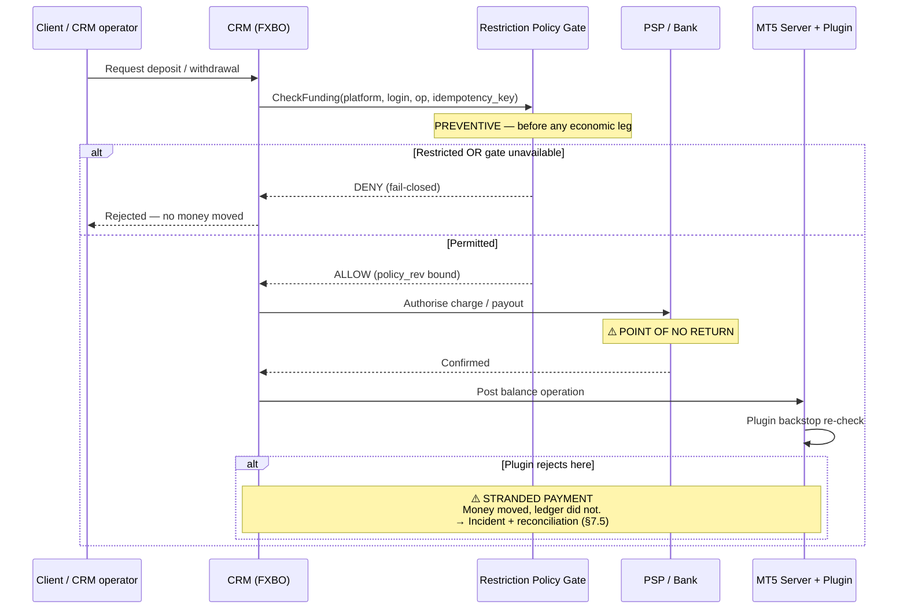
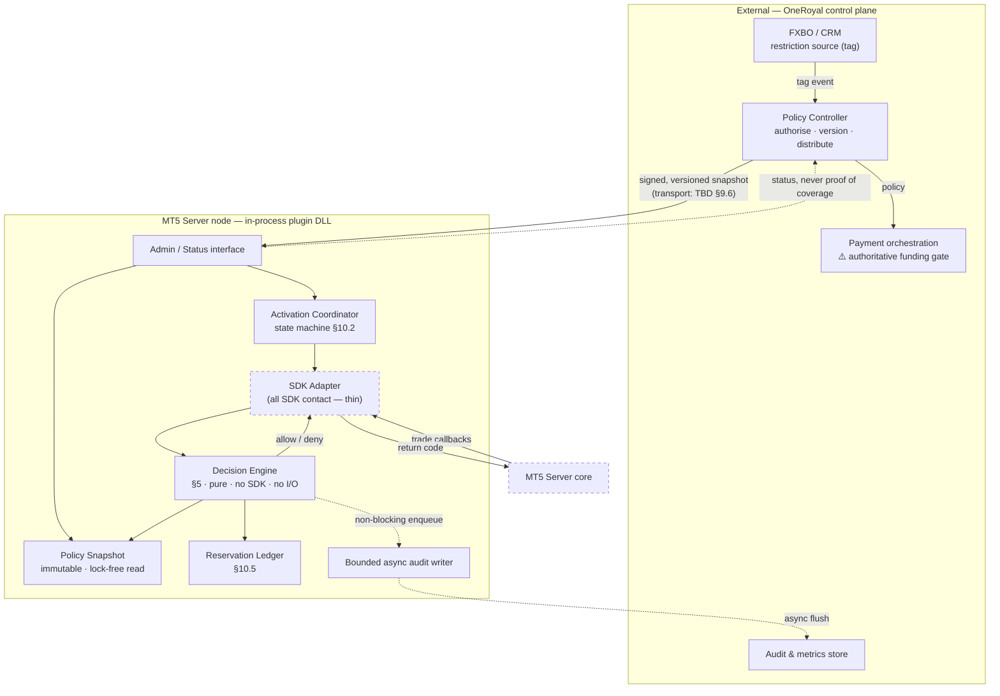
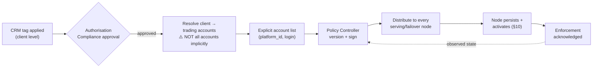
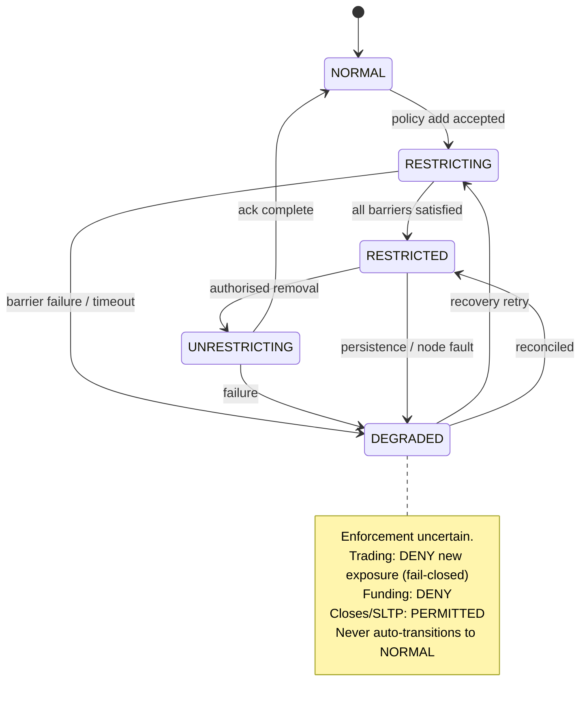

# OneRoyal — MetaTrader 5 Account-Level Restriction Plugin: Technical Specification

**Document ID:** ORL-MT5-ARP-TS
**Version:** 0.1 (DRAFT — evidence-incomplete, see §3)
**Status:** For technical review. **NOT approved for production release.**
**Date:** 2026-09-19
**Audience:** Plugin developers · MT5 administrators · QA · Operations/Dealing · Payments/CRM integration owners

---

> ## ⚠️ READ THIS FIRST — EVIDENCE STATUS
>
> The four mandatory source materials for this specification — `MetaTrader5SDK.chm`, `API.zip`,
> `Manager.zip`, and *Creating a Simple Plugin — Server API* (PDF) — **were not supplied to the
> author and have not been read.** The optional secondary inputs
> (`MT5_Account_Restriction_Review.html`, `MT5_Account_Restriction_Reference_v0.1.zip`) were also
> not supplied.
>
> Consequently **this document contains zero `SDK-documented` claims.** Every statement that would
> normally rest on a header declaration or a CHM topic is labelled
> **`Requires SDK verification`** and carries an explicit verification instruction in §6 and
> Appendix B instead of a citation. No signature, enumerator, return code, structure member,
> threading guarantee, or callback-ordering guarantee in this document may be treated as confirmed.
>
> **What this document therefore is:** a complete, implementation-ready specification of the
> *policy, decision logic, integration boundaries, architecture, control contracts, failure
> handling and acceptance criteria* — all of which are determined by OneRoyal's business rules and
> sound engineering, not by the SDK — together with a **precise, executable SDK-verification plan**
> that a developer holding the SDK completes to close the remaining gaps.
>
> **What this document is not:** a verified SDK interface mapping. §6 is a structured set of
> questions with defined acceptance evidence, not a set of answers. See §3.2 for exactly which
> sections are evidence-blocked and §16 for the release blockers this creates.
>
> Identifier names such as `IMTServerPlugin`, `HookTradeRequestProcess`, `TA_TRANSFER` and
> `DealerBalanceRaw` appear in this document **because they were named in the OneRoyal task
> specification as candidate mechanisms to investigate.** Their existence, spelling, signature and
> semantics in the licensed SDK version OneRoyal actually holds are **unverified**. They are
> treated throughout as hypotheses under test, never as a design foundation.

---

## Table of Contents

| § | Section | Evidence state |
|---|---|---|
| 1 | [Executive feasibility statement](#1-executive-feasibility-statement) | Complete |
| 2 | [Scope, definitions and requirement register](#2-scope-definitions-and-requirement-register) | Complete |
| 3 | [Evidence base, labelling convention and what is blocked](#3-evidence-base-labelling-convention-and-what-is-blocked) | Complete |
| 4 | [Restriction semantics — the authoritative business rules](#4-restriction-semantics--the-authoritative-business-rules) | Complete |
| 5 | [Trading decision algorithm](#5-trading-decision-algorithm) | Complete (SDK-independent core) |
| 6 | [SDK investigation plan and coverage matrix](#6-sdk-investigation-plan-and-coverage-matrix) | **Evidence-blocked — plan only** |
| 7 | [Financial enforcement and integration boundaries](#7-financial-enforcement-and-integration-boundaries) | Complete (design); gated on §6 |
| 8 | [Architecture and implementation structure](#8-architecture-and-implementation-structure) | Complete |
| 9 | [Policy data and administration contract](#9-policy-data-and-administration-contract) | Complete |
| 10 | [Activation, pending orders and concurrency](#10-activation-pending-orders-and-concurrency) | Complete (design); gated on §6 |
| 11 | [Failure modes, security and availability](#11-failure-modes-security-and-availability) | Complete |
| 12 | [Return codes, audit and observability](#12-return-codes-audit-and-observability) | Partially blocked (return codes) |
| 13 | [Build, performance and deployment](#13-build-performance-and-deployment) | Partially blocked (toolchain/ABI) |
| 14 | [Verification and acceptance plan](#14-verification-and-acceptance-plan) | Complete (all tests NOT RUN) |
| 15 | [Work packages, ownership and dependencies](#15-work-packages-ownership-and-dependencies) | Complete |
| 16 | [Unresolved decisions and production release blockers](#16-unresolved-decisions-and-production-release-blockers) | Complete |
| A | [Appendix A — Requirement traceability matrix](#appendix-a--requirement-traceability-matrix) | Complete |
| B | [Appendix B — SDK verification worksheet](#appendix-b--sdk-verification-worksheet) | Complete |
| C | [Appendix C — Representative declarations and pseudocode](#appendix-c--representative-declarations-and-pseudocode) | Illustrative only |
| D | [Appendix D — Representative control messages](#appendix-d--representative-control-messages) | Complete |
| E | [Appendix E — Source index](#appendix-e--source-index) | Complete (records absence) |
| F | [Appendix F — Glossary](#appendix-f--glossary) | Complete |

**Normative language.** MUST / MUST NOT = mandatory. SHOULD / SHOULD NOT = recommended, deviation
requires recorded justification. MAY = optional. Statements labelled **Proposed design** are
recommendations awaiting OneRoyal approval and are not yet requirements.

---

## 1. Executive feasibility statement

**The restriction is feasible in principle at the trading layer, and is NOT achievable by the MT5
plugin alone at the funding layer.** Those are two different projects and they carry very different
risk.

**1.1 Trading restriction — feasible, subject to verification.**
Preventing new positions, volume increases, opposing hedges and reversals while permitting full
closes, partial closes and SL/TP edits is a well-formed, decidable rule. The decision needs only
information available at request time: the account's existing position state, the requested
direction, and the requested volume. §5 specifies the complete algorithm in exact integer
arithmetic with no floating-point comparisons and no dependency on client-supplied labels, flags or
comments. **The residual risk is not the logic; it is whether the MT5 Server API exposes a
*rejectable pre-execution* hook on every channel through which a trade can reach the book.** That
question is unanswered because the SDK was not supplied (§6, BLK-01).

**1.2 Funding restriction — NOT achievable inside MT5 alone. This is the headline finding.**
An MT5 plugin can, at best, refuse to post a ledger entry *inside MT5*. It cannot prevent a payment
service provider from charging a client's card, nor a bank from releasing a payout. If the PSP has
already moved money, an MT5 rejection produces the worst outcome available: the client's money has
moved, and MT5 does not reflect it — a stranded payment and a reconciliation break, not a
prevented deposit.

Therefore **REQ-FR-01: the authoritative deposit/withdrawal control MUST sit in the CRM/payment
orchestration layer, evaluated before the first economic leg. The MT5 plugin is a backstop, not the
control.** Any plan that treats the plugin as the funding control is unsound regardless of how well
the plugin is written. This is an integration programme with FXBO and the payment stack, and it is
on the critical path (§7, §15, BLK-02).

**1.3 Transfers are the sharpest edge.** A transfer touches two accounts. It must be refused if
*either* endpoint is restricted, and the check must complete before either leg posts. If OneRoyal's
transfer path is implemented as two independent calls (debit, then credit), it is **not atomic**,
and a restriction activating between the legs can strand a debit. §7.4 specifies the idempotency
key, durable workflow state and reconciliation required. **No design in this document claims that a
check-then-act lookup or two sequential API calls are atomic.**

**1.4 What this restriction does not promise.** It is a *position-opening and volume-increase*
restriction. It is **not** a portfolio net-exposure ceiling, and it is **not** a guarantee that
economic risk decreases monotonically. Closing one leg of a hedge legitimately *raises* net
directional exposure and MUST still be permitted (§4.4). It is also not a guarantee that every
position can always be closed — market gaps, session closures, liquidity withdrawal and platform
outages are unchanged by this plugin.

**1.5 Trust boundary — state this to management explicitly.** An administrator with MT5 server
access can unload or disable the plugin DLL, and privileged Server/Manager API paths may bypass
trade-request hooks entirely. **This plugin constrains client and ordinary dealer activity. It does
not constrain a server administrator, and it MUST NOT be represented to compliance, audit or a
regulator as a control that does.** Controlling administrator action requires separation of duties,
change control and audit outside the DLL (§11.4).

**1.6 Recommendation.** Proceed, in this order:

| Priority | Action | Rationale |
|---|---|---|
| **1** | Obtain the SDK and complete Appendix B | Every trading-enforcement claim is gated on it. ~1–2 engineer-weeks. |
| **2** | Start the FXBO/payment gate design in parallel **now** | Longest lead time, highest risk, not plugin-dependent. |
| **3** | Build the policy engine (§5) as a standalone, SDK-free, unit-tested library | Buildable today with zero SDK dependency; de-risks the schedule. |
| **4** | Build the SDK adapter once §6 is answered | Thin by design, so the unknown lands in the smallest possible surface. |

Do **not** begin plugin coding against assumed interfaces. Every hour spent implementing against an
unverified signature is an hour that may be discarded.

---

## 2. Scope, definitions and requirement register

### 2.1 In scope

A server-side MT5 plugin plus the minimum external control plane required to make it correct,
enforcing an account-level restriction that:

- prevents deposits, withdrawals and transfers touching a restricted trading account;
- prevents new positions, position-volume increases, opposing hedge openings and reversals;
- permits full closes, partial closes and SL/TP add/modify/remove;
- leaves group membership, group permissions, symbol settings and instrument configuration
  **completely untouched**.

### 2.2 Explicitly out of scope / prohibited approaches

**REQ-BR-10 (Project requirement).** The following MUST NOT be used to implement this policy:

| Prohibited approach | Why it is rejected |
|---|---|
| Moving the account to a restricted group | Changes commissions, swaps, leverage, margin and symbol access as side effects; corrupts reporting; the task forbids it. |
| Setting symbols to close-only | Global blast radius — affects every account on the platform. Forbidden. |
| Editing symbol/instrument settings | Same. Forbidden. |
| Blanket trading-disable / read-only account flag | Also blocks the closes and SL/TP edits the policy MUST permit. |
| Account cloning / migration | Breaks account identity, history, and client access. |
| Client-terminal EA or terminal-side control | Trivially bypassed; not a server control; does not cover mobile/web/API. |
| Freezing the account's equity or margin | Not a restriction mechanism; causes unintended liquidation behaviour. |

**Reading** group and symbol configuration for validation purposes is permitted and expected
(e.g. reading lot step, volume limits, fill modes). **Writing** it to enforce this policy is not.

### 2.3 Definitions

| Term | Definition |
|---|---|
| **Restricted account** | A trading account whose `(platform_id, login)` pair is explicitly present in the authorised, effective restriction policy snapshot. Nothing else makes an account restricted. |
| **Platform ID** | An unambiguous identifier for the MT5 server instance / environment (e.g. `ORL-LIVE-1`). Required because logins are only unique *within* a server. |
| **Account key** | The tuple `(platform_id, login)`. The sole enforcement key. |
| **New exposure** | Any result in which the account ends with directional exposure it did not previously hold, or more of an existing direction. |
| **Reduce-only** | An operation that strictly decreases `|volume|` of an existing position without crossing zero. |
| **Reversal** | An opposite-direction operation whose volume exceeds existing volume, leaving opposite exposure. Prohibited — it is a new position in disguise. |
| **Point of no return** | The instant after which an operation's economic effect cannot be withdrawn by the plugin (e.g. LP fill received, PSP charge authorised). |
| **Preventive control** | A rejectable check evaluated *before* the point of no return. |
| **Detective control** | A post-event observation. **Never** a substitute for a preventive control. |
| **Effective policy** | The persisted, versioned snapshot currently loaded and active on a specific plugin node. |

### 2.4 Requirement register (summary — full traceability in Appendix A)

| ID | Requirement | Source | Priority |
|---|---|---|---|
| REQ-BR-01 | Restriction applies at trading-account granularity, never client-wide by inference | Task §3 | MUST |
| REQ-BR-02 | Account identified by `(platform_id, login)` | Task §3 | MUST |
| REQ-BR-03 | A CRM tag MAY trigger policy, but is not itself the enforcement source of truth | Task §3 | MUST |
| REQ-BR-04 | Unlisted accounts keep existing permissions unchanged | Task §3 | MUST |
| REQ-BR-05 | Plugin never grants permissions or bypasses other controls | Task §3 | MUST |
| REQ-BR-10 | No group/symbol/clone/blanket-disable/EA implementation | Task §3 | MUST |
| REQ-TR-01..12 | Trading decision rules | Task §3, §5 | MUST |
| REQ-FR-01..12 | Funding rules and integration boundaries | Task §6 | MUST |
| REQ-PC-01..10 | Policy contract and administration | Task §8 | MUST |
| REQ-ACT-01..09 | Activation, pending orders, concurrency | Task §9 | MUST |
| REQ-SEC-01..08 | Security and trust boundary | Task §10 | MUST |
| REQ-OBS-01..06 | Audit and observability | Task §11 | MUST |

---

## 3. Evidence base, labelling convention and what is blocked

### 3.1 Source inventory — actual state

| Source required by the task | Supplied? | Read? | Consequence |
|---|---|---|---|
| `MetaTrader5SDK.chm` | **No** | No | No behavioural claim can be cited. All hook semantics unverified. |
| `API.zip` (headers) | **No** | No | No signature, type, enum or return code can be cited. ABI unverified. |
| `Manager.zip` (examples) | **No** | No | Balance/dealer/custom-command patterns unverified. Cannot classify examples as client vs. server. |
| *Creating a Simple Plugin* (PDF) | **No** | No | DLL structure, exports, lifecycle and build guidance unverified. |
| `MT5_Account_Restriction_Review.html` (optional) | No | No | Cannot re-check its six findings against primary sources (§6.6). |
| `MT5_Account_Restriction_Reference_v0.1.zip` (optional) | No | No | No staging reference available. |

**SDK version reviewed: UNKNOWN.** The task requires identifying the SDK version from the files;
with no files, this is undeterminable. **Installed MT5 server build and production topology:
UNKNOWN** (the task instructs treating these as unknown until supplied, which remains the case).

**No attachment was read. Nothing in this document should be read as implying otherwise.**

### 3.2 Which sections are evidence-blocked

| Section | State | Reason |
|---|---|---|
| §4 Business rules | **Complete** | Determined by OneRoyal policy, not the SDK. |
| §5 Decision algorithm | **Complete** | Pure arithmetic over position state. SDK supplies inputs, not logic. One open constant: `VOLUME_UNITS_PER_LOT` (§5.2). |
| §6 SDK mapping | **BLOCKED** | Reduced to a verification plan with acceptance evidence per item. |
| §7 Funding | **Design complete**, enforcement coverage blocked | The integration argument stands; which MT5 hook sees which writer does not. |
| §8 Architecture | **Complete** | Deliberately isolates the unknown into a thin adapter. |
| §9 Policy contract | **Complete** | Independent of SDK except the transport choice (§9.6). |
| §10 Activation/concurrency | **Design complete**, guarantees blocked | Serialization guarantees require SDK threading documentation. |
| §11 Failure/security | **Complete** | |
| §12 Return codes | **Partially blocked** | Reason-code taxonomy complete; SDK return-code mapping blocked. |
| §13 Build | **Partially blocked** | Process complete; toolchain/CRT/ABI specifics blocked. |
| §14 Tests | **Complete as specification**; **all tests NOT RUN** | No environment, no SDK, no server. |

### 3.3 Labelling convention

Every material statement carries one of:

- **`SDK-documented`** — supported by a cited header line or CHM/PDF location.
  **This label appears zero times in this document**, because no source was supplied.
- **`Project requirement`** — mandated by OneRoyal's task specification.
- **`Proposed design`** — the author's recommendation, requiring OneRoyal approval.
- **`Requires SDK verification`** — would be `SDK-documented` if the SDK were available.
  Resolved by completing the corresponding Appendix B worksheet row.
- **`Requires runtime verification`** — cannot be settled by reading headers or docs; needs a
  live MT5 test server (timing, ordering, threading, actual field population).
- **`Requires vendor clarification`** — needs a written answer from MetaQuotes; not discoverable
  from headers, docs or black-box testing with acceptable confidence.

### 3.4 Evidence rules binding on the implementation team

**REQ-EV-01 (Project requirement).** Headers establish *declarations*; documentation establishes
*behaviour*. Where they conflict, the discrepancy MUST be recorded in Appendix B with its design
effect. Choosing whichever supports the preferred design without recording the conflict is
prohibited.

**REQ-EV-02.** Line-number citations MUST only be written for files actually opened. A citation
copied from this document's placeholders into a later revision without inspection is a defect.

**REQ-EV-03.** Public MQL5 *terminal* API documentation MUST NOT be substituted as evidence for
licensed *Server* API behaviour. They are different APIs with different guarantees. External
sources, if used, MUST be cited and distinguished from the supplied SDK version.

**REQ-EV-04.** Inventing API methods, configuration flags, built-in account tags or callback
guarantees is prohibited. Where a mechanism is needed but unconfirmed, it MUST be written as an
open question with defined acceptance evidence, not as a design.

---

## 4. Restriction semantics — the authoritative business rules

These rules are **`Project requirement`** unless marked otherwise. They are SDK-independent and are
the acceptance standard for §5.

### 4.1 The operation table

| Operation on a restricted account | Required outcome | Req ID |
|---|---|---|
| Deposit funds | **Prevent** | REQ-FR-02 |
| Withdraw funds | **Prevent** | REQ-FR-03 |
| Transfer in or out | **Prevent** — validate **both** endpoints | REQ-FR-04 |
| Open a new position | **Prevent** | REQ-TR-01 |
| Increase an existing position's volume | **Prevent** | REQ-TR-02 |
| Open a separate opposing hedge | **Prevent** — it is a new position | REQ-TR-03 |
| Reverse a position into opposite exposure | **Prevent** | REQ-TR-04 |
| Fully close an existing position | **Permit**, subject to ordinary MT5 validation | REQ-TR-05 |
| Partially close an existing position | **Permit**, without creating opposite exposure | REQ-TR-06 |
| Modify SL/TP on an existing position | **Permit**, without permitting unrelated changes | REQ-TR-07 |

### 4.2 What "no new trades" means — precisely

**REQ-TR-08.** "No new trades" means **no new positions, no position-volume increases, and no
reversals.** It explicitly does **not** prohibit the orders and deals required to *execute an exit*.
A close generates an order and a deal; rejecting those because they are "new orders" would defeat
the policy's own requirement to permit closes. The enforcement predicate is the **resulting
exposure**, never the existence of an order or deal record.

**REQ-TR-09.** "Resizing smaller" means a **genuine partial close** that produces a real closing
deal with real execution and real P/L settlement. It **MUST NOT** be implemented by rewriting a
position's stored volume field. Overwriting a volume record fabricates accounting, destroys the
audit trail and is prohibited.

### 4.3 Unlisted accounts

**REQ-BR-04.** An account not in the effective policy continues under its existing MT5 permissions,
with exactly one exception: **it cannot transfer to or from a restricted endpoint** (REQ-FR-04).
An unrestricted counterparty does not launder a restricted endpoint.

**REQ-BR-05.** The plugin MUST NOT grant any permission, relax any existing control, or provide a
bypass for any account, restricted or not. If a request would be rejected by ordinary MT5
validation, the plugin's "allow" decision MUST leave that rejection intact — the plugin's allow is
"no objection from this policy", never "force execution".

### 4.4 Exposure is not the invariant — this matters

**REQ-TR-10.** This is a **position-opening and volume-increase restriction, not a net-exposure
ceiling.**

Worked case (hedging mode): account holds `BUY 1.00 EURUSD` and `SELL 1.00 EURUSD`; net exposure
zero. The client closes the `SELL 1.00` leg. Net directional exposure **rises from 0 to +1.00 BUY**.

**This close MUST be permitted.** Rejecting it because net exposure increased would be a false
denial of a legitimate exit and a direct violation of REQ-TR-05.

**REQ-TR-11.** The policy makes **no promise of monotonically decreasing economic risk.** Permitted
operations (closing a hedge leg, widening a stop, removing a take-profit) can each increase risk.
Operations/Dealing MUST be briefed on this, and any expectation of decreasing risk is a separate,
unapproved requirement.

### 4.5 Preserved behaviour

**REQ-TR-12.** The plugin MUST preserve:

- normal account access, login and visibility (no hiding accounts, no forced logout) unless a
  separate approved requirement says otherwise;
- SL and TP triggered exits;
- stop-out / forced liquidation by the server;
- margin-call processing;
- the accounting required to settle permitted closes — realized P/L, commission, swap and
  mandatory settlement postings (§7.6). **A funding restriction that rejects the ledger entries of
  a legitimate close makes closing impossible and is a defect, not a stricter control.**

### 4.6 Policy decisions beyond the original request

These are **decisions OneRoyal must make**, not settled requirements. Defaults below are
**`Proposed design`** and require sign-off.

| ID | Question | Proposed default | Rationale | Approver |
|---|---|---|---|---|
| PD-01 | New **entry** pending orders (limit/stop) on a restricted account | **Deny** placement, and deny their activation into a position | A pending entry order is a deferred new position; permitting it defeats the policy | Operations/Dealing |
| PD-02 | **Cancellation** of existing pending orders | **Permit** always | Cancellation only removes potential exposure | Operations/Dealing |
| PD-03 | Pending entry orders **inherited** at activation | **Remove safely** during RESTRICTING (§10.4) | Otherwise the account opens a new position after restriction | Operations/Dealing |
| PD-04 | **Widening or removing** SL/TP | **Permit** | Within "modify SL/TP"; permitting only tightening would trap clients | Operations/Dealing |
| PD-05 | **Tightening** SL/TP | **Permit** (same as PD-04) — but flag: tightening accelerates exit | Both directions are protective-level edits | Operations/Dealing |
| PD-06 | Automatic restriction **expiry** | **None.** Restrictions persist until explicitly removed | Auto-expiry silently re-enables a restricted account | Compliance |
| PD-07 | Pending orders that *close* a position (e.g. a stop targeting an open position) | Permit **only** where reduce-only can be validated at activation, not from the order's label (§5.8) | Labels are not authorisation | Operations/Dealing |
| PD-08 | Manual credit / bonus / correction / fee / negative-balance ops | **Deny by default**; exceptions only via approved, audited, narrowly scoped authorisation (§7.7) | Otherwise every restriction has an open back door | Compliance + Finance |

**REQ-BR-06.** Tightening the SL/TP rules or introducing *financial* exceptions MUST go through
written approval. Silent scope changes are prohibited.

---

## 5. Trading decision algorithm

This section is **SDK-independent**. It defines the decision given a set of inputs; §6 defines how
those inputs are obtained. Implement this as a standalone library with no SDK dependency
(§8.3) so it can be unit- and property-tested today.

### 5.1 Decision inputs and invariants

**REQ-TR-20.** Every decision MUST be a pure function of:

| Input | Type | Invariant that MUST hold |
|---|---|---|
| `platform_id` | opaque ID | Matches this node's configured platform. Mismatch ⇒ reject (fail-closed). |
| `login` | uint64 | The account the request acts on. Owner of the target position. |
| `action` | enum | The trade action. Unknown value ⇒ **deny** (§5.9). |
| `symbol` | string | Normalised; must match the target position's symbol exactly. |
| `req_dir` | BUY / SELL | Requested direction. |
| `req_volume` | **int64, integer lot units** | `> 0`. Zero or negative ⇒ reject. |
| `target_ticket` | uint64 \| 0 | Position/order ticket if ticket-targeted. |
| `existing` | position state | Retrieved from the server, **never from the request**. |
| `account_mode` | NETTING / HEDGING | Retrieved from account/group config (read-only). |
| `policy_rev` | uint64 | The snapshot revision that decided. Recorded in audit. |

**REQ-TR-21 — Ownership.** The target position MUST belong to `login`. A ticket owned by another
account ⇒ reject, audit as a targeting violation. Never infer ownership from the request.

**REQ-TR-22 — Server truth.** Existing position identity, symbol, direction and volume MUST be read
from the server's position store, never from client-supplied request fields. The request states
intent; it is not evidence of state.

### 5.2 Volume arithmetic — integers only

**REQ-TR-23 (MUST).** All volume comparisons MUST use the SDK's documented **integer** volume
representation. Floating-point lots MUST NOT be used to establish authorisation.
`if (fabs(a-b) < 1e-8)` as an authorisation test is a defect: it admits a tolerance band in which an
increase is misread as a flat close.

**`Requires SDK verification` (Appendix B, row B-14):** the integer unit scale
(`VOLUME_UNITS_PER_LOT`) and whether the SDK exposes both a legacy volume field and an extended
higher-precision field. The implementation MUST read this constant from the SDK, MUST NOT hardcode
a guess, and MUST use the *same* field consistently for existing and requested volume. **Mixing a
legacy and an extended volume field in one comparison is a critical defect** — it silently compares
different scales.

```
// Guarded arithmetic. No floats anywhere on the authorisation path.
static_assert(std::is_same_v<VolumeUnits, std::int64_t>);

enum class VolumeError { OK, ZERO, NEGATIVE, OVERFLOW, NOT_LOT_STEP_ALIGNED };

VolumeError ValidateVolume(VolumeUnits v, VolumeUnits lot_step) {
    if (v == 0)                      return VolumeError::ZERO;
    if (v < 0)                       return VolumeError::NEGATIVE;
    if (lot_step > 0 && v % lot_step != 0) return VolumeError::NOT_LOT_STEP_ALIGNED;
    return VolumeError::OK;
}

// Signed net volume: BUY positive, SELL negative. Overflow-checked.
bool TryAddSigned(VolumeUnits a, VolumeUnits b, VolumeUnits& out) {
    return !__builtin_add_overflow(a, b, &out);   // MSVC: use SafeInt / intrinsics
}
```

**REQ-TR-24.** Overflow MUST be detected, not wrapped. Any arithmetic failure ⇒ **deny** and audit
as `ERR_ARITHMETIC`. A wrapped comparison could turn a reversal into an apparent reduction.

**REQ-TR-25 — Lot step.** Lot-step and min/max volume are **read** from symbol configuration for
validation only. The plugin MUST NOT modify symbol settings (REQ-BR-10). If a requested close
volume is not lot-step aligned, the plugin **rejects**; it MUST NOT round the client's quantity
(REQ-TR-28).

### 5.3 The core predicate — netting mode

Let `V` = signed net volume of the account's existing position in `symbol`
(BUY = `+`, SELL = `−`; `V = 0` if flat).
Let `r` = signed requested volume (BUY = `+req_volume`, SELL = `−req_volume`).

**REQ-TR-26 — Netting allow rule.** Allow **if and only if all** hold:

1. `V != 0` — there is something to reduce; and
2. `sign(r) == -sign(V)` — the request opposes the existing position; and
3. `|r| <= |V|` — the request does not exceed what exists.

Otherwise **reject**. Equivalently: allow iff `|V + r| < |V|` **and** `sign(V + r) ∈ {sign(V), 0}`.

This single rule produces every required outcome. Worked example — existing `BUY 1.00`, no
outstanding conflicting request, `V = +1.00`:

| Requested | `r` | `V + r` | Rule check | Decision | Result |
|---|---|---|---|---|---|
| SELL 0.40 | −0.40 | +0.60 | opposite ✓, 0.40 ≤ 1.00 ✓ | **Allow** | BUY 0.60 remains |
| SELL 1.00 | −1.00 | 0.00 | opposite ✓, 1.00 ≤ 1.00 ✓ | **Allow** | Flat |
| BUY 0.20 | +0.20 | +1.20 | same sign ✗ | **Reject** | Would increase to BUY 1.20 |
| SELL 1.20 | −1.20 | −0.20 | opposite ✓, 1.20 > 1.00 ✗ | **Reject** | Would reverse to SELL 0.20 |
| SELL 0.40 *after the position already closed* | −0.40 | −0.40 | `V == 0` ✗ | **Reject** | Would create a new position |

The final row is the reason condition (1) exists and why state MUST be re-read at decision time
(§5.10, §10.5). A stale cached `V` would wrongly allow a brand-new SELL.

### 5.4 The core predicate — hedging mode

In hedging mode positions are independent; net symbol volume is **not** the invariant.

**REQ-TR-27 — Hedging allow rule.** Allow **if and only if**:

1. the request is **ticket-targeted** at an existing position `P`; and
2. `P.login == login` (ownership); and
3. `P.symbol == symbol`; and
4. `req_dir == opposite(P.direction)`; and
5. `0 < req_volume <= P.volume_remaining`.

An opposite-direction request that is **not** ticket-targeted at an existing position is a **new
opposing position** ⇒ **reject** (REQ-TR-03). A same-direction request is an increase ⇒ **reject**.

| Case | Decision |
|---|---|
| Ticket-targeted opposite, `volume < P.volume` | **Allow** — partial close |
| Ticket-targeted opposite, `volume == P.volume` | **Allow** — full close |
| Ticket-targeted opposite, `volume > P.volume` | **Reject** — oversized (REQ-TR-28) |
| Untargeted opposite-direction order | **Reject** — new hedge position |
| Same-direction order (targeted or not) | **Reject** — increase |
| Ticket targets another account's position | **Reject** + security audit |
| Ticket targets a closed/stale position | **Reject** — nothing to reduce |

**REQ-TR-28 — No silent quantity rewriting.** An oversized closing request MUST be **rejected**, not
silently reduced to the available volume. Rewriting a client's order quantity changes their
instruction without consent and can produce an unexpected residual position. Auto-clamping requires
a separate, explicitly approved requirement; it is **not** authorised by this specification.

### 5.5 Close By

**REQ-TR-29.** For a Close-By operation between positions `A` and `B`, allow **iff**:

1. `A.login == B.login == login`; and
2. `A.symbol == B.symbol == symbol`; and
3. `A.direction == opposite(B.direction)`; and
4. both are live, non-zero-volume positions; and
5. neither ticket resolves to a position created by this same request.

Unequal volumes are acceptable — a partial Close By reduces the larger leg and closes the smaller.
The residual MUST remain on the original side; the operation MUST NOT be permitted if the platform
would implement it by opening a new position.

**REQ-TR-30.** Pre-existing platform restrictions on Close By (group permissions, symbol settings,
account mode) MUST be preserved. The plugin's allow never enables a Close By that MT5 would
otherwise refuse (REQ-BR-05).

**REQ-TR-31.** Per REQ-TR-10, a Close By that raises net directional exposure MUST still be
permitted if it satisfies the rule above.

### 5.6 Do not trust labels

**REQ-TR-32 (MUST).** The decision MUST NOT rely on:

- a "close" flag or position-effect flag in the request;
- the request comment or any free-text field;
- a declared exit reason;
- an order's label, name or magic number;
- the client application's claim about what the order does.

All of these are attacker- or bug-controlled. **Authorisation MUST derive solely from validated
server-side state** — the target position's real ownership, symbol, direction and remaining volume
versus the real requested direction and volume. A request labelled "partial close" that resolves to
an untargeted opposite-side order is a new hedge and MUST be rejected.

### 5.7 Deal-type treatment

**REQ-TR-33.** Deal entry classification (entry / exit / reversal / close-by) MUST be treated as
follows:

| Classification | Expectation under restriction | Handling |
|---|---|---|
| **Entry** | Should never occur on a restricted account | If observed post-execution ⇒ **breach**: alert, incident, reconcile (§12.5). Detection, not prevention. |
| **Exit** | Expected and permitted | Allow associated accounting (§7.6). |
| **Reversal** | Must never occur | Prevented pre-execution; if observed ⇒ breach. |
| **Close By** | Permitted per §5.5 | |

**`Requires SDK verification` (B-18):** the exact enumeration of deal entry types and whether the
processing stage exposes the classification *before* execution or only on the resulting deal. If
classification is only available post-execution, it is a **detective** signal and MUST NOT be
presented as preventive (§12.5).

### 5.8 SL/TP-only validation — separate path

**REQ-TR-34.** An SL/TP modification MUST be validated on a distinct code path from execution, and
allowed **only if it changes nothing but protective levels**.

```
Decision ValidateProtectiveLevels(req, P /* server-side position */) {
    if (P.login   != req.login)         return DENY(ERR_OWNERSHIP);
    if (P.ticket  != req.ticket)        return DENY(ERR_IDENTITY);
    if (P.symbol  != req.symbol)        return DENY(ERR_SYMBOL_MISMATCH);
    if (req.changes_volume())           return DENY(ERR_SLTP_WITH_VOLUME);
    if (req.changes_open_price())       return DENY(ERR_SLTP_WITH_PRICE);
    if (req.changes_direction())        return DENY(ERR_SLTP_WITH_DIRECTION);
    if (req.changes_ownership())        return DENY(ERR_SLTP_WITH_OWNERSHIP);
    // Only SL/TP fields differ → permitted (PD-04, PD-05)
    return ALLOW(REASON_SLTP_ONLY);
}
```

**REQ-TR-35.** A request that bundles an allowed protective-level change with an unauthorised
volume, price, direction, ownership or identity change MUST be **rejected in full**. The plugin MUST
NOT strip the unauthorised part and execute the remainder — partial execution of a modified
instruction is a silent rewrite (REQ-TR-28).

**REQ-TR-36.** Covered under this path: SL/TP **addition**, **modification**, **removal**, and
**trailing-stop-generated updates** arriving as ordinary modification requests. The plugin MUST NOT
implement a server-side trailing-stop service; it only validates the updates it observes.

**`Requires runtime verification` (B-19):** whether SL/TP modification requests arrive with NULL or
absent order/position/symbol objects. If so, the validator MUST retrieve the position by ticket
before deciding, and MUST deny when retrieval fails rather than defaulting to allow.

### 5.9 Unknown, ambiguous and edge-case handling

**REQ-TR-37 — Unknown action ⇒ deny (fail-closed).** An action enumerator the plugin does not
recognise MUST be denied for restricted accounts and audited as `ERR_UNKNOWN_ACTION` with the raw
value. Classification MUST NOT be reduced to "BUY vs SELL": the action space includes client orders,
dealer operations, server-generated operations, pending orders, protective exits and financial
operations, each with different semantics. **`Requires SDK verification` (B-10)** — full enumerator
list for OneRoyal's SDK version. A new enumerator appearing after an SDK upgrade MUST be treated as
unknown (deny) until explicitly classified, and MUST raise an alert.

**REQ-TR-38 — Edge cases.**

| Case | Required handling |
|---|---|
| Stale/closed position | Reject; there is nothing to reduce. Never treat as a permitted close. |
| Missing ticket | Reject unless netting mode makes the target unambiguous via §5.3. |
| Mismatched ticket (symbol/owner differs) | Reject; audit as targeting violation. |
| Position retrieval fails | **Deny** (fail-closed). Never allow on lookup failure. |
| Utility/rollover ticket change | The position may reappear under a new ticket. Match on the stable position identifier, not solely the ticket. **`Requires SDK verification` (B-15)**: which identifier is stable across rollover. |
| Partial fill | Remaining volume MUST be recomputed from server state before any subsequent decision. |
| Requote / re-price | Re-validate on the re-submitted request; a prior allow does not carry over. |
| Order-only acknowledgement (no deal) | Not evidence of execution. Reservation stays held (§10.5). |
| Pending order intended to close | PD-07: validate reduce-only at **activation** against live state, not from the label. |
| Zero/invalid volume | Reject (`VolumeError`). |
| Duplicate request ID | Idempotent — return the original decision; do not double-reserve. |

**REQ-TR-39.** Documented lifecycle operations (rollover, swap application, corrections) MUST be
handled explicitly and safely. The implementation MUST NOT introduce a general "privileged bypass"
flag — a blanket exemption is the single most likely route to a silent policy hole (§7.7, §11.4).

### 5.10 Decision procedure (normative pseudocode)

```
Decision EvaluateTradeRequest(const Request& q) {

    // 1. Policy lookup — O(1), lock-free read of the immutable snapshot (§8.4)
    const Snapshot& snap = g_policy.Acquire();          // refcounted, never blocks
    if (snap.platform_id != q.platform_id) return DENY(ERR_PLATFORM_MISMATCH);
    if (!snap.IsRestricted(q.login))       return ALLOW(REASON_NOT_RESTRICTED);
    //  ^ unlisted accounts: unchanged behaviour (REQ-BR-04), except transfers (§7.3)

    // 2. Classify action. Unknown ⇒ deny (REQ-TR-37)
    ActionClass cls = Classify(q.action);
    if (cls == ActionClass::Unknown)  return DENY(ERR_UNKNOWN_ACTION);
    if (cls == ActionClass::Financial) return EvaluateFinancial(q);        // §7
    if (cls == ActionClass::ProtectiveLevelsOnly)
        return ValidateProtectiveLevels(q, FetchPositionOrDeny(q.ticket)); // §5.8
    if (cls == ActionClass::PendingCancel)  return ALLOW(REASON_CANCEL_OK); // PD-02
    if (cls == ActionClass::PendingEntryPlace) return DENY(ERR_NEW_ENTRY_ORDER); // PD-01
    if (cls == ActionClass::CloseBy)   return EvaluateCloseBy(q);          // §5.5

    // 3. Volume sanity BEFORE any state work
    if (ValidateVolume(q.volume, SymbolLotStep(q.symbol)) != VolumeError::OK)
        return DENY(ERR_VOLUME_INVALID);

    // 4. Read authoritative server-side state. Failure ⇒ deny.
    PositionView P;
    if (!FetchPositionState(q, /*out*/ P)) return DENY(ERR_STATE_UNAVAILABLE);

    // 5. Apply the mode-specific predicate
    Decision d = (P.mode == Mode::Netting) ? EvaluateNetting(q, P)   // §5.3
                                           : EvaluateHedging(q, P);  // §5.4
    if (!d.allowed) return d;

    // 6. Reserve the reduction so concurrent closes cannot jointly overshoot (§10.5)
    if (!g_reservations.TryReserve(q.correlation_id, P.key, q.volume))
        return DENY(ERR_CONCURRENT_RESERVATION);

    d.policy_rev = snap.revision;      // bind the deciding revision for audit
    return d;                           // ALLOW — normal routing MUST proceed unchanged
}
```

**REQ-TR-40.** On **allow**, the plugin MUST leave normal request routing and ordinary MT5
validation completely intact. An allow is "this policy raises no objection" — never a forced
execution or a bypass (REQ-BR-05, §12.1).

---

## 6. SDK investigation plan and coverage matrix

> **This section is evidence-blocked.** The SDK was not supplied. What follows is **not** an
> interface mapping — it is the structured investigation that MUST be completed before any adapter
> code is written, with defined acceptance evidence per item. Every identifier below originates
> from the OneRoyal task specification's list of *candidates to investigate*, not from an inspected
> header. **No signature, return code, ownership rule or ordering guarantee is asserted here.**

### 6.1 Interfaces to assess

For each of the following the developer MUST record: exact declaration with file path and line
number, header-vs-documentation agreement, and suitability verdict.

`IMTServerPlugin`, `IMTServerAPI`, `IMTTradeSink`, `IMTRequest`, `IMTConfirm`, `IMTPosition`,
`IMTOrder`, `IMTDeal`, `IMTExecution`, `IMTConPluginSink`, `IMTCustomSink`.

**REQ-SDK-01.** For **every** interface adopted, the following MUST be documented before use:

| Attribute | Why it is mandatory |
|---|---|
| Exact signature | Wrong signature ⇒ ABI corruption, not a compile error, if declared by hand. |
| Subscription mechanism | An unsubscribed sink is silently never called — a total enforcement failure that looks like "working code". |
| Invocation stage | Determines whether the hook is **preventive** or merely **detective**. This is the single most important attribute in this document. |
| Applicable operations | Which actions actually reach it. |
| Parameter ownership | Who frees what. Wrong ⇒ leak or double-free in the trading path. |
| Nullability | §6.6 flags several suspected-NULL cases. Dereferencing ⇒ server crash. |
| Mutability | Whether modifying a parameter is permitted, and whether modification is even a sanctioned pattern. |
| Permitted return codes | Which value rejects, which allows, which has side effects. |
| Rejection effect | What the client sees; whether the request is retried. |
| Callback ordering | Whether other plugins run before/after and can short-circuit. |
| Threading / reentrancy | Whether concurrent invocations occur; which SDK calls are legal inside the callback. |

### 6.2 Candidate mechanisms — investigation register

**Status legend:** 🔴 = unverified, blocking. Every row below is 🔴.

| Area | Candidates named for investigation | What MUST be established | ID |
|---|---|---|---|
| Lifecycle | `MTServerAbout`, `MTServerCreate`, `Start`, `Stop`, `Release` | Export signatures, calling convention, version negotiation, which subscriptions are required, shutdown draining semantics | B-01 |
| Request admission | `HookTradeRequestAdd` | Stage; rejectable?; which actions reach it; object nullability | B-02 |
| Request routing | `HookTradeRequestRoute` | Stage; whether symbol/position params are obsolete or NULL (§6.6-a); semantics of a "done" return | B-03 |
| Request execution | `HookTradeRequestProcess` | Stage; whether it receives a *proposed future* position (§6.6-b); rejectability | B-04 |
| Close-By execution | `HookTradeRequestProcessCloseBy` | Both-position visibility; ownership; rejectability | B-05 |
| External execution | `HookTradeExecution`, `OnTradeExecution` | **Critical:** is either preventive, or both post-fill notifications? | B-06 |
| Position retrieval | `PositionGet`, `PositionGetByTicket` | Legality inside each callback (reentrancy); which identifiers/volume fields; failure modes | B-07 |
| Financial ops | `TA_DEALER_BALANCE`, `TA_TRANSFER`, `DealerSend`, `DealerBalance`, `DealerBalanceRaw` | Which are interceptable, which bypass hooks; sender/receiver semantics (§6.6-d) | B-08 |
| Privileged ops | `DealPerform`, `OnDealPerform`, `TradeAccountSet`, history/correction/import/sync | Which mutate live balances directly; which are history-only; which are interceptable at all | B-09 |
| Actions/flags | `IMTRequest::EnTradeActions` + flags | Complete enumerator list for OneRoyal's version | B-10 |
| Control channel | Plugin configuration events, custom Manager commands | Update transport; scope of interception; permissions | B-11 |

### 6.3 The preventive-vs-detective test (do this first)

**REQ-SDK-02.** Before any hook is adopted as an enforcement point, the developer MUST classify it:

> **A hook is PREVENTIVE only if returning a rejection value causes the operation to have no
> economic effect. Anything else is DETECTIVE.**

Acceptance evidence required per hook: (a) documentation stating the rejection effect, **and**
(b) a live test on an MT5 test server showing the operation did not execute, position unchanged,
ledger unchanged, and nothing reached the gateway.

**REQ-SDK-03.** A detective hook MUST NOT appear in the "preventive control" column of §6.5, MUST
NOT be cited as satisfying any "Prevent" row of §4.1, and MUST be labelled *detection* in all
reporting (§12.5). **If every candidate turns out to be detective for a given channel, that channel
is not enforceable in-process and MUST be escalated as a release blocker — not papered over.**

### 6.4 Action classification requirements

**REQ-SDK-04.** The plugin MUST maintain an explicit classification table mapping every known
action enumerator to exactly one `ActionClass`:

`NewPosition` · `IncreasePosition` · `ReducePosition` · `CloseBy` · `ProtectiveLevelsOnly` ·
`PendingEntryPlace` · `PendingEntryModify` · `PendingCancel` · `Financial` · `ServerGenerated` ·
`Unknown`

Rules: the table MUST be exhaustive over known enumerators; anything absent maps to `Unknown` ⇒
deny (REQ-TR-37); the table MUST be data, reviewable by Operations, not scattered `if` statements;
and each SDK upgrade MUST re-run a completeness check that fails the build on an unclassified
enumerator.

### 6.5 Enforcement coverage matrix (template — to be completed)

**Every row is `unconfirmed` pending §6 completion.** Publishing this matrix with unverified rows
marked "covered" would be a misrepresentation to compliance.

| Operation | Entry channel | API / action | Preventive control | Point of no return | Documented guarantee | Verification needed | Residual gap | Owner | Test ref |
|---|---|---|---|---|---|---|---|---|---|
| Open position | Desktop / mobile / web / EA | client order | TBD (B-02/B-04) | LP fill | **None established** | B-02,B-04 + live test | Unknown until verified | Plugin dev | T-TR-001 |
| Increase position | as above | client order | TBD | LP fill | None established | B-04 | Unknown | Plugin dev | T-TR-010 |
| Opposing hedge | as above | client order | TBD | LP fill | None established | B-04 | Unknown | Plugin dev | T-TR-020 |
| Reversal | as above | client order | TBD | LP fill | None established | B-04 | Unknown | Plugin dev | T-TR-030 |
| Pending entry placement | as above | pending order | TBD | Activation → fill | None established | B-02 | Unknown | Plugin dev | T-TR-040 |
| Pending entry activation | Server-generated | server action | TBD (B-10) | LP fill | None established | B-04,B-10 | **Server-generated actions may not traverse client hooks** | Plugin dev | T-TR-041 |
| Externally routed order | Gateway / LP | execution path | TBD (B-06) | **LP fill — outside MT5** | None established | B-06 + gateway test | **Likely detective only** | Plugin dev + Gateway owner | T-CR-030 |
| Copy trading / signals | Signal service | TBD | TBD | LP fill | None established | Channel inventory | **Channel not yet inventoried — unconfirmed** | Platform owner | T-TR-060 |
| Manager-initiated trade | Manager API | dealer action | TBD (B-08) | LP fill | None established | B-08 | Unknown | Plugin dev | T-FP-010 |
| Deposit | CRM / PSP | `TA_DEALER_BALANCE` / `DealerBalance*` | **CRM gate (§7.2) — authoritative** | **PSP charge (outside MT5)** | None established | B-08 + PSP trace | **MT5 rejection is post-charge** | Payments owner | T-FP-001 |
| Withdrawal | CRM / PSP / Manager | as above | **CRM gate — authoritative** | **Bank payout** | None established | B-08 + payout trace | As above | Payments owner | T-FP-002 |
| Internal transfer | Manager / CRM | `TA_TRANSFER` | Both-endpoint check (§7.3) | First ledger leg | None established | B-08 + §6.6-d | Two-leg atomicity (§7.4) | Plugin dev + CRM | T-FP-020 |
| Cross-server transfer | CRM / multi-server | TBD | **Cross-node — no single plugin sees both** | First leg | None established | Topology unknown | **Requires distributed check** | CRM owner | T-FP-030 |
| Wallet movement | CRM wallet | TBD | CRM gate | Wallet debit | None established | CRM contract | Unconfirmed | CRM owner | T-FP-040 |
| Direct privileged deal | Server/Manager API | `DealPerform` | TBD (B-09) | Immediate ledger write | None established | B-09 + §6.6-e | **Possible full bypass** | Plugin dev | T-FP-050 |
| Manual credit / bonus / fee | Manager | TBD | Policy PD-08 | Ledger write | None established | B-08,B-09 | Unconfirmed | Ops + Finance | T-FP-060 |

**REQ-SDK-05.** No row may be marked "covered" without: (a) the interface evidence, **and** (b) a
passing live test with logged callback evidence, **and** (c) named integration owner sign-off.

### 6.6 Earlier-review findings — status: UNVERIFIABLE

The task requires re-checking six findings from an earlier review against primary sources. **Neither
the earlier review nor the primary sources were supplied.** These are therefore recorded as **open
questions with defined verification procedures** — not confirmed, not refuted, and explicitly not
repeated as fact.

| # | Claim to verify | If TRUE — design consequence | Verification procedure |
|---|---|---|---|
| **a** | The routing hook's symbol and position parameters are obsolete/NULL, and a "request done" return **bypasses normal routing** rather than being an ordinary allow | **Severe.** Using that return as "allow" would silently skip routing — orders never reach the LP, or reach it twice. The allow path MUST use whatever value means *continue normally*. Also: the routing hook cannot be the decision point if its position data is NULL | Read header comments + CHM topic; live test: allow via each return value and observe whether the order routes normally, once |
| **b** | The processing hook receives a **proposed future position** — including mostly-zeroed fields on a full close — requiring retrieval of the original state | **High.** Deciding from the future position would read a full close as "volume 0" and misclassify it. §5 already mandates fetching original state (REQ-TR-22), so the design is safe either way; confirm to size retrieval cost | Instrument the hook; log every field for full close, partial close, increase, reversal; compare to pre-request state |
| **c** | Balance, transfer and SL/TP requests carry **NULL order/position/symbol** objects, and some acknowledgements carry empty/absent deal objects | **High — crash risk.** Every access MUST be null-checked; missing objects MUST NOT default to allow. Absent deal objects mean acknowledgements are not execution evidence (§10.5) | Null-probe harness across every action type; log presence/absence per field |
| **d** | `TA_TRANSFER` uses `Login` as **sender** and `SourceLogin` as **receiver**, while other actions interpret `SourceLogin` differently | **Critical.** Reversed semantics ⇒ checking the wrong endpoint ⇒ a restricted account transfers out undetected. §7.3 mandates checking **both** endpoints, which is safe under either interpretation — but direction MUST still be established for audit correctness | Controlled transfers in all four restricted/unrestricted combinations; log both fields; confirm which account was debited |
| **e** | `DealPerform` **bypasses** normal requests/routing; `OnDealPerform` is **post-action**; direct balance-method interception is undocumented | **Critical.** A post-action-only privileged path is a **detective-only** gap. §7.5 mandates an external gate + vendor question rather than assuming interception | Live test: perform a deal via the privileged path against a restricted account; observe whether any hook fires **before** the ledger changes |
| **f** | Some operations are **history-only**; others are immediate live mutations. A custom Manager command hook intercepts **only custom commands**, not arbitrary Manager API calls | **High.** A custom command hook is a **control channel**, never an enforcement perimeter. It MUST NOT be presented as proof that Manager-initiated operations are covered (REQ-PC-09) | Classify each method by live effect on balance/positions; attempt an ordinary Manager call and confirm the custom hook does not fire |

**REQ-SDK-06.** Findings (a), (d) and (e) are **release blockers** (BLK-01, BLK-03, BLK-04).
Until each is resolved with recorded evidence, the corresponding coverage rows in §6.5 MUST remain
`unconfirmed`, and OneRoyal MUST NOT be told those paths are enforced.

---

## 7. Financial enforcement and integration boundaries

### 7.1 The central distinction

**REQ-FR-01 (MUST).** Two different things MUST be specified and controlled separately:

| | MT5 ledger restriction | External economic movement |
|---|---|---|
| What it stops | A balance entry being written **inside MT5** | Money actually moving — card charged, bank payout released, wallet debited |
| Controlled by | The plugin (if an interceptable path exists — unverified, §6.5) | CRM / payment orchestration / PSP integration |
| Point of no return | Ledger write | **PSP authorisation / bank release — outside MT5 entirely** |
| Sufficient alone? | **No** | **Yes, for funding** |

> **An MT5 rejection that occurs after a PSP charge or bank payout does NOT satisfy the
> no-deposit / no-withdrawal requirement.** It produces a *worse* state than allowing the deposit:
> the client's money has moved and MT5 does not reflect it. This is a stranded payment requiring
> manual reconciliation, plus a client complaint, plus a potential regulatory exposure.

**REQ-FR-05.** The authoritative funding control MUST therefore be a **pre-charge gate in the
payment orchestration layer**. The MT5 plugin is a defence-in-depth backstop for paths that reach
MT5 without passing that gate. Presenting the plugin as the funding control is prohibited.

### 7.2 Required control order for any funding operation



**REQ-FR-06.** The gate MUST be evaluated **before the first economic leg**, MUST be **fail-closed**
(unavailable gate ⇒ deny), and its decision MUST be bound to the `policy_rev` that produced it and
recorded for audit.

### 7.3 Transfers — both endpoints, before the first leg

**REQ-FR-04 (MUST).** A transfer MUST be rejected if **either** endpoint is restricted. Both checks
MUST complete **before** either leg posts.

| Sender | Receiver | Decision |
|---|---|---|
| Restricted | Restricted | **Reject** |
| Restricted | Unrestricted | **Reject** — funds leaving a restricted account |
| Unrestricted | Restricted | **Reject** — funds entering a restricted account |
| Unrestricted | Unrestricted | Allow (ordinary validation applies) |

**REQ-FR-07.** Endpoint direction MUST be established from verified field semantics (§6.6-d), not
assumed. Because the design checks **both** endpoints, a reversed sender/receiver interpretation
cannot cause a missed restriction — but it **can** corrupt the audit record, so direction MUST still
be verified.

**REQ-FR-08.** Cross-server transfers involve accounts on different MT5 instances. **No single
plugin node observes both endpoints.** The both-endpoint check MUST therefore be performed by the
control plane before dispatch. A per-node plugin check is necessary but **not sufficient** here, and
MUST NOT be claimed as covering cross-server transfers (§6.5, BLK-05).

### 7.4 Two-leg transfers are not atomic

**REQ-FR-09 (MUST).** Where a transfer is implemented as separate debit and credit calls, the design
MUST NOT claim atomicity. A check-then-act lookup followed by two independent API calls is **not**
atomic, and a restriction can activate between the legs.

Required mechanics:

| Mechanism | Requirement |
|---|---|
| **Idempotency key** | Every funding operation carries a client-generated key, unique per logical operation. Replays return the original outcome and MUST NOT double-post. |
| **Durable workflow state** | `PENDING → CHECKED → LEG1_POSTED → LEG2_POSTED → COMPLETE`, plus `COMPENSATION_REQUIRED`. Persisted before each external call, not after. |
| **Policy-version binding** | The deciding `policy_rev` is recorded at `CHECKED` and carried through. A later revision does not retroactively invalidate a committed leg — it triggers the exception path (§7.5). |
| **In-flight registry** | Operations between `CHECKED` and `COMPLETE` are visible to the activation coordinator (§10.3), which MUST NOT declare RESTRICTED while any in-flight operation for that account is unresolved. |
| **Timeout/retry** | Retries MUST reuse the idempotency key. A timeout is **uncertain**, never "failed" — the state MUST NOT be resolved by assumption. |
| **Reconciliation** | Periodic comparison of workflow state against MT5 ledger and PSP records; discrepancies raise an operational exception. |
| **Compensation** | Only via **explicitly authorised** procedure with recorded approval. |

**REQ-FR-10.** The system MUST NOT automatically introduce refunds or corrective credits as a policy
exception. An automatic corrective credit to a restricted account is a deposit — exactly what the
policy forbids. Compensation requires named human authorisation and audit (PD-08).

### 7.5 Mid-flight restriction and stranded legs

**REQ-FR-11.** If a restriction activates while a transfer or payment is partly committed:

1. The activation coordinator MUST **not** acknowledge fully `RESTRICTED` while that operation is
   unresolved — it remains `RESTRICTING` (§10.2). Declaring RESTRICTED with an open economic leg is
   a false statement of enforcement state.
2. The in-flight operation is **not** unwound automatically.
3. It is routed to a named exception queue. **Resolver: Finance Operations**, with Compliance
   sign-off where client funds are stranded.
4. The system MUST avoid both stranded debits **and** duplicated refunds — idempotency keys make
   the retry path safe; the compensation path is manual and audited.

### 7.6 Do not break legitimate closes

**REQ-FR-12 (MUST).** The funding restriction applies to **deposits, withdrawals and transfers
only**. It MUST NOT reject:

| Operation | Why it MUST be permitted |
|---|---|
| Realized P/L on a permitted close | Without it, a permitted close cannot settle — the restriction would make closing impossible |
| Ordinary trading commission | Mandatory settlement of a permitted trade |
| Swap / rollover | Automatic, mandatory, not a client-initiated funding movement |
| Mandatory settlement postings | Same |
| Stop-out / liquidation accounting | Required for risk management to function |

**This is the most likely functional defect in a naive implementation**: a blanket "reject all
balance operations" check blocks the accounting of permitted closes and silently converts a
trading restriction into a total account freeze. The classifier MUST distinguish *client-initiated
funding movements* from *settlement of trading activity*, and the distinction MUST be tested
explicitly (T-FP-070).

### 7.7 Exceptional operations — deny by default

**REQ-FR-13.** Manual credit, bonus, correction, fee and negative-balance operations are **explicit
policy decisions** (PD-08), defaulting to **deny** on restricted accounts.

**REQ-FR-14 (MUST NOT).** Exceptions MUST NOT be authorised by:

- a free-text comment on the operation;
- a "magic" account number, magic number or reserved code;
- a broad dealer or Manager-login exemption;
- a compile-time bypass flag.

Each of these is unauditable, forgeable, and defeats the entire control. Where an exception is
approved it MUST be: narrowly scoped (specific account, specific operation type, bounded validity),
authenticated through the control plane, individually audited with the approver's identity, and
visible in the status interface.

---

## 8. Architecture and implementation structure

### 8.1 Principles

1. **Isolate the unknown.** All SDK contact is confined to a thin adapter, so the unverified surface
   (§6) touches the smallest possible amount of code and the policy logic stays testable today.
2. **Keep the trading path local and synchronous.** No network, no database, no disk, no blocking
   I/O in a trading callback (REQ-AR-05).
3. **Fail closed.** Every uncertainty on the decision path denies.
4. **Minimum viable production architecture.** No microservice sprawl — components MAY share a
   deployment.

### 8.2 Component model



**Dashed** = behaviour dependent on unverified SDK semantics (§6). Solid = proposed controller
behaviour, fully specified in this document.

### 8.3 Component responsibilities

| Component | Responsibility | Trust boundary | SDK dependency |
|---|---|---|---|
| **SDK Adapter** | Implements plugin exports and sinks; converts SDK objects into plain structs; applies return codes | Inside MT5 process | **Total** — the only component that changes if §6 answers differ |
| **Decision Engine** | §5 rules. Pure functions over plain structs. No I/O, no SDK, no allocation on the hot path | Inside process | **None — buildable and testable today** |
| **Policy Snapshot** | Immutable, versioned, `O(1)` lookup; atomically swapped on update | Inside process | None |
| **Reservation Ledger** | Prevents concurrent reductions jointly overshooting (§10.5) | Inside process | None |
| **Activation Coordinator** | State machine; pending-order removal; in-flight tracking; acknowledgement | Inside process | Partial (cancellation API) |
| **Admin/Status interface** | Receives policy updates; exposes observed state. **Status only — never proof of coverage** | **Boundary — authenticated** | Partial (transport) |
| **Audit writer** | Bounded queue, async flush, saturation policy (§12.4) | Crosses boundary | None |
| **Policy Controller** *(external)* | Authorises, versions, persists, distributes policy; reconciles node state | **Outside** MT5 | None |
| **Payment gate** *(external)* | **Authoritative** funding control (§7.2) | **Outside** MT5 | None |

**REQ-AR-01.** Dependency direction MUST be: Adapter → Engine → Snapshot. The Engine MUST NOT
reference any SDK type, directly or transitively. This MUST be enforced by a build check
(§13.3) so the boundary cannot erode.

### 8.4 Concurrency and the hot path

**REQ-AR-02.** The Policy Snapshot MUST be immutable once published. Updates create a new snapshot
and swap an atomic pointer; readers acquire a reference without locking. Trading decisions MUST
never block behind a policy update.

**REQ-AR-05 (MUST NOT).** The following are prohibited inside any trading callback:

- HTTP / RPC / any network call
- CRM or database queries
- file polling, synchronous file reads, config re-reads from disk
- blocking logging, or logging that can block when a sink is slow
- unbounded memory allocation
- acquiring a lock also held across an SDK call (deadlock risk)
- any unbounded external dependency

Violation converts a client-facing latency problem into a platform-wide stall. **Every input the
decision needs MUST be in memory before the callback begins**, with the sole exception of SDK state
reads confirmed safe by B-07.

**`Requires runtime verification` (B-07, B-20):** which SDK reads are legal inside each callback,
and whether callbacks are invoked concurrently for the same account. Until confirmed, the
implementation MUST assume concurrent invocation and MUST NOT assume reentrant SDK calls are safe.

### 8.5 Restriction origin → enforcement (identity mapping)

**REQ-AR-03.** The path from an authorised decision to an enforced account MUST be explicit:



**REQ-BR-01 (restated as a design rule).** Step C is where the most likely business error lives.
A CRM tag is typically applied at **client** level; a client may hold several trading accounts.
Expanding a client tag to all their accounts **MUST be an explicit, reviewed decision recorded in
the policy record** — never an implicit side effect. The plugin enforces only the explicit
`(platform_id, login)` list it receives.

**REQ-AR-04.** FXBO endpoints, tag identifiers, payment service interfaces and production topology
are **TBD** and MUST NOT be invented. This document specifies the **required contracts**
(§9, Appendix D); actual integration details are owned by the CRM and Payments teams (§15).

### 8.6 Proposed project tree

```
oneroyal-mt5-restriction/
├─ CMakeLists.txt
├─ README.md
├─ docs/
│  └─ OneRoyal-MT5-Account-Restriction-Plugin-Technical-Specification.md
├─ src/
│  ├─ policy/                 # NO SDK DEPENDENCY — build & test today
│  │  ├─ decision_engine.h/.cpp      # §5.3–§5.9
│  │  ├─ volume.h/.cpp               # §5.2 integer arithmetic
│  │  ├─ action_class.h/.cpp         # §6.4 classification table
│  │  ├─ snapshot.h/.cpp             # §8.4 immutable snapshot
│  │  ├─ reservations.h/.cpp         # §10.5
│  │  └─ reason_codes.h              # §12.2
│  ├─ adapter/                # ALL SDK CONTACT — thin, isolated
│  │  ├─ plugin_exports.cpp          # B-01 lifecycle exports
│  │  ├─ trade_sink.cpp              # B-02..B-06 hooks
│  │  ├─ sdk_translate.cpp           # SDK objects → plain structs
│  │  └─ return_codes.cpp            # §12.1 mapping
│  ├─ control/
│  │  ├─ admin_interface.cpp         # §9 transport (B-11)
│  │  ├─ activation.cpp              # §10.2 state machine
│  │  └─ persistence.cpp             # §9.4 durable snapshot
│  └─ observability/
│     ├─ audit.cpp                   # §12.3 bounded async
│     └─ metrics.cpp                 # §12.4
├─ tests/
│  ├─ unit/                   # policy engine — runnable NOW
│  ├─ property/               # invariants §14.2
│  ├─ abi/                    # adapter compile/ABI checks
│  └─ integration/            # requires live MT5 — NOT RUN
└─ tools/
   └─ verify_sdk/             # Appendix B worksheet harness
```

**REQ-AR-06.** Licensed SDK headers, CHM files and any production credentials MUST NOT be committed
to this repository or included in redistributable artifacts (§13.5).

---

## 9. Policy data and administration contract

### 9.1 The policy record

**REQ-PC-01.** A restriction is a durable, versioned record. Fields:

| Field | Type | Notes |
|---|---|---|
| `platform_id` | string(32) | Environment/server instance. **Mandatory** — logins are not globally unique. |
| `login` | uint64 | Trading account login. |
| `restriction_mode` | enum | `FULL` (trading + funding). Reserved: `TRADING_ONLY`, `FUNDING_ONLY` — **not approved** (PD). |
| `reasons[]` | list of reason objects | Multiple independent reasons may apply (§9.5). |
| `source` | enum | `CRM_TAG` / `MANUAL` / `COMPLIANCE` / `RECONCILIATION`. |
| `external_ref` | string(64) | Case/ticket reference. |
| `created_by` / `approved_by` | principal IDs | **Distinct principals** where policy requires four-eyes. |
| `created_at` / `effective_from` | UTC timestamp | |
| `revision` | uint64 | Monotonic, controller-assigned. |
| `desired_state` | enum | `RESTRICTED` / `NORMAL`. |
| `observed_state[]` | per-node | Node ID → state + snapshot revision + timestamp. **Control metadata.** |
| `last_ack` | per-node | Last enforcement acknowledgement (§10.3). |

**REQ-PC-02.** `observed_state` and `last_ack` are **control metadata** and MUST be held outside the
latency-sensitive snapshot. The hot-path snapshot MUST contain only what §5 needs: `platform_id`,
`revision`, and an `O(1)`-lookup set of restricted logins. Bloating the hot-path structure with
audit metadata degrades every trading decision.

**REQ-PC-03.** 64-bit logins MUST survive every integration hop without precision loss. In JSON
they MUST be encoded as **strings**, because IEEE-754 doubles — used by JavaScript and several JSON
parsers by default — cannot represent all 64-bit integers exactly. A login silently rounded in
transit restricts the wrong account, or no account.

### 9.2 Administration operations

**REQ-PC-04.** The control interface MUST support:

| Operation | Semantics | Idempotent? |
|---|---|---|
| `add` | Add/update restriction for an account key | Yes — by `(key, revision)` |
| `remove` | Deliberate unrestriction (§9.5) | Yes |
| `list` | Enumerate effective policy on a node | N/A (read) |
| `status` | Per-account desired vs. observed state, node agreement | N/A (read) |
| `reconcile` | Force node ↔ controller comparison; report drift | Yes |
| `emergency_recover` | Audited restoration from persisted snapshot | Yes |

Each MUST specify: authorisation (§11.5), idempotency key, validation, schema version, concurrency
conflict behaviour (optimistic — stale `revision` ⇒ reject with current revision), audit record, and
a structured response/error format (Appendix D).

**REQ-PC-05 — Acceptance ≠ enforcement.** The response to `add` MUST distinguish:

- **`ACCEPTED`** — the desired policy is durably recorded by the controller; **and**
- **`ENFORCED`** — every relevant node has acknowledged activation (§10.3).

Reporting `ACCEPTED` as if it were `ENFORCED` is the most likely way this system silently fails a
compliance audit. The status interface MUST always show both.

### 9.3 Snapshots vs. increments

**REQ-PC-06.** Both MUST be supported with unambiguous semantics:

| Kind | Semantics |
|---|---|
| **Full snapshot** | Replaces the entire effective set. Carries `revision` + content hash + **explicit total count**. |
| **Incremental** | Applies deltas relative to a stated `base_revision`. Rejected if the node's revision ≠ `base_revision`, prompting a full resync. |

**REQ-PC-07 — Edge cases.**

| Case | Required handling |
|---|---|
| Duplicate logins in payload | Deduplicate; log a warning; MUST NOT abort the whole update |
| Invalid login (0, malformed, out of range) | Reject **that entry**; apply the rest; report rejected entries explicitly |
| Overflowing / oversized payload | Reject the whole update; **retain previous snapshot**; alert |
| Incomplete / truncated update | Reject whole; retain previous; alert. **Never partially apply** |
| Stale revision (< current) | Reject; report current revision |
| **Same revision, different content** | **Reject and alert — this indicates controller corruption or an attack.** MUST NOT be applied |
| Intentional empty list | Applied **only** with an explicit `intentional_empty: true` flag **and** matching `total_count: 0` (§9.5) |
| Failed persistence | **Do not activate** the new snapshot; retain previous; report `DEGRADED`; alert (§11.1) |
| Unknown schema version | Reject; retain previous; alert |

### 9.4 Persistence

**REQ-PC-08.** The effective snapshot MUST be persisted locally, atomically (write-temp + fsync +
atomic rename), with an integrity hash, before being reported as activated. On restart the plugin
MUST load the persisted snapshot **before** accepting any trading request.

> **Holding the last valid snapshot in memory does not prove recovery after restart.** Only a
> durable, integrity-checked, load-before-serve path does. This MUST be tested (T-RS-020).

### 9.5 Unrestriction must be deliberate

**REQ-PC-09 (MUST NOT).** The system MUST NOT automatically unrestrict because:

- a CRM tag disappeared;
- a connection to the controller failed;
- a policy record "expired" (PD-06: no auto-expiry);
- an empty or malformed payload arrived;
- a node restarted and could not reach the controller;
- a schema upgrade dropped an unrecognised field.

**Absence of evidence is not evidence of unrestriction.** Every one of the above is more likely to
be a fault or an attack than a genuine compliance decision to release an account.

**REQ-PC-10 — Multiple reasons.** An account may be restricted for several independent reasons
(e.g. compliance review **and** a payment dispute). Each is tracked separately. **Clearing one
reason MUST NOT clear another.** The account becomes unrestricted only when the reason set is
empty. Naive `remove(login)` semantics that delete the whole record are prohibited.

**REQ-PC-11 — Safe ordering.** Restricting: **funding controls first, then trading controls**
(money movement is irreversible; a trade can still be closed). Unrestricting: **trading first,
then funding**, each with acknowledgement before proceeding. Unrestriction MUST require explicit
authorisation, MUST be audited with approver identity, and MUST NOT silently recreate pending
orders removed during activation (§10.4).

### 9.6 Transport choice

**REQ-PC-12.** The update channel MUST be one actually supported by the SDK. Two candidates were
named for investigation; the choice is **deferred pending B-11**:

| Option | Likely advantages | Likely risks | Verify |
|---|---|---|---|
| **Plugin configuration update** | Native, persisted by the platform, survives restart | Payload size limits; update granularity; may require reconfiguration events; unclear atomicity | B-11 |
| **Custom Manager command** | Interactive, request/response, suits status queries | Requires a Manager-side client; permissions; **intercepts only custom commands** (§6.6-f) | B-11 |

**Proposed design:** configuration updates for **policy distribution** (durable, survives restart),
custom commands for **status/reconcile queries** (interactive). Subject to B-11.

**REQ-PC-13 (MUST NOT).** A custom status command MUST NOT be presented as proof that every
external pathway is protected. It reports what the plugin believes about itself. It says nothing
about paths that bypass the plugin (§6.6-e/f).

**REQ-PC-14.** Actual SDK/configuration payload limits MUST be measured, not assumed. **A code
allocation ceiling (e.g. a buffer size in an example) is not a supported platform capacity.**
Capacity planning MUST use vendor-confirmed or empirically established limits, with a defined
behaviour when the restricted-account list exceeds one payload (chunked transfer with an
all-or-nothing commit). **`Requires vendor clarification` (B-21).**

---

## 10. Activation, pending orders and concurrency

### 10.1 "Real time", defined operationally

**REQ-ACT-01.** "Real time" MUST be defined by measurable, proposed targets — **not** by an
undocumented platform guarantee:

| Property | Definition | Proposed target (`Proposed design`) |
|---|---|---|
| Decision timing | A request decided **after** local snapshot publication uses the new policy | 100% — invariant, not a target |
| Propagation objective | Controller commit → last node publishes | p95 ≤ 5 s, p99 ≤ 15 s |
| Activation completion | All nodes published **and** pending orders resolved **and** no in-flight funding ops | p95 ≤ 60 s |
| Observable timestamp | Per-node `enforced_at` in status | Always present |

**REQ-ACT-02.** A request already in flight when the snapshot publishes MAY be decided under the
previous revision. This is **inherent** to any distributed control and MUST be disclosed, not
hidden. The audit record binds the deciding `policy_rev` so any such case is explainable.

### 10.2 Activation state machine



**REQ-ACT-03 — Behaviour in every state:**

| State | New exposure | Funding | Closes / SL-TP | Notes |
|---|---|---|---|---|
| `NORMAL` | Permitted | Permitted | Permitted | Unrestricted account |
| `RESTRICTING` | **Denied** | **Denied** | **Permitted** | Deny immediately on publication — do not wait for the barrier |
| `RESTRICTED` | **Denied** | **Denied** | **Permitted** | Fully acknowledged |
| `UNRESTRICTING` | **Denied** until ack | **Denied** until ack | Permitted | Release is ordered and acknowledged (REQ-PC-11) |
| `DEGRADED` | **Denied** | **Denied** | **Permitted** | Fail-closed on new exposure, open for exits |

**REQ-ACT-04.** `DEGRADED` MUST NOT auto-transition to `NORMAL`. Recovery is explicit and audited.

### 10.3 Activation completion barrier

**REQ-ACT-05.** A node MUST NOT report `RESTRICTED` until **all** hold:

1. the snapshot is durably persisted **and** published locally;
2. **every** relevant serving and failover instance has published it;
3. queued/in-flight trade requests for the account are resolved or decided;
4. inherited pending **entry** orders are removed or confirmed unremovable (§10.4);
5. externally routed orders are cancelled **and acknowledged by the gateway**, or escalated;
6. unresolved fills are reconciled;
7. no in-flight funding operation for the account is between `CHECKED` and `COMPLETE` (§7.4).

**REQ-ACT-06 (MUST NOT).** The system MUST NOT report `RESTRICTED` merely because a CRM tag was
applied or a configuration save returned success. A successful write is evidence of a write — not
of enforcement.

### 10.4 Pending orders

**REQ-ACT-07.** Inherited pending **entry** orders MUST be removed during `RESTRICTING` (PD-03),
and cancellation MUST be performed **outside unsafe or reentrant callback contexts** — from a
dedicated worker, never from inside a trade callback (§8.4, B-20).

**REQ-ACT-08 (critical).** **Deleting an MT5 database row is NOT the same as cancelling an order at
a gateway or LP.** For externally routed orders, cancellation requires a gateway acknowledgement.
Until that acknowledgement arrives the order MUST be treated as **live**, and activation MUST NOT
complete.

| Situation | Required handling |
|---|---|
| Cancellation fails | Retain `RESTRICTING`; retry with backoff; alert after threshold; escalate |
| Cancellation acknowledged late | Reconcile; record actual cancellation time |
| Order partially executed before cancellation | The resulting position is **real** and MUST be booked (§10.6). Record as an activation-race exception |
| Order fully executed before cancellation | As above — real position, booked, incident raised |
| Unrestriction later | **MUST NOT silently recreate cancelled orders.** They are gone. Recreation is a new client instruction requiring client action |

### 10.5 Concurrency — the joint-overshoot problem

**The problem (REQ-ACT-09).** Position `BUY 1.00`. Two requests arrive concurrently: close `0.60`
and close `0.60`. Each is individually valid (`0.60 ≤ 1.00`). Executed together they close `1.20`
against `1.00` — a `SELL 0.20` reversal, exactly what the policy forbids.

**This is not hypothetical.** It arises naturally from a manual close racing an SL trigger, an EA
retrying, or a client double-clicking.

**REQ-ACT-10 — Reservation mechanism (`Proposed design`).**

| Property | Requirement |
|---|---|
| **Scope** | Keyed by `(platform_id, login, position_key)` — netting: `(login, symbol)`; hedging: `(login, ticket)`. Wrong scope ⇒ either false denials or no protection |
| **Sources** | MUST cover **all** execution sources: client, dealer, server-generated, protective exits, external. A reservation covering only client requests provides no guarantee |
| **Admission** | `available = position_volume − Σ(outstanding reservations)`. Allow iff `req_volume ≤ available` |
| **Release** | On confirmed execution (actual executed volume, which may be a partial fill), confirmed rejection, or reconciled timeout |
| **Timeout** | A timeout means **uncertain**, not failed. **The reservation MUST NOT be released while external execution is unreconciled** — premature release re-opens the overshoot window |
| **Crash recovery** | Reservations are in-memory. After restart the ledger is empty, so state MUST be re-derived from live server positions before serving (§9.4) |

**REQ-ACT-11 (MUST NOT).** A per-request mutex or a re-check at execution time MUST NOT be described
as an end-to-end guarantee without evidence. Both narrow the window; neither closes it if execution
is asynchronous and external. **`Requires runtime verification` (B-20):** whether the SDK documents
any serialization guarantee per account or per position. If it does, the reservation ledger MAY be
simplified — **only** on recorded evidence.

**REQ-ACT-12 — Additional races to handle:** SL/TP trigger racing a manual close; duplicate request
IDs (idempotent — return the original decision); partial fills (release only the executed portion);
cancellations racing activation; reconnects producing re-delivered requests; timeouts;
crash mid-decision.

### 10.6 Routing prevention vs. rejecting a real fill

**REQ-ACT-13.** These are fundamentally different and MUST NOT be conflated:

| | Preventing routing | Rejecting the booking of an already-real external fill |
|---|---|---|
| When | Before the order leaves MT5 | After the LP has filled it |
| Effect | No economic event occurs | The trade **exists in the market** |
| Legitimate? | **Yes — this is enforcement** | **No — this is falsifying records** |

**REQ-ACT-14 (MUST NOT).** Hiding, deleting, or leaving genuine fills unbooked MUST NOT be used as
an enforcement mechanism. A real fill creates a real obligation to a counterparty. Refusing to book
it makes OneRoyal's records wrong, not the trade non-existent — that is a reporting and regulatory
exposure far worse than the breach it conceals.

**REQ-ACT-15 — Late-fill procedure.** A genuine fill arriving after restriction MUST be: booked
correctly; flagged as a policy-breach event; raised as an incident with correlation ID; reconciled
against the activation timeline; and reviewed by Operations/Dealing and Compliance, who decide
remediation. **This is a detective control and MUST be reported as such** (§12.5).

---

## 11. Failure modes, security and availability

### 11.1 Failure matrix

For each failure three things are stated separately, because a design can be safe on one axis and
broken on another: **(N)** prevention of new exposure, **(F)** prevention of funds movement,
**(C)** availability of legitimate closes and SL/TP.

| # | Failure | N | F | C | Required behaviour |
|---|---|---|---|---|---|
| FM-01 | No policy file at startup | **Deny** | **Deny** | Permitted | Cannot distinguish "no restrictions" from "policy lost". Enter `DEGRADED`, alert, require explicit operator confirmation. **MUST NOT assume an empty policy** |
| FM-02 | Corrupt/unreadable policy file | **Deny** | **Deny** | Permitted | Integrity hash fails ⇒ `DEGRADED`, alert, do not activate |
| FM-03 | Malformed runtime update | Retain previous | Retain previous | Permitted | Reject whole update; keep last good snapshot; alert (§9.3) |
| FM-04 | Persistence write failure | Retain in memory, `DEGRADED` | Same | Permitted | **MUST NOT report activated.** Alert immediately — a restart would lose the policy |
| FM-05 | Controller unreachable | Retain last snapshot | Retain | Permitted | **MUST NOT unrestrict** (REQ-PC-09). Alert after staleness threshold |
| FM-06 | Stale / partitioned node | Retain last snapshot | Retain | Permitted | Report snapshot age + revision in status; alert on node-revision disagreement |
| FM-07 | Process restart | Load persisted snapshot **before serving** | Same | Permitted after load | Reservation ledger is empty — re-derive from live positions (§10.5) |
| FM-08 | Failover to standby node | Standby MUST hold the same revision | Same | Permitted | Activation barrier requires **all** instances (§10.3). Untested failover is a blocker (T-RS-040) |
| FM-09 | API/SDK version mismatch | **Refuse to load** | — | — | ⚠️ See 11.2 — refusing to load does **not** stop MT5 trading |
| FM-10 | Plugin disabled/unloaded | **No enforcement at all** | None | Permitted | Independent external detection required (§11.3) |
| FM-11 | Unhandled exception in callback | **Deny** that request | **Deny** | Permitted | Catch at the adapter boundary; never propagate into the server; alert |
| FM-12 | Resource exhaustion (memory/CPU) | **Deny** new exposure | **Deny** | Permitted | Pre-allocate hot path; bounded queues; shed audit detail before shedding decisions |
| FM-13 | Audit storage unavailable | Continue deciding | Continue | Permitted | §12.4 saturation policy. **Policy decision (PD-09): does loss of audit require halting new exposure?** Proposed: no for closes, yes for funding exceptions |
| FM-14 | Clock skew between nodes | — | — | — | Use monotonic clocks for intervals, UTC for records; alert on skew beyond threshold |

### 11.2 Two false claims this document explicitly refuses to make

**REQ-FM-01.** *"Retaining the last valid in-memory snapshot proves recovery."* **It does not.**
In-memory retention survives a controller outage; it does **not** survive a process restart. Only
the durable load-before-serve path (§9.4) provides restart recovery, and it MUST be tested
(T-RS-020).

**REQ-FM-02.** *"Refusing plugin startup is fail-closed."* **It is not, by itself.** A plugin that
refuses to load protects nothing unless the MT5 server itself also refuses to accept trading
requests. **`Requires runtime verification` (B-22):** whether MT5 continues serving trading normally
when a plugin fails to initialise. If it does — which MUST be assumed until proven otherwise — then
a failed plugin load is an **unprotected server**, and the operational response MUST be to stop the
server or remove it from service, not to rely on the plugin's refusal.

**REQ-FM-03.** The design MUST NOT be described as "fail-closed" without qualification. It is
fail-closed **within the plugin's decision path**. It is **not** fail-closed with respect to plugin
absence, privileged bypass paths (§6.6-e), or external funding channels (§7.1). State the boundary
every time the phrase is used.

### 11.3 Availability trade-off — brief Operations explicitly

**REQ-FM-04.** If enforcement uncertainty is handled by removing a node from service, that also
removes **clients' ability to close positions** on that node. For a restricted account this is
directly harmful: the client is permitted to exit and cannot.

| Option | New exposure | Client can close | Recommendation |
|---|---|---|---|
| Keep node serving in `DEGRADED` | Denied (fail-closed) | **Yes** | **Recommended** — preserves the permitted operation |
| Remove node from service | Denied | **No** | Only where `DEGRADED` cannot be trusted |
| Keep serving, enforcement off | **Permitted** — breach | Yes | **Never acceptable** |

**Proposed design:** default to `DEGRADED`-and-serving. Removal from service requires an explicit
operational decision recorded as an incident.

**REQ-FM-05 — Independent detection.** Plugin liveness, loaded policy revision and node agreement
MUST be monitored **externally**, by a system that does not depend on the plugin reporting on
itself. A plugin that has been unloaded cannot report that it has been unloaded.

### 11.4 Threat model

| Threat | Impact | Control |
|---|---|---|
| Unauthorised policy change | Restriction removed / wrongly applied | Authenticated channel; authorisation (§11.5); four-eyes on removal; full audit |
| Stale or replayed update | Old policy reinstated; restriction cleared | Monotonic revisions; reject `revision ≤ current`; **reject same-revision-different-content** (§9.3); signed payloads with nonce/timestamp |
| Account-mapping error | Wrong account restricted, or intended account missed | Explicit `(platform_id, login)` list; mandatory `platform_id`; reconciliation; pre-activation review of expansion (§8.5) |
| Malformed control message | Crash / bypass | Strict bounds validation; reject-whole; fuzz testing (T-SEC-010) |
| Credential misuse | Unauthorised control | Least privilege; separate read/write identities; rotation; audited use |
| **Other plugins** | Another plugin short-circuits the chain before this one | **`Requires runtime verification` (B-23):** callback ordering and short-circuit semantics. MUST be tested with OneRoyal's actual plugin set (T-FP-080) |
| **Direct privileged execution** | Bypasses trade hooks entirely (§6.6-e) | External gate + vendor clarification (BLK-04). **MUST NOT be assumed intercepted** |
| **Plugin removal by an administrator** | Total loss of enforcement | **Outside the DLL's power.** Change control, separation of duties, external monitoring (§11.5) |
| Malicious/compromised client | Crafted requests, label spoofing | §5.6 — no trust in labels; all authorisation from server state |

**REQ-SEC-01 (state this plainly).** **Administrators who control the MT5 server and its plugins are
inside the trust boundary.** They can unload the DLL, alter its configuration, or use privileged
APIs. They are **not** magically constrained by the same DLL. Controls over administrator action are
organisational — separation of duties, change control, privileged-access management, independent
monitoring and audit — and are **out of scope for this plugin but MUST be in scope for the
programme.**

### 11.5 Security requirements

| ID | Requirement |
|---|---|
| REQ-SEC-02 | Least-privilege integration identities. The CRM identity that *proposes* restrictions MUST NOT hold the privilege to *remove* them. |
| REQ-SEC-03 | Status/read and policy/write permissions MUST be separate, separately granted and separately audited. |
| REQ-SEC-04 | Persisted policy MUST be integrity-protected and access-restricted to the service account. |
| REQ-SEC-05 | The update channel MUST be authenticated and integrity-protected; payloads signed; replay-protected. |
| REQ-SEC-06 | Secrets MUST NOT appear in source, configuration files in the repo, logs, or audit records. Use the platform secret store. |
| REQ-SEC-07 | Emergency procedures MUST be pre-authorised, narrowly scoped, time-bounded, and fully audited. |
| REQ-SEC-08 | **No automatic unrestricted fallback exists anywhere in the system.** Any code path that could allow an operation because policy state is unknown is a defect. |

---

## 12. Return codes, audit and observability

### 12.1 Return codes

**REQ-OBS-01.** Each decision maps to (a) an SDK return code and (b) an internal reason code. These
are **different** and MUST NOT be conflated: the SDK code controls platform behaviour; the reason
code carries OneRoyal's semantics.

**`Requires SDK verification` (B-24).** The actual return-code mapping **cannot be specified** here.
Required per hook: which value allows and preserves normal routing; which rejects; which has side
effects (§6.6-a — a value meaning "done" may **bypass** routing rather than allow it); and what the
client observes.

**REQ-OBS-02.** The existence of an enum constant does **not** prove it is appropriate in every
hook. Each constant's meaning MUST be verified **per hook**, because the same value may mean
different things at different stages.

**REQ-OBS-03.** On **allow**, normal routing MUST be preserved exactly (REQ-TR-40). The allow value
MUST be the one that means *continue normally* — verified by live test, not inferred from the name.

### 12.2 Internal reason codes (SDK-independent — complete)

| Code | Meaning | Class |
|---|---|---|
| `REASON_NOT_RESTRICTED` | Account not in policy | Allow |
| `REASON_REDUCE_ONLY_OK` | Valid partial/full close | Allow |
| `REASON_SLTP_ONLY` | Protective-levels-only change | Allow |
| `REASON_CLOSEBY_OK` | Valid Close By | Allow |
| `REASON_CANCEL_OK` | Pending cancellation | Allow |
| `REASON_SETTLEMENT` | Mandatory settlement of permitted trade | Allow |
| `ERR_NEW_POSITION` | Would open a new position | Deny |
| `ERR_VOLUME_INCREASE` | Would increase existing volume | Deny |
| `ERR_OPPOSING_HEDGE` | Untargeted opposite order = new position | Deny |
| `ERR_REVERSAL` | Would reverse into opposite exposure | Deny |
| `ERR_OVERSIZED_CLOSE` | Close volume exceeds position | Deny |
| `ERR_NEW_ENTRY_ORDER` | Pending entry order placement (PD-01) | Deny |
| `ERR_FUNDING_DEPOSIT` / `_WITHDRAWAL` / `_TRANSFER_IN` / `_TRANSFER_OUT` | Funding ops | Deny |
| `ERR_TRANSFER_ENDPOINT_RESTRICTED` | Counterparty restricted | Deny |
| `ERR_SLTP_WITH_VOLUME` / `_PRICE` / `_DIRECTION` / `_OWNERSHIP` | Bundled unauthorised change | Deny |
| `ERR_OWNERSHIP` / `ERR_IDENTITY` / `ERR_SYMBOL_MISMATCH` | Targeting violation | Deny + security audit |
| `ERR_UNKNOWN_ACTION` | Unrecognised enumerator | Deny + alert |
| `ERR_STATE_UNAVAILABLE` | Position retrieval failed | Deny (fail-closed) |
| `ERR_VOLUME_INVALID` / `ERR_ARITHMETIC` | Volume/overflow validation failed | Deny |
| `ERR_CONCURRENT_RESERVATION` | Would jointly overshoot (§10.5) | Deny |
| `ERR_PLATFORM_MISMATCH` | Wrong platform ID | Deny |
| `ERR_DEGRADED_STATE` | Enforcement uncertain | Deny new exposure |

### 12.3 Visibility and message content

**REQ-OBS-04.** Three audiences, three levels of detail:

| Audience | Sees | MUST NOT see |
|---|---|---|
| **Client** | A generic, accurate refusal ("This operation is not permitted on this account. Please contact support.") | Reason codes, case references, compliance/investigation reasons, policy internals |
| **Manager/Dealer** | Reason code + account key + correlation ID | Confidential investigation narrative unless separately authorised |
| **Operator/Audit** | Full record (§12.4) | — |

**REQ-OBS-05 (MUST NOT).** Do **not** promise that terminal buttons disappear, that trading
controls grey out, or that a custom message renders identically across desktop, mobile, web and
third-party clients. **Server-side enforcement and optional UI presentation are separate
deliverables** with separate owners. Enforcement correctness MUST NOT depend on any client rendering
a message. Confidential reasons MUST NOT be placed anywhere a client can read them.

### 12.4 Audit record

**REQ-OBS-06.** Audit MUST cover **policy changes** and **rejected operations**, with:

`timestamp (UTC) · correlation_id · platform_id · login · action · symbol · request/order/deal/position identifiers (as applicable) · requested volume · existing volume · resulting volume · decision · reason_code · policy_revision · node_id · deciding principal (for policy changes)`

**REQ-OBS-07.** Audit storage MUST be tamper-evident (append-only or hash-chained), with defined
retention ownership (**Compliance**) and access controls. Audit records MUST NOT contain secrets or
client PII beyond the account identifiers required.

**REQ-OBS-08 — Bounded asynchronous logging.** The audit writer MUST use a **bounded** queue with a
non-blocking enqueue. Saturation policy, in order:

1. shed low-value repeated observations (e.g. duplicate hook notifications for one operation);
2. shed allow-path detail, **never** deny-path or policy-change records;
3. increment a `audit_dropped_total` counter and alert;
4. **never block a trading callback** (REQ-AR-05).

**REQ-OBS-09 — Metrics.** MUST distinguish **unique operations** from **repeated hook observations**
(one operation may traverse several hooks; counting observations inflates every figure and hides
real volume). Required series:

`decisions_total{decision,reason}` · `unique_operations_total` · `hook_observations_total` ·
`policy_propagation_lag_seconds` · `node_revision_disagreement` · `callback_latency_seconds{hook}`
(p50/p95/p99/max) · `false_denial_candidates_total` (denied exits — investigate every one) ·
`observed_breaches_total` · `privileged_path_events_total` · `audit_dropped_total` ·
`reservation_timeouts_unreconciled`

### 12.5 Detection is not prevention

**REQ-OBS-10 (MUST).** Any alert raised **after** an operation has had economic effect MUST be
labelled **detection** in every report, dashboard and compliance artifact. It MUST NOT be counted in
the "preventive control" column of §6.5, and MUST NOT be offered as evidence that a "Prevent"
requirement in §4.1 is satisfied. A dashboard that shows post-event breach alerts alongside
preventive denials without distinguishing them will be read as proof of prevention, and that
reading would be false.

---

## 13. Build, performance and deployment

### 13.1 Build environment — blocked, with the process defined

**`Requires SDK verification` (B-25).** The following MUST be read from the SDK and the plugin PDF,
and MUST NOT be guessed: target architecture (x64 assumed but unverified), required
compiler/toolchain version, calling convention, exported function names and signatures, CRT linkage
(static vs. dynamic) and its mandated configuration, Unicode/character-set requirements, the API
version-compatibility check and its failure behaviour, memory ownership and `Release` rules for
every returned interface, subscription requirements, shutdown draining semantics, and documented
thread-safety.

**REQ-BLD-01.** Every declaration used MUST come from the supplied headers. **Hand-transcribed
declarations are prohibited** — a mismatched signature produces silent ABI corruption inside the
trading process, not a compile error.

**REQ-BLD-02.** Interface lifetime rules MUST be honoured exactly. A missing `Release` leaks inside
a long-running trading server; a double `Release` crashes it. Adopt RAII wrappers in the adapter
(Appendix C) so ownership is structural rather than remembered.

**REQ-BLD-03.** Shutdown MUST drain: stop accepting new work, complete in-flight decisions, flush
audit, release interfaces, then return.

### 13.2 Vendor requirements vs. tutorial advice

**REQ-BLD-04.** The specification MUST separate **mandatory vendor compatibility requirements**
(ABI, exports, CRT, version checks — non-negotiable) from **tutorial recommendations** in the
introductory PDF (project layout, sample structure, illustrative settings — adaptable).

**REQ-BLD-05 (MUST NOT).** Compiler security protections MUST NOT be disabled because a tutorial
suggests a performance benefit. Specifically, control-flow guard, buffer security checks, ASLR/DEP
and equivalent hardening MUST remain **enabled** unless the SDK **mandates** otherwise. This plugin
runs in-process in a financial server handling untrusted client input; the protections are worth
far more than the microseconds. **Where any build choice deviates from the PDF's guidance, the
deviation and its supporting evidence MUST be recorded explicitly — not silently applied.**

### 13.3 Structural build checks

**REQ-BLD-06.** CI MUST fail the build on:

- any SDK type or header reachable from `src/policy/` (enforces REQ-AR-01);
- any floating-point comparison on the authorisation path (enforces REQ-TR-23);
- any unclassified action enumerator (enforces REQ-SDK-04);
- warnings on the adapter target (treat as errors).

### 13.4 Performance — targets, not measurements

**REQ-BLD-07 (`Proposed design`).** The following are **targets to be validated**. **No benchmark
has been run. These are not measurements, and OneRoyal MUST NOT assert an MT5 performance SLA on
their basis.**

| Metric | Proposed target | Note |
|---|---|---|
| Decision latency p95 | ≤ 50 µs | In-memory lookup + integer arithmetic |
| Decision latency p99 | ≤ 200 µs | |
| Decision latency max | ≤ 2 ms | Above this ⇒ investigate |
| Policy propagation p95 | ≤ 5 s | §10.1 |
| Throughput | ≥ 10× peak observed request rate | Peak rate **TBD from production telemetry** |
| Memory | O(restricted accounts); target < 100 MB at 1M accounts | Capacity assumption, configurable |
| Audit overload | Alert at > 1% dropped | §12.4 |

**REQ-BLD-08.** Capacity assumptions (max restricted accounts, max positions per account, peak
request rate) MUST be configurable, not hardcoded, and MUST be set from OneRoyal's actual production
telemetry — which is currently **unknown**.

### 13.5 Deployment

| ID | Requirement |
|---|---|
| REQ-BLD-09 | Reproducible builds; pinned toolchain and dependency versions; recorded build provenance |
| REQ-BLD-10 | Artifacts signed; integrity verified at deployment |
| REQ-BLD-11 | Staged rollout: test server → single production node (canary, monitored) → full fleet |
| REQ-BLD-12 | Monitoring in place **before** the canary, including the external detection of §11.5 |
| REQ-BLD-13 | SDK upgrades re-run the full Appendix B worksheet and the enumerator completeness check. **An SDK upgrade invalidates prior verification** |
| REQ-BLD-14 | **Rollback MUST NOT silently discard active restrictions.** The rollback procedure MUST verify that the prior DLL version loads the current persisted snapshot format, or MUST migrate it. A rollback that cannot read the snapshot MUST refuse to serve, not serve unrestricted |
| REQ-BLD-15 | Licensed SDK files and production credentials MUST NOT appear in redistributable artifacts or in this repository (REQ-AR-06) |

---
