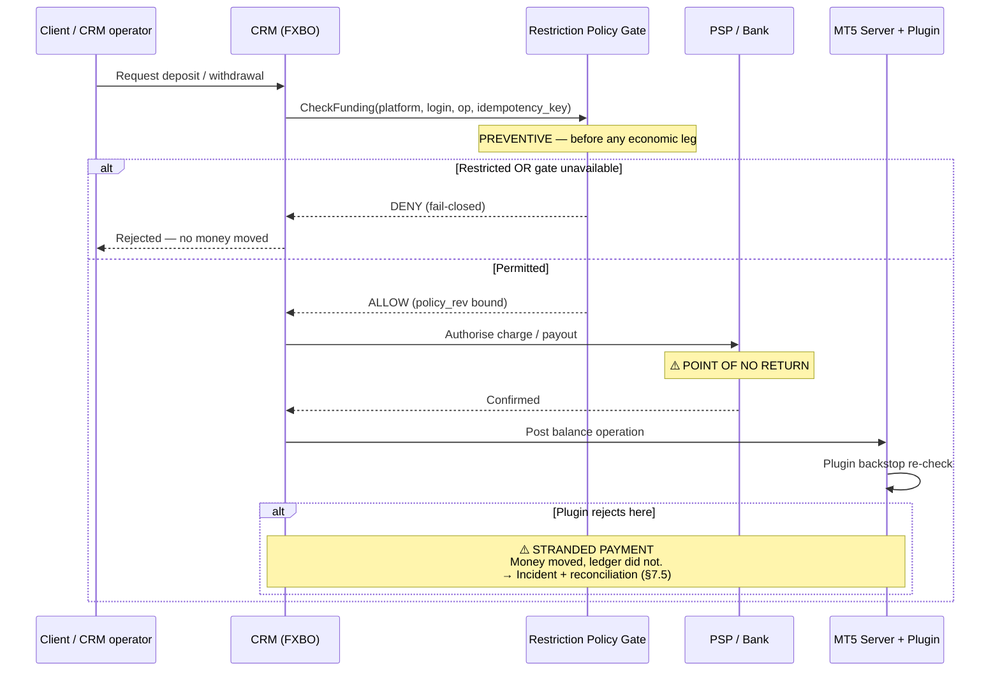
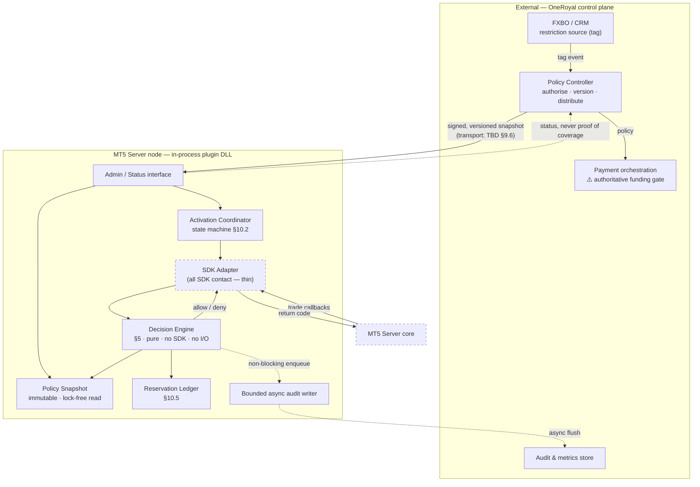
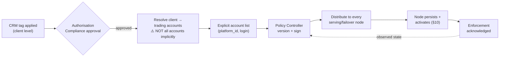
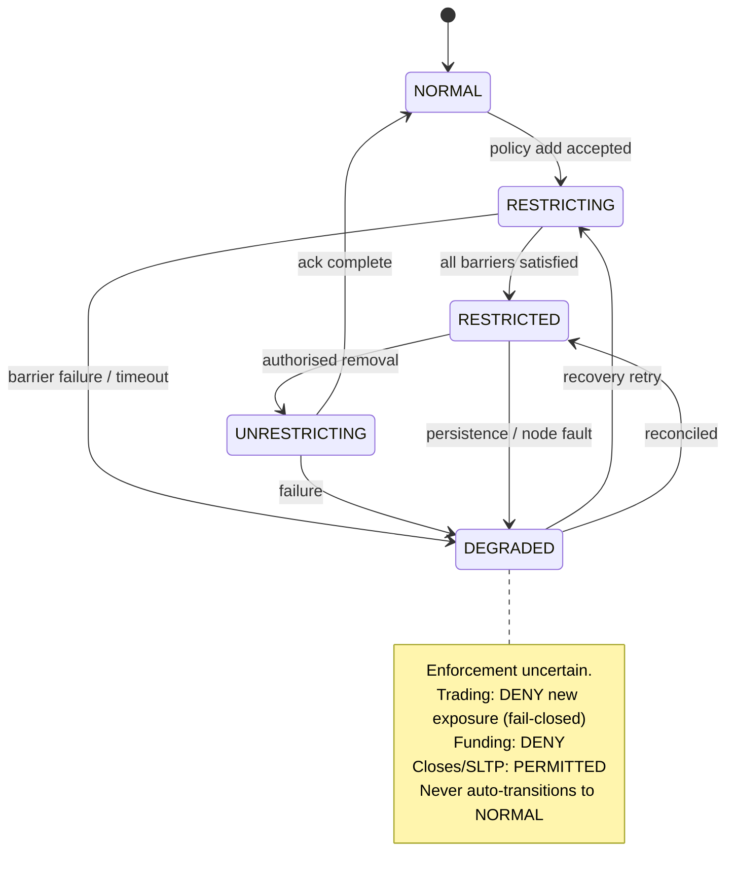

# OneRoyal — MetaTrader 5 Account-Level Restriction Plugin: Technical Specification

**Document ID:** ORL-MT5-ARP-TS
**Version:** 0.2 (DRAFT — SDK-evidenced; see §3 for what remains absent)
**Status:** For technical review. **NOT approved for production release.**
**Date:** 2026-09-19
**SDK reviewed:** MetaTrader 5 SDK 3.1 — **Server API version 6182, dated 5 Sep 2026**
(`Include/MT5APIServer.h:61-62`); Manager API 6182 (`Include/MT5APIManager.h:11-12`); Gateway API 6182.
**Audience:** Plugin developers · MT5 administrators · QA · Operations/Dealing · Payments/CRM integration owners

---

> ## EVIDENCE STATUS — READ FIRST
>
> **Supplied and read:** the SDK C++ headers (`Include/`, 395 files), the SDK examples
> (`Examples/Server`, `Examples/Manager`, `Examples/Gateway`), and the SDK documentation unpacked
> from `MetaTrader5SDK.chm` to HTML (6,677 topics). These are the primary sources for every
> statement labelled **`SDK-documented`**, each cited as `file:line` (headers actually opened) or
> `CHM: topic.htm` (documentation actually read).
>
> **Not supplied:** *Creating a Simple Plugin — Server API* (PDF). The SDK 3.1 installer does not
> ship it; the nearest primary equivalents — `Examples/Server/ServerPlugin/` and the CHM "Server
> API" section — were used instead and are cited as such. The optional earlier-analysis inputs
> (`MT5_Account_Restriction_Review.html`, `MT5_Account_Restriction_Reference_v0.1.zip`) were also
> not supplied; the six findings attributed to that review were re-checked **against primary
> sources only** (§6.7).
>
> **What changed from v0.1:** §6 is now an interface mapping with citations rather than a
> verification plan; 17 of 22 Appendix B rows are answered; three earlier-review findings are
> confirmed, one is confirmed *with a header-vs-documentation discrepancy recorded*, and two are
> resolved as "documented gap". The policy logic (§4–§5), integration design (§7–§11) and test
> matrix (§14) are unchanged in substance; where the SDK settled an open constant or constraint,
> the text now says so.
>
> **What has not changed:** no code has been compiled, no test has been run, no live MT5 server,
> gateway or payment sandbox was available. Every §14 test remains **NOT RUN**. Statements about
> runtime behaviour that the documentation does not settle remain labelled
> **`Requires runtime verification`**.

---

## Table of Contents

| § | Section | Evidence state |
|---|---|---|
| 1 | [Executive feasibility statement](#1-executive-feasibility-statement) | Complete |
| 2 | [Scope, definitions and requirement register](#2-scope-definitions-and-requirement-register) | Complete |
| 3 | [Evidence base, labelling convention and what remains open](#3-evidence-base-labelling-convention-and-what-remains-open) | Complete |
| 4 | [Restriction semantics — the authoritative business rules](#4-restriction-semantics--the-authoritative-business-rules) | Complete |
| 5 | [Trading decision algorithm](#5-trading-decision-algorithm) | Complete — volume units now SDK-documented |
| 6 | [SDK interface mapping and coverage matrix](#6-sdk-interface-mapping-and-coverage-matrix) | **SDK-documented; live verification pending** |
| 7 | [Financial enforcement and integration boundaries](#7-financial-enforcement-and-integration-boundaries) | Complete — writer inventory now SDK-documented |
| 8 | [Architecture and implementation structure](#8-architecture-and-implementation-structure) | Complete |
| 9 | [Policy data and administration contract](#9-policy-data-and-administration-contract) | Complete — transport decided on documented limits |
| 10 | [Activation, pending orders and concurrency](#10-activation-pending-orders-and-concurrency) | Complete — threading model now SDK-documented |
| 11 | [Failure modes, security and availability](#11-failure-modes-security-and-availability) | Complete |
| 12 | [Return codes, audit and observability](#12-return-codes-audit-and-observability) | Complete — codes mapped; rendering unverified |
| 13 | [Build, performance and deployment](#13-build-performance-and-deployment) | Complete — toolchain from SDK projects |
| 14 | [Verification and acceptance plan](#14-verification-and-acceptance-plan) | Complete (all tests NOT RUN) |
| 15 | [Work packages, ownership and dependencies](#15-work-packages-ownership-and-dependencies) | Complete |
| 16 | [Unresolved decisions and production release blockers](#16-unresolved-decisions-and-production-release-blockers) | Complete — re-scored on evidence |
| A | [Appendix A — Requirement traceability matrix](#appendix-a--requirement-traceability-matrix) | Complete |
| B | [Appendix B — SDK verification worksheet](#appendix-b--sdk-verification-worksheet) | 17 / 22 answered |
| C | [Appendix C — Exact SDK declarations and adapter skeleton](#appendix-c--exact-sdk-declarations-and-adapter-skeleton) | From headers; uncompiled |
| D | [Appendix D — Representative control messages](#appendix-d--representative-control-messages) | Complete |
| E | [Appendix E — Source index](#appendix-e--source-index) | Complete |
| F | [Appendix F — Glossary](#appendix-f--glossary) | Complete |

**Normative language.** MUST / MUST NOT = mandatory. SHOULD / SHOULD NOT = recommended, deviation
requires recorded justification. MAY = optional. Statements labelled **Proposed design** are
recommendations awaiting OneRoyal approval and are not yet requirements.

---

## 1. Executive feasibility statement

**The trading restriction is feasible and now rests on documented, rejectable pre-execution hooks.
The funding restriction is still NOT achievable inside MT5 alone — and the SDK evidence makes the
reason more precise, not less.**

**1.1 Trading restriction — feasible; documented preventive hooks exist.**
The SDK documents a request pipeline in which `HookTradeRequestAdd` is called *"after all checks and
verifications, but prior to adding the order"* and `HookTradeRequestProcess` *"immediately before
execution"*; in both, any return other than `MT_RET_OK` rejects the request
(**`SDK-documented`**, CHM: `hook_scheme.htm`; `imttradesink_hooktraderequestadd.htm`;
`imttradesink_hooktraderequestprocess.htm`). Server-generated SL/TP, stop-out and pending-activation
requests *"go through the same processing steps, with the call of corresponding events and hooks"*
(CHM: `hook_scheme.htm`). The decision logic in §5 is unchanged; what was a hypothesis in v0.1 is now
a documented mechanism. **What remains is live confirmation on an MT5 test server** (§14, BLK-01).

**1.2 Funding restriction — still NOT an MT5 capability. This remains the headline finding.**
The pre-charge argument of v0.1 stands untouched: an MT5 rejection after a PSP charge is a stranded
payment, not a prevented deposit. The SDK adds a second, independent reason: **the documented MT5
funding writers do not all pass through the trade-request hooks.**

| Writer | Reaches a rejectable hook? | Evidence |
|---|---|---|
| Dealer request `TA_DEALER_BALANCE` via `DealerSend` | **Yes** — `HookTradeRequestAdd` (never `HookTradeRequestProcess`) | CHM: `imttradesink_hooktraderequestadd.htm`; `imtconfirm.htm` ("confirmed automatically, not added to the execution queue") |
| Terminal transfer `TA_TRANSFER` | **Yes** — `HookTradeRequestAdd` only | same |
| `IMTManagerAPI::DealerBalance` / `DealerBalanceRaw` (direct) | **Undocumented** — the docs say balance operations "can *also* be conducted" via `TA_DEALER_BALANCE` requests, implying a distinct path | CHM: `imtmanagerapi_dealerbalance.htm` |
| Web API `POST /api/trade/balance` | **Undocumented** | CHM: `webapi_trade_balance.htm` |
| `TradeAccountSet` (gateway synchronisation) | **No hook documented**; creates `DEAL_BALANCE` / `DEAL_CORRECTION` deals directly | CHM: `imtserverapi_tradeaccountset.htm` |

**REQ-FR-01 stands: the authoritative deposit/withdrawal control MUST sit in the CRM/payment
orchestration layer.** The plugin is a backstop on the two request paths and a *detector* on the
rest (`IMTDealSink::OnDealAdd` / `OnDealPerform` fire after the ledger has changed — CHM:
`imtdealsink_ondealperform.htm`).

**1.3 Transfers — the SDK confirms there is no atomic Manager-side transfer.** The only atomic
transfer is the terminal's `TA_TRANSFER`, and it is limited to *"the same trading server … the same
type … the same deposit currency"* (CHM: `imtcongroup_tradetransfermode.htm`). No Manager or Web API
transfer method exists in the documentation set; a CRM transfer is therefore **two balance
operations** — exactly the non-atomic case §7.4 was written for. Cross-server transfers are
necessarily CRM-orchestrated and never seen whole by any plugin (§7.3, BLK-05).

**1.4 A privileged trading bypass is documented — and it is a trading bypass, not a funding one.**
`IMTServerAPI::DealPerform` (and the Manager/Admin equivalents) performs a buy/sell *"as if performed
by the client … no trade request and no order is created … routing rules are not applied"*, and only
`DEAL_BUY` / `DEAL_SELL` are permitted (CHM: `imtserverapi_dealperform.htm`). No pre-execution hook
is documented for it; `OnDealPerform` fires after the balance and position are already updated. This
is a **documented gap** that only administrative control and detection can cover (§11.4, BLK-04).

**1.5 What this restriction does not promise** — unchanged: it is a position-opening and
volume-increase restriction, not a net-exposure ceiling (§4.4); it does not guarantee every position
can always be closed; and it does not constrain administrators, who can unload the DLL or use the
privileged paths above (§11.4).

**1.6 Recommendation (revised).**

| Priority | Action | Status |
|---|---|---|
| **1** | Complete the five remaining Appendix B rows on a **live MT5 test server** | Test environment is now the gating item (WP-11) |
| **2** | Start the FXBO/payment pre-charge gate design **now** | Unchanged — longest lead time, not SDK-dependent |
| **3** | Build the policy engine (§5) as a standalone tested library | Buildable today; volume units now fixed (§5.2) |
| **4** | Build the SDK adapter against the real headers (Appendix C) | **Unblocked** — signatures are known |
| **5** | Decide the six policy questions in §4.6 and PD-09..11 | Operations / Compliance |

Coding against the real headers can start. Coding against *assumed runtime behaviour* still cannot:
the five open Appendix B rows (B-19 nullability under every action, B-20 serialization, B-22 server
behaviour on plugin failure, B-23 multi-plugin short-circuiting, B-24 terminal rendering of return
codes) each need a live server.

---

## 2. Scope, definitions and requirement register

### 2.1 In scope

A server-side MT5 plugin plus the minimum external control plane required to make it correct,
enforcing an account-level restriction that:

- prevents deposits, withdrawals and transfers touching a restricted trading account;
- prevents new positions, position-volume increases, opposing hedge openings and reversals;
- permits full closes, partial closes and SL/TP add/modify/remove;
- leaves group membership, group permissions, symbol settings and instrument configuration
  **completely untouched**.

### 2.2 Explicitly out of scope / prohibited approaches

**REQ-BR-10 (Project requirement).** The following MUST NOT be used to implement this policy:

| Prohibited approach | Why it is rejected |
|---|---|
| Moving the account to a restricted group | Changes commissions, swaps, leverage, margin and symbol access as side effects; corrupts reporting; the task forbids it. |
| Setting symbols to close-only | Global blast radius — affects every account on the platform. Forbidden. |
| Editing symbol/instrument settings | Same. Forbidden. |
| Blanket trading-disable / read-only account flag | Also blocks the closes and SL/TP edits the policy MUST permit. |
| Account cloning / migration | Breaks account identity, history, and client access. |
| Client-terminal EA or terminal-side control | Trivially bypassed; not a server control; does not cover mobile/web/API. |
| Freezing the account's equity or margin | Not a restriction mechanism; causes unintended liquidation behaviour. |

**Reading** group and symbol configuration for validation purposes is permitted and expected
(e.g. reading lot step, volume limits, fill modes). **Writing** it to enforce this policy is not.

### 2.3 Definitions

| Term | Definition |
|---|---|
| **Restricted account** | A trading account whose `(platform_id, login)` pair is explicitly present in the authorised, effective restriction policy snapshot. Nothing else makes an account restricted. |
| **Platform ID** | An unambiguous identifier for the MT5 server instance / environment (e.g. `ORL-LIVE-1`). Required because logins are only unique *within* a server. |
| **Account key** | The tuple `(platform_id, login)`. The sole enforcement key. |
| **New exposure** | Any result in which the account ends with directional exposure it did not previously hold, or more of an existing direction. |
| **Reduce-only** | An operation that strictly decreases `|volume|` of an existing position without crossing zero. |
| **Reversal** | An opposite-direction operation whose volume exceeds existing volume, leaving opposite exposure. Prohibited — it is a new position in disguise. |
| **Point of no return** | The instant after which an operation's economic effect cannot be withdrawn by the plugin (e.g. LP fill received, PSP charge authorised). |
| **Preventive control** | A rejectable check evaluated *before* the point of no return. |
| **Detective control** | A post-event observation. **Never** a substitute for a preventive control. |
| **Effective policy** | The persisted, versioned snapshot currently loaded and active on a specific plugin node. |

### 2.4 Requirement register (summary — full traceability in Appendix A)

| ID | Requirement | Source | Priority |
|---|---|---|---|
| REQ-BR-01 | Restriction applies at trading-account granularity, never client-wide by inference | Task §3 | MUST |
| REQ-BR-02 | Account identified by `(platform_id, login)` | Task §3 | MUST |
| REQ-BR-03 | A CRM tag MAY trigger policy, but is not itself the enforcement source of truth | Task §3 | MUST |
| REQ-BR-04 | Unlisted accounts keep existing permissions unchanged | Task §3 | MUST |
| REQ-BR-05 | Plugin never grants permissions or bypasses other controls | Task §3 | MUST |
| REQ-BR-10 | No group/symbol/clone/blanket-disable/EA implementation | Task §3 | MUST |
| REQ-TR-01..12 | Trading decision rules | Task §3, §5 | MUST |
| REQ-FR-01..12 | Funding rules and integration boundaries | Task §6 | MUST |
| REQ-PC-01..10 | Policy contract and administration | Task §8 | MUST |
| REQ-ACT-01..09 | Activation, pending orders, concurrency | Task §9 | MUST |
| REQ-SEC-01..08 | Security and trust boundary | Task §10 | MUST |
| REQ-OBS-01..06 | Audit and observability | Task §11 | MUST |

---

## 3. Evidence base, labelling convention and what remains open

### 3.1 Source inventory — actual state

| Source required by the task | Supplied as | Read? | Notes |
|---|---|---|---|
| `MetaTrader5SDK.chm` | `MT5SDK_3_1_docs_html.zip` → `Docs/html/*.htm` (6,677 topics, English) | **Yes** — the topics cited in Appendix E | Unpacked CHM content; cited as `CHM: topic.htm` |
| `API.zip` (Server API headers) | `MT5SDK_3_1_essentials.zip` → `Include/MT5APIServer.h`, `Include/Bases/*.h`, `Include/Config/*.h`, `Include/MT5APIConstants.h`, `Include/MT5APITypes.h` | **Yes** — files cited with line numbers | 395 headers; Server API **version 6182, 5 Sep 2026** |
| `Manager.zip` (Manager API + examples) | same archive → `Include/MT5APIManager.h`, `Examples/Manager/*` | **Yes** | Manager API version 6182 |
| *Creating a Simple Plugin — Server API* (PDF) | **Not supplied** | No | Not shipped in SDK 3.1. `Examples/Server/ServerPlugin/` and CHM `imtserverplugin*.htm`, `mtserverabout.htm`, `mtservercreate.htm` used instead |
| `MT5_Account_Restriction_Review.html` (optional) | Not supplied | No | Its six findings re-checked against primary sources (§6.7) |
| `MT5_Account_Restriction_Reference_v0.1.zip` (optional) | Not supplied | No | No staging reference |
| `README.md` inside the essentials archive | Supplied | Yes | **Third-party extraction note, not MetaQuotes documentation.** Used only for provenance (installer 5.0.0.6204, built 2026-01-02). Its technical remarks were independently verified and are not cited as evidence |

**SDK version reviewed:** `MTServerAPIVersion 6182` (`Include/MT5APIServer.h:61`), `MTServerAPIDate
L"5 Sep 2026"` (`:62`). **Installed MT5 server build and production topology: still UNKNOWN.**
Binaries in the SDK were not executed; only source text and documentation were inspected.

### 3.2 Which sections remain evidence-limited

| Section | State | What is still open |
|---|---|---|
| §5 Decision algorithm | Complete | Nothing — volume scale documented (§5.2) |
| §6 SDK mapping | **Documented; live verification pending** | Five Appendix B rows need a running server (B-19, B-20, B-22, B-23, B-24) |
| §7 Funding | Design complete | Whether direct `DealerBalance*` and Web API balance calls traverse `HookTradeRequestAdd` is undocumented (B-08 residual) |
| §10 Concurrency | Design complete | No per-account serialization guarantee is documented; reservation ledger stays (B-20) |
| §12 Return codes | Mapped | Terminal rendering of each code unverified (B-24) |
| §13 Build | Complete | Toolchain from SDK projects; the tutorial PDF's own advice unavailable |
| §14 Tests | Complete as specification | **All NOT RUN** |

### 3.3 Labelling convention

- **`SDK-documented`** — supported by a cited header line (`path:line`) or CHM topic (`CHM: topic.htm`),
  both actually opened. Where a header and the documentation disagree, **both are cited and the
  discrepancy is recorded** (see §6.7-d).
- **`Project requirement`** — mandated by OneRoyal's task specification.
- **`Proposed design`** — the author's recommendation, requiring OneRoyal approval.
- **`Requires runtime verification`** — cannot be settled by headers or documentation; needs a live
  MT5 test server. Each carries an Appendix B row.
- **`Requires vendor clarification`** — needs a written MetaQuotes answer.

### 3.4 Evidence rules binding on the implementation team

**REQ-EV-01 (Project requirement).** Headers establish *declarations*; documentation establishes
*behaviour*. Where they conflict, the discrepancy MUST be recorded with its design effect. One such
conflict exists in this SDK version and is recorded at §6.7-d (`IMTRequest::SourceLogin`).

**REQ-EV-02.** Line-number citations MUST only be written for files actually opened. All line
numbers in this document were read from the supplied SDK 3.1 headers; they MUST be re-verified on
any SDK upgrade (REQ-BLD-13).

**REQ-EV-03.** Public MQL5 *terminal* API documentation MUST NOT be substituted as evidence for
licensed *Server* API behaviour. No external source was used in this document.

**REQ-EV-04.** Inventing API methods, configuration flags, built-in account tags or callback
guarantees is prohibited. Every identifier in §6 and Appendix C was read from the headers.

---

## 4. Restriction semantics — the authoritative business rules

These rules are **`Project requirement`** unless marked otherwise. They are SDK-independent and are
the acceptance standard for §5.

### 4.1 The operation table

| Operation on a restricted account | Required outcome | Req ID |
|---|---|---|
| Deposit funds | **Prevent** | REQ-FR-02 |
| Withdraw funds | **Prevent** | REQ-FR-03 |
| Transfer in or out | **Prevent** — validate **both** endpoints | REQ-FR-04 |
| Open a new position | **Prevent** | REQ-TR-01 |
| Increase an existing position's volume | **Prevent** | REQ-TR-02 |
| Open a separate opposing hedge | **Prevent** — it is a new position | REQ-TR-03 |
| Reverse a position into opposite exposure | **Prevent** | REQ-TR-04 |
| Fully close an existing position | **Permit**, subject to ordinary MT5 validation | REQ-TR-05 |
| Partially close an existing position | **Permit**, without creating opposite exposure | REQ-TR-06 |
| Modify SL/TP on an existing position | **Permit**, without permitting unrelated changes | REQ-TR-07 |

### 4.2 What "no new trades" means — precisely

**REQ-TR-08.** "No new trades" means **no new positions, no position-volume increases, and no
reversals.** It explicitly does **not** prohibit the orders and deals required to *execute an exit*.
A close generates an order and a deal; rejecting those because they are "new orders" would defeat
the policy's own requirement to permit closes. The enforcement predicate is the **resulting
exposure**, never the existence of an order or deal record.

**REQ-TR-09.** "Resizing smaller" means a **genuine partial close** that produces a real closing
deal with real execution and real P/L settlement. It **MUST NOT** be implemented by rewriting a
position's stored volume field. Overwriting a volume record fabricates accounting, destroys the
audit trail and is prohibited.

### 4.3 Unlisted accounts

**REQ-BR-04.** An account not in the effective policy continues under its existing MT5 permissions,
with exactly one exception: **it cannot transfer to or from a restricted endpoint** (REQ-FR-04).
An unrestricted counterparty does not launder a restricted endpoint.

**REQ-BR-05.** The plugin MUST NOT grant any permission, relax any existing control, or provide a
bypass for any account, restricted or not. If a request would be rejected by ordinary MT5
validation, the plugin's "allow" decision MUST leave that rejection intact — the plugin's allow is
"no objection from this policy", never "force execution".

### 4.4 Exposure is not the invariant — this matters

**REQ-TR-10.** This is a **position-opening and volume-increase restriction, not a net-exposure
ceiling.**

Worked case (hedging mode): account holds `BUY 1.00 EURUSD` and `SELL 1.00 EURUSD`; net exposure
zero. The client closes the `SELL 1.00` leg. Net directional exposure **rises from 0 to +1.00 BUY**.

**This close MUST be permitted.** Rejecting it because net exposure increased would be a false
denial of a legitimate exit and a direct violation of REQ-TR-05.

**REQ-TR-11.** The policy makes **no promise of monotonically decreasing economic risk.** Permitted
operations (closing a hedge leg, widening a stop, removing a take-profit) can each increase risk.
Operations/Dealing MUST be briefed on this, and any expectation of decreasing risk is a separate,
unapproved requirement.

### 4.5 Preserved behaviour

**REQ-TR-12.** The plugin MUST preserve:

- normal account access, login and visibility (no hiding accounts, no forced logout) unless a
  separate approved requirement says otherwise;
- SL and TP triggered exits;
- stop-out / forced liquidation by the server;
- margin-call processing;
- the accounting required to settle permitted closes — realized P/L, commission, swap and
  mandatory settlement postings (§7.6). **A funding restriction that rejects the ledger entries of
  a legitimate close makes closing impossible and is a defect, not a stricter control.**

### 4.6 Policy decisions beyond the original request

These are **decisions OneRoyal must make**, not settled requirements. Defaults below are
**`Proposed design`** and require sign-off.

| ID | Question | Proposed default | Rationale | Approver |
|---|---|---|---|---|
| PD-01 | New **entry** pending orders (limit/stop) on a restricted account | **Deny** placement, and deny their activation into a position | A pending entry order is a deferred new position; permitting it defeats the policy | Operations/Dealing |
| PD-02 | **Cancellation** of existing pending orders | **Permit** always | Cancellation only removes potential exposure | Operations/Dealing |
| PD-03 | Pending entry orders **inherited** at activation | **Remove safely** during RESTRICTING (§10.4) | Otherwise the account opens a new position after restriction | Operations/Dealing |
| PD-04 | **Widening or removing** SL/TP | **Permit** | Within "modify SL/TP"; permitting only tightening would trap clients | Operations/Dealing |
| PD-05 | **Tightening** SL/TP | **Permit** (same as PD-04) — but flag: tightening accelerates exit | Both directions are protective-level edits | Operations/Dealing |
| PD-06 | Automatic restriction **expiry** | **None.** Restrictions persist until explicitly removed | Auto-expiry silently re-enables a restricted account | Compliance |
| PD-07 | Pending orders that *close* a position (e.g. a stop targeting an open position) | Permit **only** where reduce-only can be validated at activation, not from the order's label (§5.8) | Labels are not authorisation | Operations/Dealing |
| PD-08 | Manual credit / bonus / correction / fee / negative-balance ops | **Deny by default**; exceptions only via approved, audited, narrowly scoped authorisation (§7.7) | Otherwise every restriction has an open back door | Compliance + Finance |

**REQ-BR-06.** Tightening the SL/TP rules or introducing *financial* exceptions MUST go through
written approval. Silent scope changes are prohibited.

---

## 5. Trading decision algorithm

This section is **SDK-independent**. It defines the decision given a set of inputs; §6 defines how
those inputs are obtained. Implement this as a standalone library with no SDK dependency
(§8.3) so it can be unit- and property-tested today.

### 5.1 Decision inputs and invariants

**REQ-TR-20.** Every decision MUST be a pure function of:

| Input | Type | Invariant that MUST hold |
|---|---|---|
| `platform_id` | opaque ID | Matches this node's configured platform. Mismatch ⇒ reject (fail-closed). |
| `login` | uint64 | The account the request acts on. Owner of the target position. |
| `action` | enum | The trade action. Unknown value ⇒ **deny** (§5.9). |
| `symbol` | string | Normalised; must match the target position's symbol exactly. |
| `req_dir` | BUY / SELL | Requested direction. |
| `req_volume` | **int64, integer lot units** | `> 0`. Zero or negative ⇒ reject. |
| `target_ticket` | uint64 \| 0 | Position/order ticket if ticket-targeted. |
| `existing` | position state | Retrieved from the server, **never from the request**. |
| `account_mode` | NETTING / HEDGING | Retrieved from account/group config (read-only). |
| `policy_rev` | uint64 | The snapshot revision that decided. Recorded in audit. |

**REQ-TR-21 — Ownership.** The target position MUST belong to `login`. A ticket owned by another
account ⇒ reject, audit as a targeting violation. Never infer ownership from the request.

**REQ-TR-22 — Server truth.** Existing position identity, symbol, direction and volume MUST be read
from the server's position store, never from client-supplied request fields. The request states
intent; it is not evidence of state.

### 5.2 Volume arithmetic — integers only

**REQ-TR-23 (MUST).** All volume comparisons MUST use the SDK's documented **integer** volume
representation. Floating-point lots MUST NOT be used to establish authorisation.
`if (fabs(a-b) < 1e-8)` as an authorisation test is a defect: it admits a tolerance band in which an
increase is misread as a flat close.

**`SDK-documented` (B-14 resolved).** Two integer representations exist on every request,
position, deal and confirmation object: `Volume()` — *one unit = 1/10,000 lot* — and `VolumeExt()` —
*one unit = 1/100,000,000 lot* (e.g. 105,000,000 = 1.05 lots) (CHM: `imtrequest_volume.htm`,
`imtrequest_volumeext.htm`, `imtposition_volume.htm`, `imtposition_volumeext.htm`;
`Bases/MT5APIRequest.h:113,190`; `Bases/MT5APIPosition.h:134,207`; `Bases/MT5APIConfirm.h:33,69`).
**The implementation MUST use `VolumeExt()` on both sides of every comparison** (`uint64_t`,
`VOLUME_UNITS_PER_LOT = 100'000'000`) and MUST NOT mix it with `Volume()`. **Mixing the two in one
comparison is a critical defect** — it compares values 10,000× apart in scale.

```
// Guarded arithmetic. No floats anywhere on the authorisation path.
static_assert(std::is_same_v<VolumeUnits, std::int64_t>);

enum class VolumeError { OK, ZERO, NEGATIVE, OVERFLOW, NOT_LOT_STEP_ALIGNED };

VolumeError ValidateVolume(VolumeUnits v, VolumeUnits lot_step) {
    if (v == 0)                      return VolumeError::ZERO;
    if (v < 0)                       return VolumeError::NEGATIVE;
    if (lot_step > 0 && v % lot_step != 0) return VolumeError::NOT_LOT_STEP_ALIGNED;
    return VolumeError::OK;
}

// Signed net volume: BUY positive, SELL negative. Overflow-checked.
bool TryAddSigned(VolumeUnits a, VolumeUnits b, VolumeUnits& out) {
    return !__builtin_add_overflow(a, b, &out);   // MSVC: use SafeInt / intrinsics
}
```

**REQ-TR-24.** Overflow MUST be detected, not wrapped. Any arithmetic failure ⇒ **deny** and audit
as `ERR_ARITHMETIC`. A wrapped comparison could turn a reversal into an apparent reduction.

**REQ-TR-25 — Lot step.** Lot-step and min/max volume are **read** from symbol configuration for
validation only. The plugin MUST NOT modify symbol settings (REQ-BR-10). If a requested close
volume is not lot-step aligned, the plugin **rejects**; it MUST NOT round the client's quantity
(REQ-TR-28).

### 5.3 The core predicate — netting mode

Let `V` = signed net volume of the account's existing position in `symbol`
(BUY = `+`, SELL = `−`; `V = 0` if flat).
Let `r` = signed requested volume (BUY = `+req_volume`, SELL = `−req_volume`).

**REQ-TR-26 — Netting allow rule.** Allow **if and only if all** hold:

1. `V != 0` — there is something to reduce; and
2. `sign(r) == -sign(V)` — the request opposes the existing position; and
3. `|r| <= |V|` — the request does not exceed what exists.

Otherwise **reject**. Equivalently: allow iff `|V + r| < |V|` **and** `sign(V + r) ∈ {sign(V), 0}`.

This single rule produces every required outcome. Worked example — existing `BUY 1.00`, no
outstanding conflicting request, `V = +1.00`:

| Requested | `r` | `V + r` | Rule check | Decision | Result |
|---|---|---|---|---|---|
| SELL 0.40 | −0.40 | +0.60 | opposite ✓, 0.40 ≤ 1.00 ✓ | **Allow** | BUY 0.60 remains |
| SELL 1.00 | −1.00 | 0.00 | opposite ✓, 1.00 ≤ 1.00 ✓ | **Allow** | Flat |
| BUY 0.20 | +0.20 | +1.20 | same sign ✗ | **Reject** | Would increase to BUY 1.20 |
| SELL 1.20 | −1.20 | −0.20 | opposite ✓, 1.20 > 1.00 ✗ | **Reject** | Would reverse to SELL 0.20 |
| SELL 0.40 *after the position already closed* | −0.40 | −0.40 | `V == 0` ✗ | **Reject** | Would create a new position |

The final row is the reason condition (1) exists and why state MUST be re-read at decision time
(§5.10, §10.5). A stale cached `V` would wrongly allow a brand-new SELL.

### 5.4 The core predicate — hedging mode

In hedging mode positions are independent; net symbol volume is **not** the invariant.

**REQ-TR-27 — Hedging allow rule.** Allow **if and only if**:

1. the request is **ticket-targeted** at an existing position `P`; and
2. `P.login == login` (ownership); and
3. `P.symbol == symbol`; and
4. `req_dir == opposite(P.direction)`; and
5. `0 < req_volume <= P.volume_remaining`.

An opposite-direction request that is **not** ticket-targeted at an existing position is a **new
opposing position** ⇒ **reject** (REQ-TR-03). A same-direction request is an increase ⇒ **reject**.

| Case | Decision |
|---|---|
| Ticket-targeted opposite, `volume < P.volume` | **Allow** — partial close |
| Ticket-targeted opposite, `volume == P.volume` | **Allow** — full close |
| Ticket-targeted opposite, `volume > P.volume` | **Reject** — oversized (REQ-TR-28) |
| Untargeted opposite-direction order | **Reject** — new hedge position |
| Same-direction order (targeted or not) | **Reject** — increase |
| Ticket targets another account's position | **Reject** + security audit |
| Ticket targets a closed/stale position | **Reject** — nothing to reduce |

**REQ-TR-28 — No silent quantity rewriting.** An oversized closing request MUST be **rejected**, not
silently reduced to the available volume. Rewriting a client's order quantity changes their
instruction without consent and can produce an unexpected residual position. Auto-clamping requires
a separate, explicitly approved requirement; it is **not** authorised by this specification.

### 5.5 Close By

**REQ-TR-29.** For a Close-By operation between positions `A` and `B`, allow **iff**:

1. `A.login == B.login == login`; and
2. `A.symbol == B.symbol == symbol`; and
3. `A.direction == opposite(B.direction)`; and
4. both are live, non-zero-volume positions; and
5. neither ticket resolves to a position created by this same request.

Unequal volumes are acceptable — a partial Close By reduces the larger leg and closes the smaller.
The residual MUST remain on the original side; the operation MUST NOT be permitted if the platform
would implement it by opening a new position.

**REQ-TR-30.** Pre-existing platform restrictions on Close By (group permissions, symbol settings,
account mode) MUST be preserved. The plugin's allow never enables a Close By that MT5 would
otherwise refuse (REQ-BR-05).

**REQ-TR-31.** Per REQ-TR-10, a Close By that raises net directional exposure MUST still be
permitted if it satisfies the rule above.

### 5.6 Do not trust labels

**REQ-TR-32 (MUST).** The decision MUST NOT rely on:

- a "close" flag or position-effect flag in the request;
- the request comment or any free-text field;
- a declared exit reason;
- an order's label, name or magic number;
- the client application's claim about what the order does.

All of these are attacker- or bug-controlled. **Authorisation MUST derive solely from validated
server-side state** — the target position's real ownership, symbol, direction and remaining volume
versus the real requested direction and volume. A request labelled "partial close" that resolves to
an untargeted opposite-side order is a new hedge and MUST be rejected.

### 5.7 Deal-type treatment

**REQ-TR-33.** Deal entry classification (entry / exit / reversal / close-by) MUST be treated as
follows:

| Classification | Expectation under restriction | Handling |
|---|---|---|
| **Entry** | Should never occur on a restricted account | If observed post-execution ⇒ **breach**: alert, incident, reconcile (§12.5). Detection, not prevention. |
| **Exit** | Expected and permitted | Allow associated accounting (§7.6). |
| **Reversal** | Must never occur | Prevented pre-execution; if observed ⇒ breach. |
| **Close By** | Permitted per §5.5 | |

**`SDK-documented` (B-18 resolved).** `IMTDeal::EnDealEntry` = `ENTRY_IN` (0), `ENTRY_OUT` (1),
`ENTRY_INOUT` (2, reverse), `ENTRY_OUT_BY` (3) (`Bases/MT5APIDeal.h:44-53`). The recalculated `deal`
is passed **into `HookTradeRequestProcess` before execution** (CHM:
`imttradesink_hooktraderequestprocess.htm`), so `deal->Entry()` is available as a *preventive*
cross-check at stage 7: an `ENTRY_IN` or `ENTRY_INOUT` deal for a restricted account MUST be rejected
there even if stage 3 was somehow passed. Observed on `OnDealAdd`/`OnDealPerform` it is detective (§12.5).

### 5.8 SL/TP-only validation — separate path

**REQ-TR-34.** An SL/TP modification MUST be validated on a distinct code path from execution, and
allowed **only if it changes nothing but protective levels**.

```
Decision ValidateProtectiveLevels(req, P /* server-side position */) {
    if (P.login   != req.login)         return DENY(ERR_OWNERSHIP);
    if (P.ticket  != req.ticket)        return DENY(ERR_IDENTITY);
    if (P.symbol  != req.symbol)        return DENY(ERR_SYMBOL_MISMATCH);
    if (req.changes_volume())           return DENY(ERR_SLTP_WITH_VOLUME);
    if (req.changes_open_price())       return DENY(ERR_SLTP_WITH_PRICE);
    if (req.changes_direction())        return DENY(ERR_SLTP_WITH_DIRECTION);
    if (req.changes_ownership())        return DENY(ERR_SLTP_WITH_OWNERSHIP);
    // Only SL/TP fields differ → permitted (PD-04, PD-05)
    return ALLOW(REASON_SLTP_ONLY);
}
```

**REQ-TR-35.** A request that bundles an allowed protective-level change with an unauthorised
volume, price, direction, ownership or identity change MUST be **rejected in full**. The plugin MUST
NOT strip the unauthorised part and execute the remainder — partial execution of a modified
instruction is a silent rewrite (REQ-TR-28).

**REQ-TR-36.** Covered under this path: SL/TP **addition**, **modification**, **removal**, and
**trailing-stop-generated updates** arriving as ordinary modification requests. The plugin MUST NOT
implement a server-side trailing-stop service; it only validates the updates it observes.

**`SDK-documented`:** for `TA_SLTP` (and `TA_DEALER_POS_MODIFY`, `TA_TRANSFER`, `TA_DEALER_BALANCE`,
`TA_PRICE`) the `order` and `order_new` parameters of `HookTradeRequestAdd` are **always NULL** (CHM:
`imttradesink_hooktraderequestadd.htm`). The `position` parameter is documented only as *"corresponds
to the client and symbol"*; under hedging the request carries the target ticket in
`IMTRequest::Position()` (*"must be specified if the account supports the hedging option"*, CHM:
`imtrequest_position.htm`). The validator MUST therefore retrieve the position by
`PositionGetByTicket` (hedging) or `PositionGet(login, symbol)` (netting) and MUST deny when
retrieval fails. **`Requires runtime verification` (B-19 / BLK-13):** whether `symbol`/`position`
are NULL for these actions.

### 5.9 Unknown, ambiguous and edge-case handling

**REQ-TR-37 — Unknown action ⇒ deny (fail-closed).** An action enumerator the plugin does not
recognise MUST be denied for restricted accounts and audited as `ERR_UNKNOWN_ACTION` with the raw
value. Classification MUST NOT be reduced to "BUY vs SELL": the action space includes client orders,
dealer operations, server-generated operations, pending orders, protective exits and financial
operations, each with different semantics. **`SDK-documented` (B-10 resolved)** — the complete enumerator list for SDK 6182 is classified in §6.5. A new enumerator appearing after an SDK upgrade MUST be treated as
unknown (deny) until explicitly classified, and MUST raise an alert.

**REQ-TR-38 — Edge cases.**

| Case | Required handling |
|---|---|
| Stale/closed position | Reject; there is nothing to reduce. Never treat as a permitted close. |
| Missing ticket | Reject unless netting mode makes the target unambiguous via §5.3. |
| Mismatched ticket (symbol/owner differs) | Reject; audit as targeting violation. |
| Position retrieval fails | **Deny** (fail-closed). Never allow on lookup failure. |
| Utility/rollover ticket change | **`SDK-documented`:** the position ticket **changes** when a position is re-opened by rollover, split, variation margin, external sync or symbol transfer, and on a netting reversal in one `ENTRY_INOUT` deal (CHM: `imtposition_position.htm`). No stable cross-rollover identifier is documented (B-15). Netting: key by `(login, symbol)`. Hedging: treat a new ticket as a new identity and re-derive reservations from live positions after any `POSITION_REASON_ROLLOVER/SPLIT/VMARGIN/SYNC/TRANSFER` event (`Bases/MT5APIPosition.h:49-63`). |
| Partial fill | Remaining volume MUST be recomputed from server state before any subsequent decision. |
| Requote / re-price | Re-validate on the re-submitted request; a prior allow does not carry over. |
| Order-only acknowledgement (no deal) | Not evidence of execution. Reservation stays held (§10.5). |
| Pending order intended to close | PD-07: validate reduce-only at **activation** against live state, not from the label. |
| Zero/invalid volume | Reject (`VolumeError`). |
| Duplicate request ID | Idempotent — return the original decision; do not double-reserve. |

**REQ-TR-39.** Documented lifecycle operations (rollover, swap application, corrections) MUST be
handled explicitly and safely. The implementation MUST NOT introduce a general "privileged bypass"
flag — a blanket exemption is the single most likely route to a silent policy hole (§7.7, §11.4).

### 5.10 Decision procedure (normative pseudocode)

```
Decision EvaluateTradeRequest(const Request& q) {

    // 1. Policy lookup — O(1), lock-free read of the immutable snapshot (§8.4)
    const Snapshot& snap = g_policy.Acquire();          // refcounted, never blocks
    if (snap.platform_id != q.platform_id) return DENY(ERR_PLATFORM_MISMATCH);
    if (!snap.IsRestricted(q.login))       return ALLOW(REASON_NOT_RESTRICTED);
    //  ^ unlisted accounts: unchanged behaviour (REQ-BR-04), except transfers (§7.3)

    // 2. Classify action. Unknown ⇒ deny (REQ-TR-37)
    ActionClass cls = Classify(q.action);
    if (cls == ActionClass::Unknown)  return DENY(ERR_UNKNOWN_ACTION);
    if (cls == ActionClass::Financial) return EvaluateFinancial(q);        // §7
    if (cls == ActionClass::ProtectiveLevelsOnly)
        return ValidateProtectiveLevels(q, FetchPositionOrDeny(q.ticket)); // §5.8
    if (cls == ActionClass::PendingCancel)  return ALLOW(REASON_CANCEL_OK); // PD-02
    if (cls == ActionClass::PendingEntryPlace) return DENY(ERR_NEW_ENTRY_ORDER); // PD-01
    if (cls == ActionClass::CloseBy)   return EvaluateCloseBy(q);          // §5.5

    // 3. Volume sanity BEFORE any state work
    if (ValidateVolume(q.volume, SymbolLotStep(q.symbol)) != VolumeError::OK)
        return DENY(ERR_VOLUME_INVALID);

    // 4. Read authoritative server-side state. Failure ⇒ deny.
    PositionView P;
    if (!FetchPositionState(q, /*out*/ P)) return DENY(ERR_STATE_UNAVAILABLE);

    // 5. Apply the mode-specific predicate
    Decision d = (P.mode == Mode::Netting) ? EvaluateNetting(q, P)   // §5.3
                                           : EvaluateHedging(q, P);  // §5.4
    if (!d.allowed) return d;

    // 6. Reserve the reduction so concurrent closes cannot jointly overshoot (§10.5)
    if (!g_reservations.TryReserve(q.correlation_id, P.key, q.volume))
        return DENY(ERR_CONCURRENT_RESERVATION);

    d.policy_rev = snap.revision;      // bind the deciding revision for audit
    return d;                           // ALLOW — normal routing MUST proceed unchanged
}
```

**REQ-TR-40.** On **allow**, the plugin MUST leave normal request routing and ordinary MT5
validation completely intact. An allow is "this policy raises no objection" — never a forced
execution or a bypass (REQ-BR-05, §12.1).

---

## 6. SDK interface mapping and coverage matrix

All statements in this section are **`SDK-documented`** unless labelled otherwise. Header citations
are `Include/<file>:<line>` from SDK 3.1 (Server API 6182); documentation citations are
`CHM: <topic>.htm`. Signatures are reproduced verbatim in Appendix C.

### 6.1 Lifecycle

| Element | Declaration | Documented behaviour | Design consequence |
|---|---|---|---|
| Entry points | `MTAPIENTRY MTAPIRES MTServerAbout(MTPluginInfo& info)`; `MTAPIENTRY MTAPIRES MTServerCreate(uint32_t apiversion, IMTServerPlugin** plugin)` — `MT5APIServer.h:1165-1166`. `MTAPIENTRY` = `extern "C" __declspec(dllexport)` (`MT5APITypes.h:10`); `MTAPIRES` = `uint32_t` (`MT5APITypes.h:14`) | `MTServerAbout` fills `MTPluginInfo`; a non-`MT_RET_OK` return keeps the plugin out of the module list (CHM: `mtserverabout.htm`). `MTServerCreate` receives *"the current version of the Server API supported by the server"* (CHM: `mtservercreate.htm`) | **REQ-SDK-07:** `MTServerCreate` MUST compare `apiversion` with `MTServerAPIVersion` and return an error on mismatch. The reference example does not (`Examples/Server/ServerPlugin/ServerPlugin.cpp:47-56`); the docs do not say the server enforces it. |
| `MTPluginInfo` | `MT5APIServer.h:87-99` — `version_api`, `name[64]`, `defaults[128]` of `MTPluginParam` (`value[256]`, `:70-80`), `#pragma pack(push,1)` | Passed via `MTServerAbout` (CHM: `mtplugininfo.htm`) | `version_api` MUST be `MTServerAPIVersion`. Byte packing is mandatory — never redeclare. |
| `IMTServerPlugin` | `class IMTServerPlugin { Release(); Start(IMTServerAPI*); Stop(); }` — `MT5APIServer.h:1154-1161` | `Start` is called at boot after database preparation (for secondary/history servers, after sync with the main server) and when a plugin configuration is enabled. **A non-`MT_RET_OK` return means the plugin is not loaded and its object destroyed; the configuration is *not* disabled and the server retries `Start` on any plugin-configuration change** (CHM: `imtserverplugin_start.htm`). `Stop` is called at shutdown and when the configuration is disabled; the server has already unsubscribed the plugin from all events by then; after `Stop` the object may be destroyed at any time; the DLL unloads only after all objects are removed (CHM: `imtserverplugin.htm`, `imtserverplugin_stop.htm`). `Release` deletes unconditionally — **API objects do not reference-count** (CHM: `imtserverplugin.htm`) | Persisted snapshot MUST be loaded inside `Start` before subscribing (§9.4). `Stop` MUST drain and MUST NOT call the API afterwards. `Release` = `delete this`, exactly as `Examples/Server/ServerPlugin/PluginInstance.cpp:24-27`. |
| `MTServerInfo` / `About` | `MT5APIServer.h:104-113`; `IMTServerAPI::About(MTServerInfo&)` `:363` | Provides `platform_name`, `server_type`, **`server_id`** (CHM: `mtserverinfo.htm`, `imtserverapi_about.htm`) | **REQ-SDK-08:** `platform_id` (§2.3) MUST be bound to `server_id` + `platform_name` read at `Start`; a policy snapshot whose `platform_id` does not match MUST NOT be activated (§5.10 step 1). |
| Subscriptions | `TradeSubscribe(IMTTradeSink*)` `:734`; `DealSubscribe(IMTDealSink*)` `:635`; `PluginSubscribe(IMTConPluginSink*)` `:387`; `CustomSubscribe(IMTCustomSink*)` `:726` | Thread-safe; duplicate subscription → `MT_RET_ERR_DUPLICATE`; **the sink object must remain in memory until unsubscribed or the plugin is deleted** (CHM: `imtserverapi_tradesubscribe.htm`, `imtserverapi_dealsubscribe.htm`, `imtserverapi_pluginsubscribe.htm`). *"A plugin starts processing of events only after the `Start` method is executed"* (CHM: `imtserverplugin_start.htm`) | Required subscriptions: **Trade** (enforcement), **Deal** (detection), **Plugin** (config-change trigger), **Custom** (control channel). Sinks are members of the plugin instance, never temporaries. |

### 6.2 The documented request pipeline

CHM: `hook_scheme.htm` documents the full path. Stages relevant to enforcement, with the thread the
documentation names for each:

| # | Stage | Thread | Hook / event | Rejectable? |
|---|---|---|---|---|
| 1 | Request received, signature validated, added to initial queue | — | `IMTRequestSink::OnRequestAdd` (event) | No |
| 2 | **Primary verification**: group/symbol permissions, sessions, account enabled / trading allowed / not read-only, volume, prices, stops, order and volume limits, **margin** | *"A separate stream"* | — | — |
| 3 | *"After all checks and verifications, but prior to adding the order"* | same | **`HookTradeRequestAdd`** | **Yes** — any code ≠ `MT_RET_OK` rejects with that code |
| 4 | Order created in *Started* state (only for order-placing requests) | same | `OnTradeRequestAdd` (event) | No |
| 5 | Routing queue, *"handled in a separate thread"*; before routing rules | routing thread | **`HookTradeRequestRoute`** | Yes — but `MT_RET_REQUEST_DONE` **confirms without routing rules**; `MT_RET_OK` applies rules; other → reject |
| 6 | Routing → dealer / gateway / auto-confirm; gateway may answer `MT_RET_REQUEST_PLACED` (order handed to external system) | — | — | — |
| 7 | Execution queue, *"a separate stream executes verified requests"*; *"immediately before execution"* | execution thread | **`HookTradeRequestProcess`** / **`…CloseBy`** | **Yes** — code ≠ `MT_RET_OK` rejects |
| 8 | Deal created | | `IMTDealSink::OnDealPerform` (event) | No — *"the deal has been executed and … already reflected on the trading account balance"* (CHM: `imtdealsink_ondealperform.htm`) |
| 9 | Request executed | | `OnTradeRequestProcess` (event) | No |
| 10 | Gateway sends an execution for a *Placed* order; *"the hook is called before the execution is applied"* | | **`HookTradeExecution`** | Yes — but the fill **already exists in the external system** (§10.6) |
| 11 | Execution applied | | `OnTradeExecution` (event) | No |

Two documented facts shape the whole design:

- **Server-generated actions traverse the same pipeline.** *"Processing of pending order activation
  requests, position closure by Stop Loss, Take Profit and Stop Out requests is performed similarly
  to processing of regular trading requests … with the call of corresponding events and hooks"*
  (CHM: `hook_scheme.htm`). PD-01 (deny activation of inherited pending entries) is therefore
  implementable at stage 3.
- **Balance and transfer requests never reach stage 7.** `TA_TRANSFER` and `TA_DEALER_BALANCE` are
  *"confirmed automatically. Requests of this type are not added to the execution queue"* (CHM:
  `imtconfirm.htm`). They **do** reach `HookTradeRequestAdd`, which lists them explicitly (CHM:
  `imttradesink_hooktraderequestadd.htm`). **Funding decisions MUST therefore be taken at stage 3;
  a plugin that enforces funding only in `HookTradeRequestProcess` enforces nothing.**
  Whether they pass stage 5 is not stated — **`Requires runtime verification`** (B-19).

### 6.3 Hook-by-hook mapping

| Hook | Declaration | Stage | Operations | Parameters — ownership / nullability / mutability | Return codes | Verdict |
|---|---|---|---|---|---|---|
| **`HookTradeRequestAdd`** | `MT5APIServer.h:184-189` | 3 — pre-order, pre-routing | **All** client, server and dealer actions | `request` **[in/out]** (may be modified); `group`, `symbol` [in] (symbol carries no session data); `position` [in] — *"corresponds to the client and symbol"*; `order` [in] — filled only for `TA_MODIFY`, `TA_REMOVE`, `TA_ACTIVATE`, `TA_ACTIVATE_STOPLIMIT`, `TA_STOPOUT_ORDER`, `TA_EXPIRATION`, `TA_DEALER_ORD_MODIFY/REMOVE/ACTIVATE/SLIMIT`; `order_new` [in/out] — filled only for `TA_REQUEST`, `TA_INSTANT`, `TA_MARKET`, `TA_EXCHANGE`, `TA_PENDING`, `TA_DEALER_POS_EXECUTE`, `TA_ACTIVATE_SL`, `TA_ACTIVATE_TP`, `TA_STOPOUT_POSITION` (ticket not yet assigned); **`order` and `order_new` both NULL for `TA_PRICE`, `TA_SLTP`, `TA_TRANSFER`, `TA_DEALER_POS_MODIFY`, `TA_DEALER_BALANCE`** (CHM: `imttradesink_hooktraderequestadd.htm`). All objects are server-owned; the plugin MUST NOT `Release` them | `MT_RET_OK` = confirm; *"otherwise, the request will be rejected with a response code returned from the hook"* | **PRIMARY enforcement point** for every trading **and** funding decision. Position state for hedging MUST be fetched by `request->Position()` ticket — which position the `position` parameter carries under hedging is not documented (B-19) |
| **`HookTradeRequestRoute`** | `:191-196` | 5 | All routed requests | `request`, `confirm` [in/out]; `group` [in]; **`symbol` and `position` are obsolete and always NULL**; `order` [in] (CHM: `imttradesink_hooktraderequestroute.htm`) | `MT_RET_REQUEST_DONE` = **confirmed without routing rules**; `MT_RET_OK` = routed normally; other = reject | **NOT an enforcement point.** No position data; and the "done" value bypasses routing — returning it as an "allow" would skip the dealer/gateway entirely (§6.7-a). The adapter MUST NOT override it. |
| **`HookTradeRequestProcess`** | `:198-204` | 7 — pre-execution | Executed requests (**never** `TA_TRANSFER` / `TA_DEALER_BALANCE`, §6.2) | `request`, `confirm`, `group`, `symbol` [in]; `position` [in/out] — **the *future* state as if executed; on a full close all fields are zero except direction and symbol**; `order`, `deal` [in/out] — recalculated state. *"Depending on the request type, parameters symbol, position and order can be equal to NULL."* Original state via `PositionGet` / `PositionGetByTicket`, which the topic itself recommends (CHM: `imttradesink_hooktraderequestprocess.htm`). Not called during day/month closing | `MT_RET_OK` = execute; other = reject with that code | **SECONDARY enforcement point** (final re-validation against the recalculated deal and `confirm->Volume()` / `VolumeExt()` for dealer- or gateway-modified volume). Reservation finalised here (§10.5). |
| **`HookTradeRequestProcessCloseBy`** | `:274-281` | 7 | `TA_CLOSE_BY`, `TA_DEALER_CLOSE_BY` | as above, plus `deal` and `deal_by` [in] — both `ENTRY_OUT_BY` (CHM: `imttradesink_hooktraderequestprocesscloseby.htm`) | as above | Secondary point for §5.5; primary validation of both tickets still at stage 3 via `request->Position()` / `PositionBy()` (`Bases/MT5APIRequest.h:178-182`) |
| **`HookTradeExecution`** | `:255-261` | 10 | Gateway executions for *Placed* orders | `gateway` **always NULL**; `execution` [in]; `symbol`, `position`, `order`, `deal` [in/out], may be NULL (CHM: `imttradesink_hooktradeexecution.htm`) | ≠ `MT_RET_OK` ⇒ *"the trade execution will not be applied"* | **MUST NOT be used to reject** — the fill is already real at the LP (REQ-ACT-14). Used only to **detect** a post-restriction external fill and raise the §10.6 incident |
| `OnTradeExecution` | `:247-253` | 11 | as above | all [in] | `void` | Detection only |
| `OnTradeRequestRefuse` | `:263` | before queue | refused requests | `request` [in]; reason in `IMTRequest::ResultRetcode` (CHM: `imttradesink_ontraderequestrefuse.htm`) | `void` | Audit correlation for plugin rejections at stage 3 |
| `OnTradeRequestProcess` / `OnTradeRequestDelete` | `:174-181`, `:172` | 9 / any | executed / removed requests | [in] | `void` | Reservation release (§10.5) |
| **`IMTDealSink::OnDealPerform`** | `Bases/MT5APIDeal.h:313` | after ledger write | deals from `IMTServerAPI` / `IMTManagerAPI` / `IMTAdminAPI::DealPerform*` | `deal` [in]; `account` [in] — state *after* the deal; `position` [in] — final position, **NULL for balance operations**, zero-volume object for closes (CHM: `imtdealsink_ondealperform.htm`) | `void` | **Detection only** for the privileged path (§6.7-e). *"It is not recommended to call `DealPerform` from `OnDealAdd`, `OnDealUpdate`, `OnDealPerform`"* (CHM: `imtserverapi_dealperform.htm`) |
| `IMTDealSink::OnDealAdd` | `Bases/MT5APIDeal.h:308` | on insert | every new deal, incl. balance deals | `deal` [in] | `void` | **Detection** of balance deals arriving via any writer (Manager direct methods, Web API, `TradeAccountSet`) |
| **`IMTCustomSink::HookManagerCommand`** | `:139-145` (≤ 64 KB buffer form) and `:148-152` (`IMTByteStream` form) | on custom command | **Custom commands only** | `manager` [in] — sender's configuration (identity + rights); `indata` [in]; `outdata` [out] — allocated with `IMTServerAPI::Allocate` (`:367`) (CHM: `imtcustomsink_hookmanagercommand.htm`) | `MT_RET_OK_NONE` = not handled; any other code is forwarded to the caller with `outdata`. *"Called consistently in accordance with the order of plugins in the list until the first plugin that has returned a response code other than `MT_RET_OK_NONE`"* | **Control channel** (§9.6). Both forms are invoked for payloads under 64 KB; the byte-stream form alone above it. **Not** an enforcement perimeter (§6.7-f) |
| `IMTCustomSink::HookPluginCommand` | `:160-162` | on cluster command | commands from `IMTServerAPI::CustomCommand` on another server | `IMTByteStream` in/out (CHM: `imtcustomsink_hookplugincommand.htm`) | as above | Optional cross-node propagation (§9.6) |
| `IMTConPluginSink::OnPluginUpdate` | `Config/MT5APIConfigPlugin.h:103` | on config change | plugin configuration updates | `plugin` [in] | `void` | "Configuration changed" trigger only (§9.6) |

**REQ-SDK-02 (classification rule, retained from v0.1).** A hook is PREVENTIVE only if returning a
rejection value causes the operation to have no economic effect. By that rule, on the documentation:
`HookTradeRequestAdd` and `HookTradeRequestProcess[CloseBy]` are preventive for everything that
reaches them; `HookTradeExecution` is *technically* rejectable but economically post-event;
everything named `On…` is detective. Live evidence (§14, L3) is still required before any row of
§6.6 is marked covered.

### 6.4 Position, order and volume retrieval

| Need | API | Evidence | Constraint |
|---|---|---|---|
| Netting position | `IMTServerAPI::PositionGet(login, symbol, IMTPosition*)` `MT5APIServer.h:652` | *"To get a position when using the hedging accounting system (`MARGIN_MODE_RETAIL_HEDGED`), use `PositionGetByTicket` … a position in that case is identified by the ticket, not by the login and symbol"* (CHM: `imtserverapi_positionget.htm`) | Object created by `PositionCreate`, released by the plugin |
| Hedging position | `PositionGetByTicket(ticket, IMTPosition*)` `:655` | ticket = `IMTPosition::Position()` (`Bases/MT5APIPosition.h:198`; CHM: `imtserverapi_positiongetbyticket.htm`) | as above |
| All positions of a login | `PositionGet(login, IMTPositionArray*)` `:653` | CHM: `imtserverapi_positionget.htm` | Used at activation (§10.3) and restart re-derivation (§10.5) |
| Account mode | `IMTUser::Group()` (`Bases/MT5APIUser.h:90`) → `GroupGet(name, IMTConGroup*)` (`:497`) → `IMTConGroup::MarginMode()` (`Config/MT5APIConfigGroup.h:777`) | `MARGIN_MODE_RETAIL=0`, `MARGIN_MODE_EXCHANGE_DISCOUNT=1`, `MARGIN_MODE_RETAIL_HEDGED=2` (`:611-613`; CHM: `imtcongroup_marginmode.htm`) | Read-only. The `group` parameter passed to the hooks already carries it |
| Volume scale | `IMTRequest::Volume()` `Bases/MT5APIRequest.h:113`; `VolumeExt()` `:190`; `IMTPosition::Volume()` `Bases/MT5APIPosition.h:134`; `VolumeExt()` `:207`; `IMTConfirm::Volume()/VolumeExt()` `Bases/MT5APIConfirm.h:33,69` | **`Volume`: one unit = 1/10,000 lot; `VolumeExt`: one unit = 1/100,000,000 lot** (e.g. 105,000,000 = 1.05 lots) (CHM: `imtrequest_volume.htm`, `imtrequest_volumeext.htm`, `imtposition_volume.htm`, `imtposition_volumeext.htm`) | **REQ-TR-23 fixed:** use `VolumeExt` on both sides of every comparison, `uint64_t`, never mixed with `Volume` |
| Ticket stability | `IMTPosition::Position()` | The ticket **changes** for positions re-opened by rollover, split, variation margin, sync, symbol transfer, and for a netting reversal in a single `ENTRY_INOUT` deal (CHM: `imtposition_position.htm`) | **No stable cross-rollover identifier is documented.** §5.9 and §10.5 key reservations by `(login, symbol)` in netting and re-derive hedging tickets after any `POSITION_REASON_ROLLOVER/SPLIT/VMARGIN/SYNC/TRANSFER` event (`Bases/MT5APIPosition.h:49-63`) |
| Reads inside hooks | `PositionGet*`, `OrderGet`, `LoggerOut`, `TradeRequest` | The `HookTradeRequestProcess` topic itself instructs the reader to call `PositionGet`/`PositionGetByTicket`, and its example calls `TradeRequest` and `LoggerOut` inside the hook (CHM: `imttradesink_hooktraderequestprocess.htm`) | **Documented as intended usage.** Prohibited inside deal events: synchronous calls that change deals outside the event's own group — *"failure to comply with this rule can cause server deadlocks"* (CHM: `imtdealsink.htm`). `CustomCommand` is synchronous and *"strongly recommended not to call from hooks and event handlers"* (CHM: `imtserverapi_customcommand.htm`) |

### 6.5 Action classification — complete for SDK 6182

`IMTRequest::EnTradeActions` (`Bases/MT5APIRequest.h:14-56`), with the required fields documented in
CHM: `imtrequest_enum.htm`. `ActionClass` is the §5 classification; "Add / Process" says which
enforcement hooks see the action.

| Value | Enumerator | Documented meaning | ActionClass | Add | Process | Notes |
|---|---|---|---|---|---|---|
| 0 | `TA_PRICE` | Price request | `Allow` | ✓ | — | No economic effect |
| 1 | `TA_REQUEST` | Market order, request execution | `NewPosition` / `IncreasePosition` / `ReducePosition` by §5.3–5.4 | ✓ | ✓ | `Position` = ticket to close (hedging); `Type` = `OP_BUY`/`OP_SELL` |
| 2 | `TA_INSTANT` | Instant execution | as above | ✓ | ✓ | |
| 3 | `TA_MARKET` | Market execution | as above | ✓ | ✓ | |
| 4 | `TA_EXCHANGE` | Exchange execution | as above | ✓ | ✓ | |
| 5 | `TA_PENDING` | Place pending order | `PendingEntryPlace` | ✓ | ✓ | **Deny** (PD-01) |
| 6 | `TA_SLTP` | Modify position SL/TP | `ProtectiveLevelsOnly` | ✓ | ✓ | `order`/`order_new` NULL at Add; validate per §5.8 |
| 7 | `TA_MODIFY` | Modify pending order | `PendingEntryModify` | ✓ | ✓ | Deny for entry orders (PD-01); `order` populated |
| 8 | `TA_REMOVE` | Delete pending order (`ORDER_STATE_PLACED` only) | `PendingCancel` | ✓ | ✓ | **Allow** (PD-02) |
| 9 | `TA_TRANSFER` | Transfer funds between accounts — **`Login` = sender, `SourceLogin` = receiver, `PriceOrder` = amount** | `Financial` | ✓ | **never** | See §6.7-d; both endpoints checked at Add |
| 10 | `TA_CLOSE_BY` | Close by opposite position (hedging only); `Position`, `PositionBy` | `CloseBy` | ✓ | ✓ (`…CloseBy`) | §5.5 |
| 100 | `TA_ACTIVATE` | Pending order activation | `PendingEntryActivate` → **Deny** (PD-01) | ✓ | ✓ | Server-generated; traverses hooks |
| 101 | `TA_ACTIVATE_SL` | Close by Stop Loss | `ProtectiveExit` → **Allow** | ✓ | ✓ | REQ-TR-12 |
| 102 | `TA_ACTIVATE_TP` | Close by Take Profit | `ProtectiveExit` → **Allow** | ✓ | ✓ | |
| 103 | `TA_ACTIVATE_STOPLIMIT` | Stop-limit → limit | `PendingEntryActivate` → **Deny** | ✓ | ✓ | Becomes a resting entry order |
| 104 | `TA_STOPOUT_ORDER` | Forced order removal at stop-out | `PendingCancel` → **Allow** | ✓ | ✓ | |
| 105 | `TA_STOPOUT_POSITION` | Forced close at stop-out | `ProtectiveExit` → **Allow** | ✓ | ✓ | |
| 106 | `TA_EXPIRATION` | Cancel expired order | `PendingCancel` → **Allow** | ✓ | ✓ | |
| 200 | `TA_DEALER_POS_EXECUTE` | Dealer executes a trade | as `TA_MARKET` | ✓ | ✓ | `SourceLogin` = dealer |
| 201 | `TA_DEALER_ORD_PENDING` | Dealer places pending | `PendingEntryPlace` → **Deny** | ✓ | ✓ | |
| 202 | `TA_DEALER_POS_MODIFY` | Dealer modifies position | `ProtectiveLevelsOnly` **if** only SL/TP change; else **Deny** | ✓ | ✓ | `order`/`order_new` NULL at Add; REQ-TR-35 |
| 203 | `TA_DEALER_ORD_MODIFY` | Dealer modifies order | `PendingEntryModify` → **Deny** | ✓ | ✓ | |
| 204 | `TA_DEALER_ORD_REMOVE` | Dealer deletes pending | `PendingCancel` → **Allow** | ✓ | ✓ | **The documented cancellation mechanism** for §10.4 |
| 205 | `TA_DEALER_ORD_ACTIVATE` | Dealer activates order | `PendingEntryActivate` → **Deny** | ✓ | ✓ | |
| 206 | `TA_DEALER_BALANCE` | Balance operation — `Type` ∈ `DEAL_BALANCE/CREDIT/CHARGE/CORRECTION/BONUS/COMMISSION`, `PriceOrder` = amount | `Financial` | ✓ | **never** | Deny by class (§7.7 / PD-08); `DEAL_COMMISSION` here is a *dealer-initiated* commission posting, not the settlement of a close |
| 207 | `TA_DEALER_ORD_SLIMIT` | Dealer activates stop-limit | `PendingEntryActivate` → **Deny** | ✓ | ✓ | |
| 208 | `TA_DEALER_CLOSE_BY` | Dealer Close By | `CloseBy` | ✓ | ✓ (`…CloseBy`) | |
| other | — | — | `Unknown` → **Deny** | | | REQ-TR-37; `TA_END = 255` |

**REQ-SDK-04.** The table above MUST be implemented as data (`src/policy/action_class.cpp`), reviewable
by Operations; it MUST be exhaustive over the 26 enumerators; anything absent maps to `Unknown` ⇒
deny; and the build MUST fail on an unclassified enumerator after any SDK upgrade (§13.3).

`EnTradeActionFlags` (`Bases/MT5APIRequest.h:58-76`): `TA_FLAG_CLOSE` (*"position close request"*),
`TA_FLAG_CHANGED_PRICE/TRIGGER/SL/TP/EXP_TYPE/EXP_TIME`, `TA_FLAG_EXPERT`, `TA_FLAG_SIGNAL`,
`TA_FLAG_SKIP_MARGIN_CHECK` (dealers only). Per REQ-TR-32 these flags are **inputs to audit and
routing of the check, never authorisation**: `TA_FLAG_CLOSE` does not prove a reduction, and
`TA_FLAG_CHANGED_*` are used only to detect that an SL/TP request also changes something it must not.
`TA_FLAG_EXPERT` / `TA_FLAG_SIGNAL` identify the EA and signal-copy channels, which therefore **do**
traverse the same hooks — closing the §6.6 "copy trading" uncertainty at the documentation level.

Deal classification available at stage 7 on the recalculated `deal`: `IMTDeal::Entry()` ∈
`ENTRY_IN=0`, `ENTRY_OUT=1`, `ENTRY_INOUT=2` (reverse), `ENTRY_OUT_BY=3` (`Bases/MT5APIDeal.h:44-53`).
`IMTDeal::Action()` ∈ `DEAL_BUY`, `DEAL_SELL`, `DEAL_BALANCE`, `DEAL_CREDIT`, `DEAL_CHARGE`,
`DEAL_CORRECTION`, `DEAL_BONUS`, `DEAL_COMMISSION*`, `DEAL_AGENT*`, `DEAL_INTERESTRATE`, `DEAL_DIVIDEND*`,
`DEAL_TAX`, `DEAL_SO_COMPENSATION*` (`:16-42`). `IMTDeal::Reason()` distinguishes
`DEAL_REASON_CLIENT/EXPERT/DEALER/SL/TP/SO/ROLLOVER/…/SIGNAL/SYNC/MOBILE/WEB/…` (`:55-82`) — used for
the §7.6 settlement-vs-funding distinction and for channel attribution in audit.

### 6.6 Enforcement coverage matrix

Rows marked **doc** have documentation establishing the preventive point; **live** evidence is still
required for all of them. Rows marked **gap** have no documented preventive hook.

**REQ-SDK-05.** No row may be marked *covered* without (a) the documentation cited here, **and**
(b) a passing live test with logged callback evidence, **and** (c) named integration-owner sign-off.

| Operation | Entry channel | Action | Preventive control | Point of no return | Documented guarantee | Verification needed | Residual gap | Owner | Test |
|---|---|---|---|---|---|---|---|---|---|
| Open / increase / hedge / reverse | Desktop, mobile, web terminal | `TA_REQUEST/INSTANT/MARKET/EXCHANGE` | `HookTradeRequestAdd` + `HookTradeRequestProcess` — **doc** | LP fill | Reject ⇒ no order created (Add) / not executed (Process) | Live L3 | None documented | Plugin dev | T-TR-001..030 |
| as above | EA | same, `TA_FLAG_EXPERT` | same — **doc** | LP fill | same | Live L3 | None documented | Plugin dev | T-TR-004 |
| as above | Signal / copy service | same, `TA_FLAG_SIGNAL`; deals `DEAL_REASON_SIGNAL` | same — **doc** | LP fill | same | Live L3 | Channel documented as a request source; the signal *server* topology still to inventory | Platform owner | T-TR-060 |
| as above | Manager / dealer | `TA_DEALER_POS_EXECUTE` | same — **doc** | LP fill | same | Live L3 | None documented | Plugin dev | T-FP-010 |
| Pending entry placement | any | `TA_PENDING`, `TA_DEALER_ORD_PENDING` | `HookTradeRequestAdd` — **doc** | Activation → fill | Reject ⇒ order not created | Live L3 | — | Plugin dev | T-TR-040 |
| Pending entry activation | Server-generated | `TA_ACTIVATE`, `TA_ACTIVATE_STOPLIMIT`, `TA_DEALER_ORD_ACTIVATE/SLIMIT` | `HookTradeRequestAdd` — **doc** (server actions traverse hooks) | LP fill | same | Live L3 | — | Plugin dev | T-TR-041 |
| Externally routed order fills | Gateway / LP | `HookTradeExecution` | **None legitimate** — order was prevented at placement; a late fill is booked and flagged | **LP fill — outside MT5** | Rejection would leave a real fill unbooked (prohibited) | Live L4 | Inherent; handled by §10.6 | Plugin dev + Gateway owner | T-CR-030 |
| **Direct privileged trade** | Server / Manager / Admin API | `DealPerform`, `DealPerformCloseBy`, `DealPerformBatch` (`MT5APIServer.h:642-643, 812`) | **gap** — *"no trade request and no order is created … routing rules are not applied"*; only `DEAL_BUY`/`DEAL_SELL` | Immediate ledger + position write | None | Live: confirm no hook fires (T-FP-050) | **Administrative control + `OnDealPerform` detection only** | MT5 admin + Compliance | T-FP-050 |
| Deposit / withdrawal via dealer request | Manager `DealerSend(TA_DEALER_BALANCE)` | `TA_DEALER_BALANCE` | `HookTradeRequestAdd` — **doc** (backstop); **CRM pre-charge gate — authoritative** | PSP charge (outside MT5) | Reject at Add ⇒ no deal | Live L3 + L5 | MT5 rejection is post-charge | Payments owner | T-FP-001a |
| Deposit / withdrawal via direct method | Manager `DealerBalance` / `DealerBalanceRaw` | direct | **CRM gate — authoritative**; MT5 hook traversal **undocumented** | PSP charge | None | **Live: does `HookTradeRequestAdd` fire?** (B-08) | Assume **gap** until proven | Payments owner | T-FP-001b |
| Deposit / withdrawal via Web API | `POST /api/trade/balance` | REST | **CRM gate — authoritative**; traversal **undocumented** | PSP charge | None | Live (B-08) | Assume **gap** | Payments owner | T-FP-001c |
| Balance via gateway sync | `TradeAccountSet` | corrective `DEAL_BALANCE` / `DEAL_CORRECTION` | **gap** — documented direct write, no hook | Ledger write | None | Live: `OnDealAdd` fires? | Administrative + detection | Gateway owner | T-FP-051 |
| Terminal transfer | Client terminal | `TA_TRANSFER` | `HookTradeRequestAdd` — **doc**; both endpoints from `Login`/`SourceLogin` | First ledger leg (server-atomic) | Reject ⇒ no transfer | Live L3 | — | Plugin dev | T-FP-020 |
| CRM transfer | Manager / Web API | **two `DealerBalance*` calls** — no atomic method documented | **CRM gate — authoritative**, both endpoints before leg 1 | First leg | None | L5 | Non-atomic by construction (§7.4) | CRM owner | T-FP-022 |
| Cross-server transfer | CRM | two legs on two servers | Control plane only | First leg | `TA_TRANSFER` is same-server only | L5 | No plugin sees both endpoints | CRM owner | T-FP-030 |
| Manual credit / bonus / correction / fee | Manager, Web API | `DEAL_CREDIT/BONUS/CORRECTION/CHARGE` via any writer above | As the corresponding writer row | Ledger write | As above | As above | PD-08 | Ops + Finance | T-FP-060 |

### 6.7 Earlier-review findings — re-checked against primary sources

| # | Claim | Verdict | Evidence | Consequence |
|---|---|---|---|---|
| **a** | Route hook's `symbol`/`position` are obsolete/NULL; `MT_RET_REQUEST_DONE` bypasses routing rather than being an ordinary allow | **CONFIRMED** | *"This parameter is obsolete. Its value is always NULL"* (both); *"If `MT_RET_REQUEST_DONE` is returned … the request will be confirmed without applying routing rules. If `MT_RET_OK` is returned, the request will be processed according to the routing rule"* (CHM: `imttradesink_hooktraderequestroute.htm`; `hook_scheme.htm`) | `HookTradeRequestRoute` is not a decision point and the adapter MUST NOT override it (default returns `MT_RET_OK`, `MT5APIServer.h:196`) |
| **b** | Process hook receives the proposed *future* position, mostly zeroed on full close, requiring original-state retrieval | **CONFIRMED** | *"The parameter passes the future state of the position as if the processed request has been executed … when processing a request to completely close the position, zero values are passed in the object for all fields except direction and symbol … use `PositionGet` or `PositionGetByTicket`"* (CHM: `imttradesink_hooktraderequestprocess.htm`) | REQ-TR-22 already mandates fetching server state; the stage-7 re-check reads `deal` (recalculated) and `confirm->VolumeExt()` for executed volume |
| **c** | Balance, transfer and SL/TP requests carry NULL order/position/symbol; some acknowledgements have empty deals | **CONFIRMED for orders; partially for the rest** | `order` and `order_new` are NULL for `TA_SLTP`, `TA_TRANSFER`, `TA_DEALER_BALANCE`, `TA_DEALER_POS_MODIFY`, `TA_PRICE` (CHM: `imttradesink_hooktraderequestadd.htm`). Symbol/position: *"can be equal to NULL"* depending on type — the per-type matrix is not documented. `OnTradeExecution`: *"parameters symbol, position, order and deal can be equal to NULL"*. `OnDealPerform`: position NULL for balance operations | Null-check every object under every action (T-TR-073); acknowledgements without a `deal` are not execution evidence (§10.5). **B-19 remains open for the per-type symbol/position matrix** |
| **d** | `TA_TRANSFER` uses `Login` as sender and `SourceLogin` as receiver, while other actions interpret `SourceLogin` differently | **CONFIRMED — with a header-vs-documentation discrepancy recorded (REQ-EV-01)** | Enumeration topic: `TA_TRANSFER` — *"`Login` — the login from which funds are transferred; `SourceLogin` — the login, to which the funds are transferred; `PriceOrder` — the amount of transfer"* (CHM: `imtrequest_enum.htm`). **But** the field topic says `SourceLogin` is *"the login of the dealer, on whose behalf the request is performed"* (CHM: `imtrequest_sourcelogin.htm`), and the header comment reads `//--- source dealer login (for dealer transaction)` (`Bases/MT5APIRequest.h:174`). For every dealer action (200–208) the enumeration topic also gives `SourceLogin` = dealer | The field is **overloaded by action type**. The adapter MUST switch on `Action()` before interpreting `SourceLogin`, and the §7.3 both-endpoint check makes a mis-read non-exploitable. **BLK-03 closes on documentation**; T-FP-021 still confirms the debited account live |
| **e** | `DealPerform` bypasses requests/routing; `OnDealPerform` is post-action; direct balance-method interception is undocumented | **CONFIRMED on all three parts** | *"no trade request and no order is created … routing rules are not applied"* (CHM: `imtserverapi_dealperform.htm`, `imtmanagerapi_dealperform.htm`); *"the deal has been executed and the result … is already reflected on the trading account balance"* (CHM: `imtdealsink_ondealperform.htm`); `DealerBalance` topic mentions the request path only as an alternative — no statement that the direct method traverses any hook (CHM: `imtmanagerapi_dealerbalance.htm`) | `DealPerform` is a **trading** bypass (`DEAL_BUY`/`DEAL_SELL` only) → administrative control + `OnDealPerform` detection (BLK-04). Direct balance methods → **B-08 live test**; treated as a gap until proven otherwise |
| **f** | Some operations are history-only vs. live mutations; a custom-command hook intercepts only custom commands | **CONFIRMED** | `OrderDelete` = *"Delete an open trade order from the server data base"* (DB row; CHM: `imtserverapi_orderdelete.htm`); `HistoryUpdate`/`HistoryAdd` write history; `TradeAccountSet` and `DealPerform` are live mutations (CHM: `imtserverapi_tradeaccountset.htm`, `imtserverapi_dealperform.htm`). `HookManagerCommand` = *"a manager's or administrator's custom command"* (CHM: `imtcustomsink_hookmanagercommand.htm`) | §10.4: cancellation via `TradeRequest(TA_DEALER_ORD_REMOVE)`, never `OrderDelete`. §9.6: the custom-command channel carries control traffic only and proves nothing about coverage (REQ-PC-13) |

**REQ-SDK-06 (revised).** Finding (a) is closed by design (hook not used). Finding (d) is closed on
documentation with a recorded discrepancy. Finding (e) yields two release blockers that
documentation alone cannot close: BLK-04 (privileged trading path — administrative) and B-08
(direct balance methods — live test).

---

## 7. Financial enforcement and integration boundaries

### 7.1 The central distinction

**REQ-FR-01 (MUST).** Two different things MUST be specified and controlled separately:

| | MT5 ledger restriction | External economic movement |
|---|---|---|
| What it stops | A balance entry being written **inside MT5** | Money actually moving — card charged, bank payout released, wallet debited |
| Controlled by | The plugin — via `HookTradeRequestAdd`, for `TA_DEALER_BALANCE` and `TA_TRANSFER` requests only (§6.6) | CRM / payment orchestration / PSP integration |
| Point of no return | Ledger write | **PSP authorisation / bank release — outside MT5 entirely** |
| Sufficient alone? | **No** | **Yes, for funding** |

> **An MT5 rejection that occurs after a PSP charge or bank payout does NOT satisfy the
> no-deposit / no-withdrawal requirement.** It produces a *worse* state than allowing the deposit:
> the client's money has moved and MT5 does not reflect it. This is a stranded payment requiring
> manual reconciliation, plus a client complaint, plus a potential regulatory exposure.

**REQ-FR-05.** The authoritative funding control MUST therefore be a **pre-charge gate in the
payment orchestration layer**. The MT5 plugin is a defence-in-depth backstop for paths that reach
MT5 without passing that gate. Presenting the plugin as the funding control is prohibited.

**What the SDK documents about the MT5 side (`SDK-documented`, detail in §6.6):** only two funding
writers are documented to reach a rejectable hook — `TA_DEALER_BALANCE` requests sent through
`DealerSend`, and terminal `TA_TRANSFER` requests — and both reach **`HookTradeRequestAdd` only**;
they are *"confirmed automatically"* and *"not added to the execution queue"* (CHM: `imtconfirm.htm`).
The direct Manager methods `DealerBalance`/`DealerBalanceRaw`, the Web API `/api/trade/balance`
command and gateway `TradeAccountSet` synchronisation have **no documented hook** (BLK-08). The
backstop therefore covers a *subset* of writers even inside MT5 — a second, independent reason the
gate must sit upstream.

### 7.2 Required control order for any funding operation



**REQ-FR-06.** The gate MUST be evaluated **before the first economic leg**, MUST be **fail-closed**
(unavailable gate ⇒ deny), and its decision MUST be bound to the `policy_rev` that produced it and
recorded for audit.

### 7.3 Transfers — both endpoints, before the first leg

**REQ-FR-04 (MUST).** A transfer MUST be rejected if **either** endpoint is restricted. Both checks
MUST complete **before** either leg posts.

| Sender | Receiver | Decision |
|---|---|---|
| Restricted | Restricted | **Reject** |
| Restricted | Unrestricted | **Reject** — funds leaving a restricted account |
| Unrestricted | Restricted | **Reject** — funds entering a restricted account |
| Unrestricted | Unrestricted | Allow (ordinary validation applies) |

**REQ-FR-07.** Endpoint direction MUST be established from verified field semantics (§6.7-d), not
assumed. **`SDK-documented`:** for `TA_TRANSFER`, `Login` = *"the login from which funds are
transferred"*, `SourceLogin` = *"the login, to which the funds are transferred"*, `PriceOrder` = the
amount (CHM: `imtrequest_enum.htm`) — and for every other action `SourceLogin` is the **dealer**
login (CHM: `imtrequest_sourcelogin.htm`; `Bases/MT5APIRequest.h:174`). The adapter MUST branch on
`Action()` before reading `SourceLogin`. Because the design checks **both** endpoints, a reversed sender/receiver interpretation
cannot cause a missed restriction — but it **can** corrupt the audit record, so direction MUST still
be verified.

**REQ-FR-08.** Cross-server transfers involve accounts on different MT5 instances. **No single
plugin node observes both endpoints.** The both-endpoint check MUST therefore be performed by the
control plane before dispatch. A per-node plugin check is necessary but **not sufficient** here, and
MUST NOT be claimed as covering cross-server transfers (§6.6, BLK-05).

### 7.4 Two-leg transfers are not atomic

**REQ-FR-09 (MUST).** Where a transfer is implemented as separate debit and credit calls, the design
MUST NOT claim atomicity. **`SDK-documented`:** this is not hypothetical — no Manager API or Web API
transfer method exists in the documentation set (the only transfer-related API topic is the group
setting `IMTConGroup::TradeTransferMode`); the atomic `TA_TRANSFER` is a *client-terminal* action
limited to *"the same trading server … the same type … the same deposit currency"* (CHM:
`imtcongroup_tradetransfermode.htm`). **Every CRM- or Manager-initiated transfer is therefore two
`DealerBalance*` calls**, and this section applies to all of them. A check-then-act lookup followed by two independent API calls is **not**
atomic, and a restriction can activate between the legs.

Required mechanics:

| Mechanism | Requirement |
|---|---|
| **Idempotency key** | Every funding operation carries a client-generated key, unique per logical operation. Replays return the original outcome and MUST NOT double-post. |
| **Durable workflow state** | `PENDING → CHECKED → LEG1_POSTED → LEG2_POSTED → COMPLETE`, plus `COMPENSATION_REQUIRED`. Persisted before each external call, not after. |
| **Policy-version binding** | The deciding `policy_rev` is recorded at `CHECKED` and carried through. A later revision does not retroactively invalidate a committed leg — it triggers the exception path (§7.5). |
| **In-flight registry** | Operations between `CHECKED` and `COMPLETE` are visible to the activation coordinator (§10.3), which MUST NOT declare RESTRICTED while any in-flight operation for that account is unresolved. |
| **Timeout/retry** | Retries MUST reuse the idempotency key. A timeout is **uncertain**, never "failed" — the state MUST NOT be resolved by assumption. |
| **Reconciliation** | Periodic comparison of workflow state against MT5 ledger and PSP records; discrepancies raise an operational exception. |
| **Compensation** | Only via **explicitly authorised** procedure with recorded approval. |

**REQ-FR-10.** The system MUST NOT automatically introduce refunds or corrective credits as a policy
exception. An automatic corrective credit to a restricted account is a deposit — exactly what the
policy forbids. Compensation requires named human authorisation and audit (PD-08).

### 7.5 Mid-flight restriction and stranded legs

**REQ-FR-11.** If a restriction activates while a transfer or payment is partly committed:

1. The activation coordinator MUST **not** acknowledge fully `RESTRICTED` while that operation is
   unresolved — it remains `RESTRICTING` (§10.2). Declaring RESTRICTED with an open economic leg is
   a false statement of enforcement state.
2. The in-flight operation is **not** unwound automatically.
3. It is routed to a named exception queue. **Resolver: Finance Operations**, with Compliance
   sign-off where client funds are stranded.
4. The system MUST avoid both stranded debits **and** duplicated refunds — idempotency keys make
   the retry path safe; the compensation path is manual and audited.

### 7.6 Do not break legitimate closes

**REQ-FR-12 (MUST).** The funding restriction applies to **deposits, withdrawals and transfers
only**. It MUST NOT reject:

| Operation | Why it MUST be permitted |
|---|---|
| Realized P/L on a permitted close | Without it, a permitted close cannot settle — the restriction would make closing impossible |
| Ordinary trading commission | Mandatory settlement of a permitted trade |
| Swap / rollover | Automatic, mandatory, not a client-initiated funding movement |
| Mandatory settlement postings | Same |
| Stop-out / liquidation accounting | Required for risk management to function |

**This is the most likely functional defect in a naive implementation**: a blanket "reject all
balance operations" check blocks the accounting of permitted closes and silently converts a
trading restriction into a total account freeze. The classifier MUST distinguish *client-initiated
funding movements* from *settlement of trading activity*, and the distinction MUST be tested
explicitly (T-FP-070).

### 7.7 Exceptional operations — deny by default

**REQ-FR-13.** Manual credit, bonus, correction, fee and negative-balance operations are **explicit
policy decisions** (PD-08), defaulting to **deny** on restricted accounts.

**REQ-FR-14 (MUST NOT).** Exceptions MUST NOT be authorised by:

- a free-text comment on the operation;
- a "magic" account number, magic number or reserved code;
- a broad dealer or Manager-login exemption;
- a compile-time bypass flag.

Each of these is unauditable, forgeable, and defeats the entire control. Where an exception is
approved it MUST be: narrowly scoped (specific account, specific operation type, bounded validity),
authenticated through the control plane, individually audited with the approver's identity, and
visible in the status interface.

---

## 8. Architecture and implementation structure

### 8.1 Principles

1. **Isolate the unknown.** All SDK contact is confined to a thin adapter, so the unverified surface
   (§6) touches the smallest possible amount of code and the policy logic stays testable today.
2. **Keep the trading path local and synchronous.** No network, no database, no disk, no blocking
   I/O in a trading callback (REQ-AR-05).
3. **Fail closed.** Every uncertainty on the decision path denies.
4. **Minimum viable production architecture.** No microservice sprawl — components MAY share a
   deployment.

### 8.2 Component model



**Dashed** = behaviour dependent on unverified SDK semantics (§6). Solid = proposed controller
behaviour, fully specified in this document.

### 8.3 Component responsibilities

| Component | Responsibility | Trust boundary | SDK dependency |
|---|---|---|---|
| **SDK Adapter** | Implements plugin exports and sinks; converts SDK objects into plain structs; applies return codes | Inside MT5 process | **Total** — the only component that changes if §6 answers differ |
| **Decision Engine** | §5 rules. Pure functions over plain structs. No I/O, no SDK, no allocation on the hot path | Inside process | **None — buildable and testable today** |
| **Policy Snapshot** | Immutable, versioned, `O(1)` lookup; atomically swapped on update | Inside process | None |
| **Reservation Ledger** | Prevents concurrent reductions jointly overshooting (§10.5) | Inside process | None |
| **Activation Coordinator** | State machine; pending-order removal; in-flight tracking; acknowledgement | Inside process | Partial (cancellation API) |
| **Admin/Status interface** | Receives policy updates; exposes observed state. **Status only — never proof of coverage** | **Boundary — authenticated** | Partial (transport) |
| **Audit writer** | Bounded queue, async flush, saturation policy (§12.4) | Crosses boundary | None |
| **Policy Controller** *(external)* | Authorises, versions, persists, distributes policy; reconciles node state | **Outside** MT5 | None |
| **Payment gate** *(external)* | **Authoritative** funding control (§7.2) | **Outside** MT5 | None |

**REQ-AR-01.** Dependency direction MUST be: Adapter → Engine → Snapshot. The Engine MUST NOT
reference any SDK type, directly or transitively. This MUST be enforced by a build check
(§13.3) so the boundary cannot erode.

### 8.4 Concurrency and the hot path

**REQ-AR-02.** The Policy Snapshot MUST be immutable once published. Updates create a new snapshot
and swap an atomic pointer; readers acquire a reference without locking. Trading decisions MUST
never block behind a policy update.

**REQ-AR-05 (MUST NOT).** The following are prohibited inside any trading callback:

- HTTP / RPC / any network call
- CRM or database queries
- file polling, synchronous file reads, config re-reads from disk
- blocking logging, or logging that can block when a sink is slow
- unbounded memory allocation
- acquiring a lock also held across an SDK call (deadlock risk)
- any unbounded external dependency

Violation converts a client-facing latency problem into a platform-wide stall. **Every input the
decision needs MUST be in memory before the callback begins**, with the sole exception of SDK state
reads confirmed safe by B-07.

**`SDK-documented` (B-07 resolved).** `PositionGet`/`PositionGetByTicket` are the documented way to
read original state inside `HookTradeRequestProcess`, and the topic's own example calls
`TradeRequest` and `LoggerOut` from the hook (CHM: `imttradesink_hooktraderequestprocess.htm`).
Three documented prohibitions are binding: inside **deal events**, synchronous calls that change,
create or delete deals are allowed only for deals in the same group — *"failure to comply with this
rule can cause server deadlocks"* (CHM: `imtdealsink.htm`); `CustomCommand` is synchronous and
*"strongly recommended not to call from hooks and event handlers"* (CHM: `imtserverapi_customcommand.htm`);
`DealPerform` MUST NOT be called from `OnDealAdd`/`OnDealUpdate`/`OnDealPerform` (CHM:
`imtserverapi_dealperform.htm`). This plugin calls none of the three from any callback.
**`Requires runtime verification` (B-20):** the pipeline runs verification, routing and execution
in *"separate"* threads (CHM: `hook_scheme.htm`) and no per-account serialization is documented —
the implementation MUST assume concurrent invocation for the same account.

### 8.5 Restriction origin → enforcement (identity mapping)

**REQ-AR-03.** The path from an authorised decision to an enforced account MUST be explicit:



**REQ-BR-01 (restated as a design rule).** Step C is where the most likely business error lives.
A CRM tag is typically applied at **client** level; a client may hold several trading accounts.
Expanding a client tag to all their accounts **MUST be an explicit, reviewed decision recorded in
the policy record** — never an implicit side effect. The plugin enforces only the explicit
`(platform_id, login)` list it receives.

**REQ-AR-04.** FXBO endpoints, tag identifiers, payment service interfaces and production topology
are **TBD** and MUST NOT be invented. This document specifies the **required contracts**
(§9, Appendix D); actual integration details are owned by the CRM and Payments teams (§15).

### 8.6 Proposed project tree

```
oneroyal-mt5-restriction/
├─ CMakeLists.txt
├─ README.md
├─ docs/
│  └─ OneRoyal-MT5-Account-Restriction-Plugin-Technical-Specification.md
├─ src/
│  ├─ policy/                 # NO SDK DEPENDENCY — build & test today
│  │  ├─ decision_engine.h/.cpp      # §5.3–§5.9
│  │  ├─ volume.h/.cpp               # §5.2 integer arithmetic
│  │  ├─ action_class.h/.cpp         # §6.4 classification table
│  │  ├─ snapshot.h/.cpp             # §8.4 immutable snapshot
│  │  ├─ reservations.h/.cpp         # §10.5
│  │  └─ reason_codes.h              # §12.2
│  ├─ adapter/                # ALL SDK CONTACT — thin, isolated
│  │  ├─ plugin_exports.cpp          # B-01 lifecycle exports
│  │  ├─ trade_sink.cpp              # B-02..B-06 hooks
│  │  ├─ sdk_translate.cpp           # SDK objects → plain structs
│  │  └─ return_codes.cpp            # §12.1 mapping
│  ├─ control/
│  │  ├─ admin_interface.cpp         # §9 transport (B-11)
│  │  ├─ activation.cpp              # §10.2 state machine
│  │  └─ persistence.cpp             # §9.4 durable snapshot
│  └─ observability/
│     ├─ audit.cpp                   # §12.3 bounded async
│     └─ metrics.cpp                 # §12.4
├─ tests/
│  ├─ unit/                   # policy engine — runnable NOW
│  ├─ property/               # invariants §14.2
│  ├─ abi/                    # adapter compile/ABI checks
│  └─ integration/            # requires live MT5 — NOT RUN
└─ tools/
   └─ verify_sdk/             # Appendix B worksheet harness
```

**REQ-AR-06.** Licensed SDK headers, CHM files and any production credentials MUST NOT be committed
to this repository or included in redistributable artifacts (§13.5).

---

## 9. Policy data and administration contract

### 9.1 The policy record

**REQ-PC-01.** A restriction is a durable, versioned record. Fields:

| Field | Type | Notes |
|---|---|---|
| `platform_id` | string(32) | Environment/server instance. **Mandatory** — logins are not globally unique. |
| `login` | uint64 | Trading account login. |
| `restriction_mode` | enum | `FULL` (trading + funding). Reserved: `TRADING_ONLY`, `FUNDING_ONLY` — **not approved** (PD). |
| `reasons[]` | list of reason objects | Multiple independent reasons may apply (§9.5). |
| `source` | enum | `CRM_TAG` / `MANUAL` / `COMPLIANCE` / `RECONCILIATION`. |
| `external_ref` | string(64) | Case/ticket reference. |
| `created_by` / `approved_by` | principal IDs | **Distinct principals** where policy requires four-eyes. |
| `created_at` / `effective_from` | UTC timestamp | |
| `revision` | uint64 | Monotonic, controller-assigned. |
| `desired_state` | enum | `RESTRICTED` / `NORMAL`. |
| `observed_state[]` | per-node | Node ID → state + snapshot revision + timestamp. **Control metadata.** |
| `last_ack` | per-node | Last enforcement acknowledgement (§10.3). |

**REQ-PC-02.** `observed_state` and `last_ack` are **control metadata** and MUST be held outside the
latency-sensitive snapshot. The hot-path snapshot MUST contain only what §5 needs: `platform_id`,
`revision`, and an `O(1)`-lookup set of restricted logins. Bloating the hot-path structure with
audit metadata degrades every trading decision.

**REQ-PC-03.** 64-bit logins MUST survive every integration hop without precision loss. In JSON
they MUST be encoded as **strings**, because IEEE-754 doubles — used by JavaScript and several JSON
parsers by default — cannot represent all 64-bit integers exactly. A login silently rounded in
transit restricts the wrong account, or no account.

### 9.2 Administration operations

**REQ-PC-04.** The control interface MUST support:

| Operation | Semantics | Idempotent? |
|---|---|---|
| `add` | Add/update restriction for an account key | Yes — by `(key, revision)` |
| `remove` | Deliberate unrestriction (§9.5) | Yes |
| `list` | Enumerate effective policy on a node | N/A (read) |
| `status` | Per-account desired vs. observed state, node agreement | N/A (read) |
| `reconcile` | Force node ↔ controller comparison; report drift | Yes |
| `emergency_recover` | Audited restoration from persisted snapshot | Yes |

Each MUST specify: authorisation (§11.5), idempotency key, validation, schema version, concurrency
conflict behaviour (optimistic — stale `revision` ⇒ reject with current revision), audit record, and
a structured response/error format (Appendix D).

**REQ-PC-05 — Acceptance ≠ enforcement.** The response to `add` MUST distinguish:

- **`ACCEPTED`** — the desired policy is durably recorded by the controller; **and**
- **`ENFORCED`** — every relevant node has acknowledged activation (§10.3).

Reporting `ACCEPTED` as if it were `ENFORCED` is the most likely way this system silently fails a
compliance audit. The status interface MUST always show both.

### 9.3 Snapshots vs. increments

**REQ-PC-06.** Both MUST be supported with unambiguous semantics:

| Kind | Semantics |
|---|---|
| **Full snapshot** | Replaces the entire effective set. Carries `revision` + content hash + **explicit total count**. |
| **Incremental** | Applies deltas relative to a stated `base_revision`. Rejected if the node's revision ≠ `base_revision`, prompting a full resync. |

**REQ-PC-07 — Edge cases.**

| Case | Required handling |
|---|---|
| Duplicate logins in payload | Deduplicate; log a warning; MUST NOT abort the whole update |
| Invalid login (0, malformed, out of range) | Reject **that entry**; apply the rest; report rejected entries explicitly |
| Overflowing / oversized payload | Reject the whole update; **retain previous snapshot**; alert |
| Incomplete / truncated update | Reject whole; retain previous; alert. **Never partially apply** |
| Stale revision (< current) | Reject; report current revision |
| **Same revision, different content** | **Reject and alert — this indicates controller corruption or an attack.** MUST NOT be applied |
| Intentional empty list | Applied **only** with an explicit `intentional_empty: true` flag **and** matching `total_count: 0` (§9.5) |
| Failed persistence | **Do not activate** the new snapshot; retain previous; report `DEGRADED`; alert (§11.1) |
| Unknown schema version | Reject; retain previous; alert |

### 9.4 Persistence

**REQ-PC-08.** The effective snapshot MUST be persisted locally, atomically (write-temp + fsync +
atomic rename), with an integrity hash, before being reported as activated. On restart the plugin
MUST load the persisted snapshot **before** accepting any trading request.

> **Holding the last valid snapshot in memory does not prove recovery after restart.** Only a
> durable, integrity-checked, load-before-serve path does. This MUST be tested (T-RS-020).

### 9.5 Unrestriction must be deliberate

**REQ-PC-09 (MUST NOT).** The system MUST NOT automatically unrestrict because:

- a CRM tag disappeared;
- a connection to the controller failed;
- a policy record "expired" (PD-06: no auto-expiry);
- an empty or malformed payload arrived;
- a node restarted and could not reach the controller;
- a schema upgrade dropped an unrecognised field.

**Absence of evidence is not evidence of unrestriction.** Every one of the above is more likely to
be a fault or an attack than a genuine compliance decision to release an account.

**REQ-PC-10 — Multiple reasons.** An account may be restricted for several independent reasons
(e.g. compliance review **and** a payment dispute). Each is tracked separately. **Clearing one
reason MUST NOT clear another.** The account becomes unrestricted only when the reason set is
empty. Naive `remove(login)` semantics that delete the whole record are prohibited.

**REQ-PC-11 — Safe ordering.** Restricting: **funding controls first, then trading controls**
(money movement is irreversible; a trade can still be closed). Unrestricting: **trading first,
then funding**, each with acknowledgement before proceeding. Unrestriction MUST require explicit
authorisation, MUST be audited with approver identity, and MUST NOT silently recreate pending
orders removed during activation (§10.4).

### 9.6 Transport choice

**REQ-PC-12.** The update channel MUST be one the SDK actually supports. Both candidates were
inspected; the documented limits decide the split.

| Channel | Documented facts | Verdict |
|---|---|---|
| **Plugin configuration parameters** (`IMTConPlugin::ParameterAdd/Get`, event `IMTConPluginSink::OnPluginUpdate`) | Maximum **128 parameters** per plugin (CHM: `imtconplugin_parameteradd.htm`); each value limited to **256 characters including the terminator** (CHM: `imtconparam_value.htm`, `imtconparam_valuestring.htm`); parameters editable from the Administrator/Manager terminal when `PLUGIN_FLAG_MAN_CONFIG` is set (`Config/MT5APIConfigPlugin.h:49`); update event delivered via `OnPluginUpdate` (`Config/MT5APIConfigPlugin.h:103`) | **Documented ceiling ≈ 32,640 characters ≈ 1,500 logins.** Unsuitable for the account list. **Used only for bootstrap settings**: controller endpoint, signing-key identifier, node role, `DEGRADED` policy, dedicated dealer login for cancellations. `OnPluginUpdate` doubles as a "re-read configuration" trigger |
| **Custom Manager command** (`IMTCustomSink::HookManagerCommand`) | Two forms; the ≤ 64 KB form and the `IMTByteStream` form are both called under 64 KB, only the byte-stream form above it; **no ceiling documented** for the byte-stream form; the sender's `IMTConManager` configuration (identity and rights) is passed to the hook; dispatched in plugin-list order until the first handler (CHM: `imtcustomsink_hookmanagercommand.htm`) | **Policy distribution channel.** The Policy Controller acts as an authenticated Manager API client and pushes signed snapshots / increments (Appendix D) to each server's plugin; the plugin persists (§9.4) then activates (§10). The same hook serves `list` / `status` / `reconcile` |
| **Cross-server plugin command** (`IMTServerAPI::CustomCommand` → `IMTCustomSink::HookPluginCommand`) | Synchronous; 30 s timeout; *"strongly recommended not to call … from hooks and event handlers"*; routed via the main server between non-main servers (CHM: `imtserverapi_customcommand.htm`) | **Not used for distribution.** The controller pushes to every server directly (simpler, no cross-node coupling). MAY be used later for node-to-node revision comparison from the activation worker thread |

**REQ-PC-13 (MUST NOT).** A custom status command MUST NOT be presented as proof that every external
pathway is protected. `HookManagerCommand` intercepts *"a manager's or administrator's custom
command"* and nothing else (CHM: `imtcustomsink_hookmanagercommand.htm`); it reports what the plugin
believes about itself and says nothing about `DealPerform*`, direct balance methods or `TradeAccountSet`.

**REQ-PC-14 (resolved).** Capacity is now planned on documented limits, not on an allocation
ceiling: bootstrap data fits comfortably within 128 × 255 characters; the account list travels over
the byte-stream command in chunks with an all-or-nothing commit (§9.3), and the persisted snapshot
is the authority on restart. The command payload format is Appendix D; 64-bit logins are strings.

**REQ-PC-15.** The command handler MUST authorise on the `IMTConManager` object the server passes
(the sender's *verified* configuration), never on any identity claimed inside the payload; and it
MUST return `MT_RET_OK_NONE` for any command that is not its own so that other plugins' commands
are not swallowed (§11.4, BLK-11).

---

## 10. Activation, pending orders and concurrency

### 10.1 "Real time", defined operationally

**REQ-ACT-01.** "Real time" MUST be defined by measurable, proposed targets — **not** by an
undocumented platform guarantee:

| Property | Definition | Proposed target (`Proposed design`) |
|---|---|---|
| Decision timing | A request decided **after** local snapshot publication uses the new policy | 100% — invariant, not a target |
| Propagation objective | Controller commit → last node publishes | p95 ≤ 5 s, p99 ≤ 15 s |
| Activation completion | All nodes published **and** pending orders resolved **and** no in-flight funding ops | p95 ≤ 60 s |
| Observable timestamp | Per-node `enforced_at` in status | Always present |

**REQ-ACT-02.** A request already in flight when the snapshot publishes MAY be decided under the
previous revision. This is **inherent** to any distributed control and MUST be disclosed, not
hidden. The audit record binds the deciding `policy_rev` so any such case is explainable.

### 10.2 Activation state machine



**REQ-ACT-03 — Behaviour in every state:**

| State | New exposure | Funding | Closes / SL-TP | Notes |
|---|---|---|---|---|
| `NORMAL` | Permitted | Permitted | Permitted | Unrestricted account |
| `RESTRICTING` | **Denied** | **Denied** | **Permitted** | Deny immediately on publication — do not wait for the barrier |
| `RESTRICTED` | **Denied** | **Denied** | **Permitted** | Fully acknowledged |
| `UNRESTRICTING` | **Denied** until ack | **Denied** until ack | Permitted | Release is ordered and acknowledged (REQ-PC-11) |
| `DEGRADED` | **Denied** | **Denied** | **Permitted** | Fail-closed on new exposure, open for exits |

**REQ-ACT-04.** `DEGRADED` MUST NOT auto-transition to `NORMAL`. Recovery is explicit and audited.

### 10.3 Activation completion barrier

**REQ-ACT-05.** A node MUST NOT report `RESTRICTED` until **all** hold:

1. the snapshot is durably persisted **and** published locally;
2. **every** relevant serving and failover instance has published it;
3. queued/in-flight trade requests for the account are resolved or decided;
4. inherited pending **entry** orders are removed or confirmed unremovable (§10.4);
5. externally routed orders are cancelled **and acknowledged by the gateway**, or escalated;
6. unresolved fills are reconciled;
7. no in-flight funding operation for the account is between `CHECKED` and `COMPLETE` (§7.4).

**REQ-ACT-06 (MUST NOT).** The system MUST NOT report `RESTRICTED` merely because a CRM tag was
applied or a configuration save returned success. A successful write is evidence of a write — not
of enforcement.

### 10.4 Pending orders

**REQ-ACT-07.** Inherited pending **entry** orders MUST be removed during `RESTRICTING` (PD-03),
and cancellation MUST be performed **outside unsafe or reentrant callback contexts** — from a
dedicated worker, never from inside a trade callback (§8.4, B-20).

**REQ-ACT-08 (critical).** **Deleting an MT5 database row is NOT the same as cancelling an order at
a gateway or LP.** For externally routed orders, cancellation requires a gateway acknowledgement.
Until that acknowledgement arrives the order MUST be treated as **live**, and activation MUST NOT
complete.

| Situation | Required handling |
|---|---|
| Cancellation fails | Retain `RESTRICTING`; retry with backoff; alert after threshold; escalate |
| Cancellation acknowledged late | Reconcile; record actual cancellation time |
| Order partially executed before cancellation | The resulting position is **real** and MUST be booked (§10.6). Record as an activation-race exception |
| Order fully executed before cancellation | As above — real position, booked, incident raised |
| Unrestriction later | **MUST NOT silently recreate cancelled orders.** They are gone. Recreation is a new client instruction requiring client action |

**`SDK-documented` — the cancellation mechanism.** The plugin MUST cancel by submitting a
`TA_DEALER_ORD_REMOVE` request through `IMTServerAPI::TradeRequest` (`MT5APIServer.h:736`), exactly
as the SDK's own example does (CHM: `imttradesink_hooktraderequestprocess.htm`;
`Examples/Server/ServerPlugin/PluginInstance.cpp:76-87`), from the activation worker thread. It MUST
NOT use `IMTServerAPI::OrderDelete`, which *"deletes an open trade order from the server data base"*
— a database row removal that is documented for history repair, not for cancelling a live order
(CHM: `imtserverapi_orderdelete.htm`). Two documented constraints bound what cancellation can do:
removal is only possible for orders in `ORDER_STATE_PLACED`, and *"it is impossible to delete an order
which has been activated (currently being processed)"* (CHM: `imtrequest_enum.htm`, `TA_REMOVE`);
and a gateway-placed order (`MT_RET_REQUEST_PLACED`) lives in the external system until the gateway
acknowledges the removal request (CHM: `hook_scheme.htm`). Both are why REQ-ACT-08 requires an
acknowledgement, not a request, before activation completes.

### 10.5 Concurrency — the joint-overshoot problem

**The problem (REQ-ACT-09).** Position `BUY 1.00`. Two requests arrive concurrently: close `0.60`
and close `0.60`. Each is individually valid (`0.60 ≤ 1.00`). Executed together they close `1.20`
against `1.00` — a `SELL 0.20` reversal, exactly what the policy forbids.

**This is not hypothetical.** It arises naturally from a manual close racing an SL trigger, an EA
retrying, or a client double-clicking.

**REQ-ACT-10 — Reservation mechanism (`Proposed design`).**

| Property | Requirement |
|---|---|
| **Scope** | Keyed by `(platform_id, login, position_key)` — netting: `(login, symbol)`; hedging: `(login, ticket)`. Wrong scope ⇒ either false denials or no protection |
| **Sources** | MUST cover **all** execution sources: client, dealer, server-generated, protective exits, external. A reservation covering only client requests provides no guarantee |
| **Admission** | `available = position_volume − Σ(outstanding reservations)`. Allow iff `req_volume ≤ available` |
| **Release** | On confirmed execution (actual executed volume, which may be a partial fill), confirmed rejection, or reconciled timeout |
| **Timeout** | A timeout means **uncertain**, not failed. **The reservation MUST NOT be released while external execution is unreconciled** — premature release re-opens the overshoot window |
| **Crash recovery** | Reservations are in-memory. After restart the ledger is empty, so state MUST be re-derived from live server positions before serving (§9.4) |

**REQ-ACT-11 (MUST NOT).** A per-request mutex or a re-check at execution time MUST NOT be described
as an end-to-end guarantee without evidence. Both narrow the window; neither closes it if execution
is asynchronous and external. **`SDK-documented` (B-20, documentation part):** the server processes
primary verification, routing and execution each in *"a separate stream"* / *"a separate thread"*
(CHM: `hook_scheme.htm`); **no per-account or per-position serialization guarantee is documented
anywhere in the Server API topics read.** The reservation ledger therefore stays. The stage-7
re-check in `HookTradeRequestProcess` (recalculated `deal`, `confirm->VolumeExt()`) narrows the
window further but is not a guarantee. **`Requires runtime verification`:** T-CR-001 with the
ledger active.

**REQ-ACT-12 — Additional races to handle:** SL/TP trigger racing a manual close; duplicate request
IDs (idempotent — return the original decision); partial fills (release only the executed portion);
cancellations racing activation; reconnects producing re-delivered requests; timeouts;
crash mid-decision.

### 10.6 Routing prevention vs. rejecting a real fill

**REQ-ACT-13.** These are fundamentally different and MUST NOT be conflated:

| | Preventing routing | Rejecting the booking of an already-real external fill |
|---|---|---|
| When | Before the order leaves MT5 | After the LP has filled it |
| Effect | No economic event occurs | The trade **exists in the market** |
| Legitimate? | **Yes — this is enforcement** | **No — this is falsifying records** |

**REQ-ACT-14 (MUST NOT).** Hiding, deleting, or leaving genuine fills unbooked MUST NOT be used as
an enforcement mechanism. A real fill creates a real obligation to a counterparty. Refusing to book
it makes OneRoyal's records wrong, not the trade non-existent — that is a reporting and regulatory
exposure far worse than the breach it conceals.

**REQ-ACT-15 — Late-fill procedure.** A genuine fill arriving after restriction MUST be: booked
correctly; flagged as a policy-breach event; raised as an incident with correlation ID; reconciled
against the activation timeline; and reviewed by Operations/Dealing and Compliance, who decide
remediation. **This is a detective control and MUST be reported as such** (§12.5).

---

## 11. Failure modes, security and availability

### 11.1 Failure matrix

For each failure three things are stated separately, because a design can be safe on one axis and
broken on another: **(N)** prevention of new exposure, **(F)** prevention of funds movement,
**(C)** availability of legitimate closes and SL/TP.

| # | Failure | N | F | C | Required behaviour |
|---|---|---|---|---|---|
| FM-01 | No policy file at startup | **Deny** | **Deny** | Permitted | Cannot distinguish "no restrictions" from "policy lost". Enter `DEGRADED`, alert, require explicit operator confirmation. **MUST NOT assume an empty policy** |
| FM-02 | Corrupt/unreadable policy file | **Deny** | **Deny** | Permitted | Integrity hash fails ⇒ `DEGRADED`, alert, do not activate |
| FM-03 | Malformed runtime update | Retain previous | Retain previous | Permitted | Reject whole update; keep last good snapshot; alert (§9.3) |
| FM-04 | Persistence write failure | Retain in memory, `DEGRADED` | Same | Permitted | **MUST NOT report activated.** Alert immediately — a restart would lose the policy |
| FM-05 | Controller unreachable | Retain last snapshot | Retain | Permitted | **MUST NOT unrestrict** (REQ-PC-09). Alert after staleness threshold |
| FM-06 | Stale / partitioned node | Retain last snapshot | Retain | Permitted | Report snapshot age + revision in status; alert on node-revision disagreement |
| FM-07 | Process restart | Load persisted snapshot **before serving** | Same | Permitted after load | Reservation ledger is empty — re-derive from live positions (§10.5) |
| FM-08 | Failover to standby node | Standby MUST hold the same revision | Same | Permitted | Activation barrier requires **all** instances (§10.3). Untested failover is a blocker (T-RS-040) |
| FM-09 | API/SDK version mismatch | **Refuse to load** | — | — | ⚠️ See 11.2 — refusing to load does **not** stop MT5 trading |
| FM-10 | Plugin disabled/unloaded | **No enforcement at all** | None | Permitted | Independent external detection required (§11.3) |
| FM-11 | Unhandled exception in callback | **Deny** that request | **Deny** | Permitted | Catch at the adapter boundary; never propagate into the server; alert |
| FM-12 | Resource exhaustion (memory/CPU) | **Deny** new exposure | **Deny** | Permitted | Pre-allocate hot path; bounded queues; shed audit detail before shedding decisions |
| FM-13 | Audit storage unavailable | Continue deciding | Continue | Permitted | §12.4 saturation policy. **Policy decision (PD-09): does loss of audit require halting new exposure?** Proposed: no for closes, yes for funding exceptions |
| FM-14 | Clock skew between nodes | — | — | — | Use monotonic clocks for intervals, UTC for records; alert on skew beyond threshold |

### 11.2 Two false claims this document explicitly refuses to make

**REQ-FM-01.** *"Retaining the last valid in-memory snapshot proves recovery."* **It does not.**
In-memory retention survives a controller outage; it does **not** survive a process restart. Only
the durable load-before-serve path (§9.4) provides restart recovery, and it MUST be tested
(T-RS-020).

**REQ-FM-02.** *"Refusing plugin startup is fail-closed."* **It is not, by itself.** A plugin that
refuses to load protects nothing unless the MT5 server itself also refuses to accept trading
requests. **`SDK-documented`:** if `Start` returns anything but `MT_RET_OK`, *"the plugin will not be loaded,
and its object will be destroyed … the plugin configuration is not disabled … the server will try to
reinitialize it"* on the next plugin-configuration change (CHM: `imtserverplugin_start.htm`).
Nothing in that topic stops the server. **`Requires runtime verification` (B-22 / BLK-09):**
that trading continues normally in that state — which MUST be assumed until proven otherwise. A
failed plugin load is therefore an **unprotected server**, and the operational response MUST be to
stop the server or remove it from service (with the §11.3 trade-off recorded), not to rely on the
plugin's refusal.

**REQ-FM-03.** The design MUST NOT be described as "fail-closed" without qualification. It is
fail-closed **within the plugin's decision path**. It is **not** fail-closed with respect to plugin
absence, privileged bypass paths (§6.7-e), or external funding channels (§7.1). State the boundary
every time the phrase is used.

### 11.3 Availability trade-off — brief Operations explicitly

**REQ-FM-04.** If enforcement uncertainty is handled by removing a node from service, that also
removes **clients' ability to close positions** on that node. For a restricted account this is
directly harmful: the client is permitted to exit and cannot.

| Option | New exposure | Client can close | Recommendation |
|---|---|---|---|
| Keep node serving in `DEGRADED` | Denied (fail-closed) | **Yes** | **Recommended** — preserves the permitted operation |
| Remove node from service | Denied | **No** | Only where `DEGRADED` cannot be trusted |
| Keep serving, enforcement off | **Permitted** — breach | Yes | **Never acceptable** |

**Proposed design:** default to `DEGRADED`-and-serving. Removal from service requires an explicit
operational decision recorded as an incident.

**REQ-FM-05 — Independent detection.** Plugin liveness, loaded policy revision and node agreement
MUST be monitored **externally**, by a system that does not depend on the plugin reporting on
itself. A plugin that has been unloaded cannot report that it has been unloaded.

### 11.4 Threat model

| Threat | Impact | Control |
|---|---|---|
| Unauthorised policy change | Restriction removed / wrongly applied | Authenticated channel; authorisation (§11.5); four-eyes on removal; full audit |
| Stale or replayed update | Old policy reinstated; restriction cleared | Monotonic revisions; reject `revision ≤ current`; **reject same-revision-different-content** (§9.3); signed payloads with nonce/timestamp |
| Account-mapping error | Wrong account restricted, or intended account missed | Explicit `(platform_id, login)` list; mandatory `platform_id`; reconciliation; pre-activation review of expansion (§8.5) |
| Malformed control message | Crash / bypass | Strict bounds validation; reject-whole; fuzz testing (T-SEC-010) |
| Credential misuse | Unauthorised control | Least privilege; separate read/write identities; rotation; audited use |
| **Other plugins** | Another plugin short-circuits the chain before this one | **`SDK-documented`:** custom-command hooks run *"in accordance with the order of plugins in the list until the first plugin that has returned a response code other than `MT_RET_OK_NONE`"* (CHM: `imtcustomsink_hookmanagercommand.htm`); the list order is editable with `IMTAdminAPI::PluginShift` on the main server (CHM: `imtadminapi_pluginshift.htm`); the pipeline topic speaks of *"the hook (hooks)"* returning `MT_RET_OK` (CHM: `hook_scheme.htm`). **`Requires runtime verification` (B-23 / BLK-11):** whether an earlier plugin's `MT_RET_REQUEST_DONE` from the route hook pre-empts this plugin's trade hooks. MUST be tested with OneRoyal's actual plugin set (T-FP-080) |
| **Direct privileged execution** | `DealPerform*` bypasses requests and routing entirely (§6.7-e) | Administrative control over Server/Manager/Admin API rights + `OnDealPerform` detection (BLK-04); direct balance methods are BLK-08. **MUST NOT be assumed intercepted** |
| **Plugin removal by an administrator** | Total loss of enforcement | **Outside the DLL's power.** Change control, separation of duties, external monitoring (§11.5) |
| Malicious/compromised client | Crafted requests, label spoofing | §5.6 — no trust in labels; all authorisation from server state |

**REQ-SEC-01 (state this plainly).** **Administrators who control the MT5 server and its plugins are
inside the trust boundary.** They can unload the DLL, alter its configuration, or use privileged
APIs. They are **not** magically constrained by the same DLL. Controls over administrator action are
organisational — separation of duties, change control, privileged-access management, independent
monitoring and audit — and are **out of scope for this plugin but MUST be in scope for the
programme.**

### 11.5 Security requirements

| ID | Requirement |
|---|---|
| REQ-SEC-02 | Least-privilege integration identities. The CRM identity that *proposes* restrictions MUST NOT hold the privilege to *remove* them. |
| REQ-SEC-03 | Status/read and policy/write permissions MUST be separate, separately granted and separately audited. |
| REQ-SEC-04 | Persisted policy MUST be integrity-protected and access-restricted to the service account. |
| REQ-SEC-05 | The update channel MUST be authenticated and integrity-protected; payloads signed; replay-protected. |
| REQ-SEC-06 | Secrets MUST NOT appear in source, configuration files in the repo, logs, or audit records. Use the platform secret store. |
| REQ-SEC-07 | Emergency procedures MUST be pre-authorised, narrowly scoped, time-bounded, and fully audited. |
| REQ-SEC-08 | **No automatic unrestricted fallback exists anywhere in the system.** Any code path that could allow an operation because policy state is unknown is a defect. |

---

## 12. Return codes, audit and observability

### 12.1 Return codes

**REQ-OBS-01.** Each decision maps to (a) an SDK return code (`MTAPIRES`, `uint32_t`,
`MT5APITypes.h:14`; enumerators in `MT5APIConstants.h`) and (b) an internal reason code (§12.2).
They are different things: the SDK code drives platform behaviour and the client's standard message;
the reason code carries OneRoyal's semantics and never leaves the audit/Manager boundary.

**Allow.** `MT_RET_OK` (`MT5APIConstants.h:14`) from `HookTradeRequestAdd` and `HookTradeRequestProcess`
— documented as *"in case of confirmation `MT_RET_OK` should be returned"* (CHM:
`imttradesink_hooktraderequestadd.htm`, `…process.htm`). `HookTradeRequestRoute` is left at its default
(`MT_RET_OK`, `MT5APIServer.h:196`); **`MT_RET_REQUEST_DONE` MUST NEVER be returned from any hook by
this plugin** — from the route hook it confirms *without routing rules* (§6.7-a).

**Deny — proposed mapping (`Proposed design`; descriptions are `SDK-documented`, CHM: `retcodes_trade_request.htm`).**

| Decision (reason code) | SDK return code | Documented description | Why this code |
|---|---|---|---|
| `ERR_NEW_POSITION`, `ERR_VOLUME_INCREASE`, `ERR_REVERSAL`, `ERR_NEW_ENTRY_ORDER`, pending activation | `MT_RET_REQUEST_CLOSE_ONLY` = 10044 (`:178`) | *"Only position closing is allowed"* | Tells the client exactly what they may do, with no confidential content. The description ties it to a symbol setting (`TRADE_CLOSEONLY`); the wording shown is still accurate for this account |
| `ERR_OPPOSING_HEDGE` | `MT_RET_REQUEST_CLOSE_ONLY` (default) or `MT_RET_REQUEST_HEDGE_PROHIBITED` = 10046 (`:180`) | *"Hedge is prohibited"* | Alternative if Operations prefer a hedge-specific message (PD-12) |
| `ERR_OVERSIZED_CLOSE` | `MT_RET_REQUEST_INVALID_CLOSE_VOLUME` = 10038 (`:172`) | *"Volume to be closed exceeds the position volume"* | Exact semantic match; consistent with REQ-TR-28 (no clamping) |
| Stale / closed target | `MT_RET_REQUEST_POSITION_CLOSED` = 10036 (`:170`) | *"Position doesn't exist"* | Exact match |
| `ERR_VOLUME_INVALID`, `ERR_ARITHMETIC` | `MT_RET_REQUEST_INVALID_VOLUME` = 10014 (`:148`) | *"Invalid volume"* | Exact match |
| `ERR_SLTP_WITH_*` (bundled unauthorised change) | `MT_RET_REQUEST_CLOSE_ONLY` | as above | The SL/TP-only part is not applied (REQ-TR-35) |
| `ERR_FUNDING_*`, `ERR_TRANSFER_ENDPOINT_RESTRICTED` (`TA_DEALER_BALANCE`, `TA_TRANSFER`) | `MT_RET_REQUEST_REJECT` = 10006 (`:140`) | *"Request rejected"* | Dealer-facing; generic by design (REQ-OBS-04) |
| `ERR_OWNERSHIP`, `ERR_IDENTITY`, `ERR_SYMBOL_MISMATCH`, `ERR_UNKNOWN_ACTION`, `ERR_STATE_UNAVAILABLE`, `ERR_CONCURRENT_RESERVATION`, `ERR_PLATFORM_MISMATCH`, `ERR_DEGRADED_STATE` | `MT_RET_REQUEST_REJECT` | *"Request rejected"* | Fail-closed paths reveal nothing |

**Codes deliberately NOT used:** `MT_RET_REQUEST_TRADE_DISABLED` (10017, *"Trade is disabled"*) —
false, closes are allowed; `MT_RET_ERR_PERMISSIONS` (8) — a common-error code, not a request code;
any `MT_RET_REQUEST_DONE*` / `PLACED` / `REQUOTE` — confirmation semantics.

**REQ-OBS-02.** The same numeric value can mean different things at different stages — e.g.
`MT_RET_REQUEST_DONE` is a *confirmation* from a dealer (`DealerAnswer`), a *bypass* from the route
hook, and the *success* return of `DealerBalance` (CHM: `hook_scheme.htm`, `imtmanagerapi_dealerbalance.htm`).
Meanings MUST be verified per hook; this table covers `HookTradeRequestAdd` and `HookTradeRequestProcess` only.

**Client message customisation.** The platform shows `IMTConfirm::Comment` *"instead of the standard
message corresponding to the response code"* (CHM: `imtconfirm.htm`) — but a confirmation object is
only in the plugin's hands at the route hook (`IMTConfirm*` in/out, `MT5APIServer.h:192`), which this
design does not use for decisions. The standard message is therefore what clients see.
**`Requires runtime verification` (B-24):** how each terminal (desktop, mobile, web) renders 10044 and
10038 for a rejection returned from stage 3. Custom UI messaging remains an optional enhancement (§15.2).

**REQ-OBS-03.** On allow, normal routing MUST be preserved exactly (REQ-TR-40): `MT_RET_OK`, nothing else.

### 12.2 Internal reason codes (SDK-independent — complete)

| Code | Meaning | Class |
|---|---|---|
| `REASON_NOT_RESTRICTED` | Account not in policy | Allow |
| `REASON_REDUCE_ONLY_OK` | Valid partial/full close | Allow |
| `REASON_SLTP_ONLY` | Protective-levels-only change | Allow |
| `REASON_CLOSEBY_OK` | Valid Close By | Allow |
| `REASON_CANCEL_OK` | Pending cancellation | Allow |
| `REASON_SETTLEMENT` | Mandatory settlement of permitted trade | Allow |
| `ERR_NEW_POSITION` | Would open a new position | Deny |
| `ERR_VOLUME_INCREASE` | Would increase existing volume | Deny |
| `ERR_OPPOSING_HEDGE` | Untargeted opposite order = new position | Deny |
| `ERR_REVERSAL` | Would reverse into opposite exposure | Deny |
| `ERR_OVERSIZED_CLOSE` | Close volume exceeds position | Deny |
| `ERR_NEW_ENTRY_ORDER` | Pending entry order placement (PD-01) | Deny |
| `ERR_FUNDING_DEPOSIT` / `_WITHDRAWAL` / `_TRANSFER_IN` / `_TRANSFER_OUT` | Funding ops | Deny |
| `ERR_TRANSFER_ENDPOINT_RESTRICTED` | Counterparty restricted | Deny |
| `ERR_SLTP_WITH_VOLUME` / `_PRICE` / `_DIRECTION` / `_OWNERSHIP` | Bundled unauthorised change | Deny |
| `ERR_OWNERSHIP` / `ERR_IDENTITY` / `ERR_SYMBOL_MISMATCH` | Targeting violation | Deny + security audit |
| `ERR_UNKNOWN_ACTION` | Unrecognised enumerator | Deny + alert |
| `ERR_STATE_UNAVAILABLE` | Position retrieval failed | Deny (fail-closed) |
| `ERR_VOLUME_INVALID` / `ERR_ARITHMETIC` | Volume/overflow validation failed | Deny |
| `ERR_CONCURRENT_RESERVATION` | Would jointly overshoot (§10.5) | Deny |
| `ERR_PLATFORM_MISMATCH` | Wrong platform ID | Deny |
| `ERR_DEGRADED_STATE` | Enforcement uncertain | Deny new exposure |

### 12.3 Visibility and message content

**REQ-OBS-04.** Three audiences, three levels of detail:

| Audience | Sees | MUST NOT see |
|---|---|---|
| **Client** | A generic, accurate refusal ("This operation is not permitted on this account. Please contact support.") | Reason codes, case references, compliance/investigation reasons, policy internals |
| **Manager/Dealer** | Reason code + account key + correlation ID | Confidential investigation narrative unless separately authorised |
| **Operator/Audit** | Full record (§12.4) | — |

**REQ-OBS-05 (MUST NOT).** Do **not** promise that terminal buttons disappear, that trading
controls grey out, or that a custom message renders identically across desktop, mobile, web and
third-party clients. **Server-side enforcement and optional UI presentation are separate
deliverables** with separate owners. Enforcement correctness MUST NOT depend on any client rendering
a message. Confidential reasons MUST NOT be placed anywhere a client can read them.

### 12.4 Audit record

**REQ-OBS-06.** Audit MUST cover **policy changes** and **rejected operations**, with:

`timestamp (UTC) · correlation_id · platform_id · login · action · symbol · request/order/deal/position identifiers (as applicable) · requested volume · existing volume · resulting volume · decision · reason_code · policy_revision · node_id · deciding principal (for policy changes)`

**REQ-OBS-07.** Audit storage MUST be tamper-evident (append-only or hash-chained), with defined
retention ownership (**Compliance**) and access controls. Audit records MUST NOT contain secrets or
client PII beyond the account identifiers required.

**REQ-OBS-08 — Bounded asynchronous logging.** The audit writer MUST use a **bounded** queue with a
non-blocking enqueue. Saturation policy, in order:

1. shed low-value repeated observations (e.g. duplicate hook notifications for one operation);
2. shed allow-path detail, **never** deny-path or policy-change records;
3. increment a `audit_dropped_total` counter and alert;
4. **never block a trading callback** (REQ-AR-05).

**REQ-OBS-09 — Metrics.** MUST distinguish **unique operations** from **repeated hook observations**
(one operation may traverse several hooks; counting observations inflates every figure and hides
real volume). Required series:

`decisions_total{decision,reason}` · `unique_operations_total` · `hook_observations_total` ·
`policy_propagation_lag_seconds` · `node_revision_disagreement` · `callback_latency_seconds{hook}`
(p50/p95/p99/max) · `false_denial_candidates_total` (denied exits — investigate every one) ·
`observed_breaches_total` · `privileged_path_events_total` · `audit_dropped_total` ·
`reservation_timeouts_unreconciled`

### 12.5 Detection is not prevention

**REQ-OBS-10 (MUST).** Any alert raised **after** an operation has had economic effect MUST be
labelled **detection** in every report, dashboard and compliance artifact. It MUST NOT be counted in
the "preventive control" column of §6.6, and MUST NOT be offered as evidence that a "Prevent"
requirement in §4.1 is satisfied. A dashboard that shows post-event breach alerts alongside
preventive denials without distinguishing them will be read as proof of prevention, and that
reading would be false.

---

## 13. Build, performance and deployment

### 13.1 Build environment — from the SDK projects

**`SDK-documented`** (source: `Examples/Server/ServerPlugin/ServerPlugin.vcxproj`, identical settings
in all nine `Examples/Server/*/*.vcxproj`; `Examples/Server/ServerPlugin/stdafx.h`; headers):

| Item | Value in SDK 3.1 | Citation |
|---|---|---|
| Configuration type | `DynamicLibrary` | `ServerPlugin.vcxproj:45` |
| Platforms | `x64` and `ARM64` (Debug / Release / AVX / AVX2 each) | `:6-10`, `:79-122` |
| Toolset | `PlatformToolset v145` | `:46` |
| Language | `stdcpp17` / `stdc17` | `:206-207`, `:277-278` |
| Character set | `Unicode` — every string API is `LPCWSTR` / `wchar_t` | `:48`; e.g. `IMTRequest::Symbol()` `Bases/MT5APIRequest.h:90` |
| C runtime | `MultiThreaded` (static `/MT`) in Release, `MultiThreadedDebug` in Debug | `:262`, `:193` |
| Optimisation / LTO | `MaxSpeed`, `WholeProgramOptimization`, `UseLinkTimeCodeGeneration` | `:256`, `:49`, `:290` |
| Exceptions | `Sync` (`/EHsc`) | `:261` |
| Windows target | `WINVER`/`_WIN32_WINNT` = Windows 7, `WIN32_LEAN_AND_MEAN` | `stdafx.h:9-16` |
| Exports | `MTAPIENTRY` = `extern "C" __declspec(dllexport)` — no `.def` file in any example | `MT5APITypes.h:10` |
| Structure layout | `#pragma pack(push,1)` on `MTPluginParam`, `MTPluginInfo`, `MTServerInfo` | `MT5APIServer.h:66-113` |
| API version constant | `MTServerAPIVersion 6182` | `MT5APIServer.h:61` |

**REQ-BLD-01.** Every declaration MUST come from the supplied headers, included via
`Include/MT5APIServer.h` exactly as `stdafx.h:19` does. Hand-transcribed declarations are prohibited.

**REQ-BLD-02.** Lifetime rules: API objects **do not reference-count**; `Release` deletes
unconditionally (CHM: `imtserverplugin.htm`). Objects the plugin creates (`PositionCreate`,
`TradeRequestCreate`, `OrderCreate`, `DealCreate`) MUST be released exactly once by the plugin;
objects passed *into* hooks are server-owned and MUST NOT be released. `outdata` returned from
`HookManagerCommand` MUST be allocated with `IMTServerAPI::Allocate` (`MT5APIServer.h:367`;
CHM: `imtcustomsink_hookmanagercommand.htm`). RAII wrappers (Appendix C) make this structural.

**REQ-BLD-03.** Shutdown: `Stop` is called after the server has unsubscribed the plugin
(unsubscribing there returns `MT_RET_ERR_NOTFOUND`, CHM: `imtserverplugin_stop.htm`). `Stop` MUST
stop worker threads, complete in-flight decisions, flush audit, clear the stored `IMTServerAPI*`
and return; it MUST NOT call the API afterwards.

**REQ-SDK-07 (restated).** `MTServerCreate` MUST check `apiversion == MTServerAPIVersion` and return
`MT_RET_ERR_PARAMS` otherwise; `MTPluginInfo::version_api` MUST be `MTServerAPIVersion`. The SDK does
not document a server-side compatibility check, so the plugin's own check is the only one.

### 13.2 Vendor requirements vs. example-project conventions

**Mandatory (vendor compatibility — non-negotiable):** the export names and signatures
(`MT5APIServer.h:1165-1166`), `extern "C"` linkage, byte-packed structures, `Unicode` strings,
`MTServerAPIVersion` in `MTPluginInfo`, the object-ownership rules above, and x64 (or ARM64) targets.

**Example-project conventions (adaptable, with the following recorded deviations):**

| Setting in every SDK example | This project | Evidence and justification |
|---|---|---|
| `BufferSecurityCheck` = **false** (`/GS-`) in all 8 configurations | **Enabled (`/GS`)** | `ServerPlugin.vcxproj:194, 264` and the other eight projects (8 occurrences each). The plugin parses untrusted client requests inside a financial server process; stack-protection cost is negligible against a decision budget of tens of microseconds (§13.4). **Deviation recorded per REQ-BLD-05.** |
| `ControlFlowGuard` = **false** in all configurations | **Enabled (`/guard:cf`)** | `ServerPlugin.vcxproj:203, 272`. Same rationale; CFG is compatible with `/MT` and LTCG. |
| `FunctionLevelLinking` = false | Enabled | `:265` — no ABI effect; enables dead-code removal |
| Static CRT `/MT` | **Kept** | Every example uses it; it avoids coupling the plugin to a CRT version the server process may not carry. **Convention, not a documented mandate** — recorded as such |
| Windows 7 target macros | Raised to the OS actually deployed | `stdafx.h:9-13` — no API effect; set from OneRoyal's server OS (unknown) |
| `WholeProgramOptimization` + LTCG | Kept | No ABI effect |

**REQ-BLD-05 (MUST NOT).** `/GS`, `/guard:cf`, `/DYNAMICBASE` and `/NXCOMPAT` MUST remain enabled.
The SDK examples disable the first two; that is an example-project choice, not a documented
requirement, and it MUST NOT be copied. Any further deviation from the example projects MUST be
recorded in this table with its evidence.

### 13.3 Structural build checks

**REQ-BLD-06.** CI MUST fail the build on:

- any SDK type or header reachable from `src/policy/` (enforces REQ-AR-01);
- any floating-point comparison on the authorisation path (enforces REQ-TR-23);
- any unclassified action enumerator (enforces REQ-SDK-04);
- warnings on the adapter target (treat as errors).

### 13.4 Performance — targets, not measurements

**REQ-BLD-07 (`Proposed design`).** The following are **targets to be validated**. **No benchmark
has been run. These are not measurements, and OneRoyal MUST NOT assert an MT5 performance SLA on
their basis.**

| Metric | Proposed target | Note |
|---|---|---|
| Decision latency p95 | ≤ 50 µs | In-memory lookup + integer arithmetic |
| Decision latency p99 | ≤ 200 µs | |
| Decision latency max | ≤ 2 ms | Above this ⇒ investigate |
| Policy propagation p95 | ≤ 5 s | §10.1 |
| Throughput | ≥ 10× peak observed request rate | Peak rate **TBD from production telemetry** |
| Memory | O(restricted accounts); target < 100 MB at 1M accounts | Capacity assumption, configurable |
| Audit overload | Alert at > 1% dropped | §12.4 |

**REQ-BLD-08.** Capacity assumptions (max restricted accounts, max positions per account, peak
request rate) MUST be configurable, not hardcoded, and MUST be set from OneRoyal's actual production
telemetry — which is currently **unknown**.

### 13.5 Deployment

| ID | Requirement |
|---|---|
| REQ-BLD-09 | Reproducible builds; pinned toolchain and dependency versions; recorded build provenance |
| REQ-BLD-10 | Artifacts signed; integrity verified at deployment |
| REQ-BLD-11 | Staged rollout: test server → single production node (canary, monitored) → full fleet |
| REQ-BLD-12 | Monitoring in place **before** the canary, including the external detection of §11.5 |
| REQ-BLD-13 | SDK upgrades re-run the full Appendix B worksheet and the enumerator completeness check. **An SDK upgrade invalidates prior verification** |
| REQ-BLD-14 | **Rollback MUST NOT silently discard active restrictions.** The rollback procedure MUST verify that the prior DLL version loads the current persisted snapshot format, or MUST migrate it. A rollback that cannot read the snapshot MUST refuse to serve, not serve unrestricted |
| REQ-BLD-15 | Licensed SDK files and production credentials MUST NOT appear in redistributable artifacts or in this repository (REQ-AR-06) |

---

## 14. Verification and acceptance plan

> ### ⚠️ EXECUTION STATUS: **ALL TESTS BELOW ARE `NOT RUN`.**
> The SDK headers and documentation were available; **no MT5 server, gateway or payment sandbox was.**
> Nothing in this section has been executed, compiled, or observed. Every row is a specification of a test to be performed.
> **No test result, pass, or coverage figure may be reported from this document.**

### 14.1 Test layers — and what each can and cannot prove

**REQ-TST-01.** Results from one layer MUST NOT be presented as evidence for another.

| Layer | Environment | Proves | **Cannot prove** | Status |
|---|---|---|---|---|
| **L1 Policy unit/property** | None — pure C++ | §5 decision logic is correct | Nothing about MT5, hooks, or coverage | **Runnable today. NOT RUN** |
| **L2 Adapter compile/ABI** | SDK headers | Declarations match; ABI links; ownership rules compile | Runtime behaviour | **Unblocked — headers available (Appendix C). NOT RUN** |
| **L3 MT5 integration** | Live MT5 test server | Hooks fire; decisions take effect; **coverage is real** | Gateway/LP and payment behaviour | **Blocked. NOT RUN** |
| **L4 Gateway** | Test gateway + LP sim | External routing/cancellation/late fills | Payment behaviour | **Blocked. NOT RUN** |
| **L5 Payment integration** | CRM + PSP sandbox | Pre-charge gate prevents movement | MT5 trading behaviour | **Blocked. NOT RUN** |
| **L6 Operational resilience** | Full staging + failover | Restart, failover, partition, load | Correctness of decisions | **Blocked. NOT RUN** |

**REQ-TST-02 (MUST).** **Synthetic arithmetic checks cannot prove live callback coverage or
production safety.** A green L1 suite proves the *rules* are right; it says nothing about whether
the plugin is ever *asked*. Acceptance requires L3 evidence for every "Prevent" row in §4.1.

**REQ-TST-03.** Every test MUST capture **callback evidence**: which hook fired, at which stage,
with which parameters populated/NULL, what was returned, and the observed platform effect. A test
that records only the final outcome cannot distinguish "the plugin prevented it" from "it failed
for an unrelated reason" — and that distinction is the entire point.

### 14.2 L1 — Policy unit and property tests (runnable now)

**Property tests (invariants that MUST hold for all generated inputs):**

| ID | Property |
|---|---|
| P-01 | An allowed netting decision never yields `\|V+r\| ≥ \|V\|` |
| P-02 | An allowed netting decision never changes `sign(V)` except to zero |
| P-03 | An allowed hedging decision never increases any position's volume |
| P-04 | No unrestricted account's decision differs from `ALLOW` for any input (REQ-BR-04, transfers excepted) |
| P-05 | No input produces `ALLOW` via an arithmetic overflow path |
| P-06 | No float appears on the authorisation path (static check, §13.3) |
| P-07 | Reservations never permit `Σ allowed reductions > position volume` (§10.5) |
| P-08 | Every action enumerator maps to exactly one `ActionClass`; unknown ⇒ DENY |

**Worked-example tests — netting, existing `BUY 1.00`:**

| ID | Req | Requested | Expected | Before → After |
|---|---|---|---|---|
| T-NT-001 | REQ-TR-06 | SELL 0.40 | **ALLOW** `REASON_REDUCE_ONLY_OK` | BUY 1.00 → BUY 0.60 |
| T-NT-002 | REQ-TR-05 | SELL 1.00 | **ALLOW** `REASON_REDUCE_ONLY_OK` | BUY 1.00 → flat |
| T-NT-003 | REQ-TR-02 | BUY 0.20 | **DENY** `ERR_VOLUME_INCREASE` | BUY 1.00 → BUY 1.00 |
| T-NT-004 | REQ-TR-04 | SELL 1.20 | **DENY** `ERR_REVERSAL` | BUY 1.00 → BUY 1.00 |
| T-NT-005 | REQ-TR-01 | SELL 0.40 after position closed | **DENY** `ERR_NEW_POSITION` | flat → flat |
| T-NT-006 | REQ-TR-23 | SELL 1.0000001 (sub-step) | **DENY** `ERR_VOLUME_INVALID` | unchanged |
| T-NT-007 | REQ-TR-24 | Volume near `INT64_MAX` | **DENY** `ERR_ARITHMETIC` | unchanged |

**Hedging:**

| ID | Req | Scenario | Expected |
|---|---|---|---|
| T-HG-001 | REQ-TR-06 | Ticket-targeted opposite, volume < position | **ALLOW** |
| T-HG-002 | REQ-TR-05 | Ticket-targeted opposite, volume == position | **ALLOW** |
| T-HG-003 | REQ-TR-28 | Ticket-targeted opposite, volume > position | **DENY** `ERR_OVERSIZED_CLOSE` — **and volume NOT clamped** |
| T-HG-004 | REQ-TR-03 | Untargeted opposite-side order | **DENY** `ERR_OPPOSING_HEDGE` |
| T-HG-005 | REQ-TR-02 | Same-direction order | **DENY** `ERR_VOLUME_INCREASE` |
| T-HG-006 | REQ-TR-21 | Ticket owned by another account | **DENY** `ERR_OWNERSHIP` + security audit |
| T-HG-007 | REQ-TR-38 | Ticket of a closed position | **DENY** |
| **T-HG-008** | **REQ-TR-10** | **Hold BUY 1.00 + SELL 1.00; close the SELL leg** | **ALLOW** — net exposure rises 0 → +1.00. **Must NOT be denied.** Critical false-denial test |

**SL/TP:**

| ID | Req | Scenario | Expected |
|---|---|---|---|
| T-SL-001..003 | REQ-TR-07 | SL/TP add · modify · remove | **ALLOW** `REASON_SLTP_ONLY` |
| T-SL-004 | PD-04/05 | Widen SL; tighten SL | **ALLOW** both |
| T-SL-005 | REQ-TR-35 | SL change bundled with volume change | **DENY** `ERR_SLTP_WITH_VOLUME`; **nothing applied** |
| T-SL-006 | REQ-TR-35 | SL change bundled with open-price change | **DENY** `ERR_SLTP_WITH_PRICE` |
| T-SL-007 | REQ-TR-35 | SL change bundled with ownership change | **DENY** `ERR_SLTP_WITH_OWNERSHIP` |
| T-SL-008 | REQ-TR-36 | Trailing-stop-generated update | **ALLOW**; no server-side trailing service introduced |
| T-SL-009 | REQ-TR-32 | Request labelled "close" that resolves to a new opposite order | **DENY** — label ignored |

### 14.3 L3 — MT5 integration tests (blocked; specification only)

**Template applied to every row:** *Setup* = restricted account in stated mode with stated
positions; *Steps* = issue the operation from the stated channel; *Evidence* = callback log +
position table + ledger diff; *Pass* = expected decision **and** expected before/after state **and**
expected callback evidence, all three.

| ID | Req | Mode | Channel | Scenario | Expected | Pass criteria |
|---|---|---|---|---|---|---|
| T-TR-001 | REQ-TR-01 | Both | Desktop | Open new position | **DENY** | No position created; no deal; no gateway traffic; preventive hook logged |
| T-TR-002..005 | REQ-TR-01 | Both | Mobile · Web · EA · Manager | Same | **DENY** | As above, per channel |
| T-TR-010 | REQ-TR-02 | Netting | Desktop | Same-side increase | **DENY** | Volume unchanged |
| T-TR-020 | REQ-TR-03 | Hedging | Desktop | Opposing hedge open | **DENY** | No second position |
| T-TR-030 | REQ-TR-04 | Netting | Desktop | Reversal | **DENY** | Original position intact |
| T-TR-040 | PD-01 | Both | Desktop | Place pending **entry** order | **DENY** | Order not created |
| T-TR-041 | PD-01 | Both | Server-generated | Inherited pending **activates** | **DENY** activation | No position. **Confirms live what §6.2 documents: server-generated actions traverse the hooks** |
| T-TR-042 | PD-02 | Both | Desktop | Cancel pending order | **ALLOW** | Order removed |
| T-TR-050 | REQ-TR-05/06 | Both | All | Full and partial closes | **ALLOW** | Position reduced/closed; **P/L settled correctly** |
| T-TR-051 | REQ-TR-12 | Both | Server | SL hit · TP hit · stop-out | **ALLOW** | Exit executes normally |
| T-TR-052 | REQ-TR-29 | Hedging | Desktop | Close By, equal and unequal volumes | **ALLOW** | Correct residual on the original side |
| T-TR-053 | REQ-TR-30 | Hedging | Desktop | Close By where platform already forbids it | **DENY by platform** | Plugin did not enable it |
| T-TR-060 | §6.6 | Both | **Copy/signal service** | Copied trade opens a position | **DENY** | **If it executes, this channel is an unenforced gap** |
| T-TR-070 | REQ-TR-38 | Both | Server | Utility/rollover ticket change | Correct position matched | Decisions remain correct after ticket change |
| T-TR-071 | REQ-TR-38 | Both | Desktop | Partial fill of an allowed close | **ALLOW**; remaining recomputed | Reservation releases only executed volume |
| T-TR-072 | §6.6-b | Both | Desktop | Full close — inspect hook parameters | Decision correct | **Confirms zeroed-future-position handling** |
| T-TR-073 | §6.6-c | Both | Multiple | Null-probe across all actions | No crash; deny on missing state | **No NULL dereference under any action** |
| T-TR-080 | REQ-BR-04 | Both | All | **Unrestricted-account regression** | **ALL ALLOW** | **Zero behaviour change vs. baseline.** Run the full trading regression suite |

**REQ-TST-04.** T-TR-080 is a **release gate**. A restriction plugin that degrades unrestricted
accounts is a worse commercial outcome than no plugin. It MUST run against every execution mode
OneRoyal actually uses in production — which MUST first be inventoried (currently unknown).

### 14.4 L3/L5 — Funds and privileged paths (blocked)

| ID | Req | Scenario | Expected | Pass criteria |
|---|---|---|---|---|
| T-FP-001 | REQ-FR-02 | Deposit via **every** production writer (CRM, each PSP) | **DENY at the pre-charge gate** | **No PSP charge occurs.** MT5-only rejection = **FAIL** |
| T-FP-001a | REQ-FR-02 | Deposit via Manager `DealerSend(TA_DEALER_BALANCE)` with the gate bypassed (backstop test) | **DENY at `HookTradeRequestAdd`** | Hook logged; no deal; `OnDealAdd` not fired |
| T-FP-001b | REQ-FR-02, BLK-08 | Deposit via direct `DealerBalance` / `DealerBalanceRaw` with the gate bypassed | **Record whether `HookTradeRequestAdd` fires** | Either outcome is evidence; if it does not fire, `OnDealAdd` MUST log a detection and the writer is a confirmed gap |
| T-FP-001c | REQ-FR-02, BLK-08 | Deposit via Web API `POST /api/trade/balance` with the gate bypassed | as T-FP-001b | as T-FP-001b |
| T-FP-002 | REQ-FR-03 | Withdrawal, every writer | **DENY at gate** | No payout released |
| T-FP-003 | REQ-FR-13 | Positive and negative balance operations, every writer | **DENY** (PD-08) | Ledger unchanged |
| T-FP-020 | REQ-FR-04 | Native transfer — **all four** combinations (R→R, R→U, U→R, U→U) | First three **DENY**, fourth **ALLOW** | **Both endpoints checked before the first leg** |
| T-FP-021 | §6.6-d | Transfer — log `Login` and `SourceLogin`, confirm which account was debited | Direction established | Resolves the sender/receiver question |
| T-FP-022 | REQ-FR-09 | Two-leg transfer; kill between legs | Workflow recovers | No double-post; no stranded debit unreported |
| T-FP-023 | REQ-FR-11 | Restriction activates **mid-transfer** | Node stays `RESTRICTING` | Exception queued to Finance Ops; **not auto-unwound** |
| T-FP-024 | REQ-FR-09 | Retry with same idempotency key | Original outcome returned | No duplicate posting |
| T-FP-030 | REQ-FR-08 | **Cross-server** transfer | **DENY at control plane** | Proves per-node check is insufficient |
| T-FP-040 | §6.6 | Wallet movement involving restricted account | **DENY** | CRM gate enforced |
| T-FP-050 | §6.6-e | `DealPerform` / direct privileged execution against restricted account | **DENY**, or **documented as an unenforced gap** | **Either outcome is acceptable evidence; silence is not** |
| T-FP-051 | §6.6-f | History/correction/import/synchronisation methods | Classified live-vs-history | Each method's actual effect recorded |
| T-FP-060 | PD-08 | Manual credit · bonus · correction · fee · negative-balance | **DENY** by default | Exceptions only via authorised path |
| T-FP-061 | REQ-FR-14 | Attempt exception via comment · magic number · dealer login | **DENY all three** | **No back door exists** |
| **T-FP-070** | **REQ-FR-12** | **Close a position on a restricted account with P/L, commission and swap** | **ALLOW — close settles fully** | **Critical: proves the funding restriction does not break legitimate closes** |
| T-FP-080 | §11.4 | Run with OneRoyal's **actual** other plugins installed | Enforcement intact | **Confirms no other plugin short-circuits this one** |
| T-FP-090 | REQ-SEC-03 | Unauthorised control command; replayed update; same-revision-different-content | **All rejected + audited** | No policy change applied |

### 14.5 L4/L6 — Concurrency and resilience (blocked)

| ID | Req | Scenario | Expected |
|---|---|---|---|
| T-CR-001 | REQ-ACT-09 | **Two concurrent 0.60 closes against BUY 1.00** | Exactly one allowed, or both partially within 1.00. **Never > 1.00 total. Never a reversal** |
| T-CR-002 | REQ-ACT-12 | Manual close races an SL trigger | No overshoot; position never reverses |
| T-CR-003 | REQ-ACT-12 | Duplicate request IDs | Idempotent — one effect |
| T-CR-010 | REQ-ACT-10 | Reservation timeout with unresolved external execution | **Reservation NOT released** until reconciled |
| T-CR-020 | REQ-ACT-02 | Request in flight during policy publication | Decided under a recorded revision; auditable |
| T-CR-030 | REQ-ACT-15 | **External late fill after restriction** | Fill **booked correctly**, breach flagged, incident raised. **Never hidden or left unbooked** |
| T-CR-031 | REQ-ACT-08 | Pending cancellation fails at gateway | Stays `RESTRICTING`; retries; alerts; **never reports RESTRICTED** |
| T-CR-032 | REQ-ACT-08 | Order partially executes before cancellation | Position booked; activation-race exception raised |
| T-RS-001 | REQ-PC-07 | Out-of-order / stale / same-revision-different-content updates | Correct accept/reject per §9.3 |
| T-RS-010 | FM-04 | Persistence failure during update | Not activated; `DEGRADED`; alert |
| T-RS-020 | FM-07 | **Process restart** | **Persisted snapshot loaded before serving any request.** Reservations re-derived |
| T-RS-021 | FM-01 | Start with **no** policy file | `DEGRADED` + deny new exposure. **MUST NOT assume empty policy** |
| T-RS-022 | FM-02 | Start with corrupt policy file | `DEGRADED`; previous not activated |
| T-RS-030 | FM-05/06 | Controller unreachable; node partitioned | **No auto-unrestriction**; staleness alert |
| T-RS-040 | FM-08 | **Failover to standby** | Standby enforces the same revision |
| T-RS-050 | FM-10 | Plugin unloaded | **External** detection fires (not self-reported) |
| T-RS-051 | FM-09 | API version mismatch | Plugin refuses to load **and** the operational response removes the server from service (REQ-FM-02) |
| T-RS-060 | FM-12/13 | Load flooding; audit sink unavailable | Decisions unaffected; drops counted and alerted; **no blocking** |
| T-RS-070 | REQ-PC-10 | Two restriction reasons; clear one | **Account stays restricted** |
| T-RS-071 | REQ-PC-11 | Authorised unrestriction | Ordered release; audited; **cancelled pending orders NOT recreated** |
| T-SEC-010 | §11.4 | Fuzz the control channel | No crash; all malformed input rejected |

### 14.6 Acceptance criteria

**REQ-TST-05.** Acceptance requires **both** directions proven — prohibition **and** availability:

| Gate | Criterion |
|---|---|
| **G1 — Prohibition** | Every "Prevent" row of §4.1 has a passing **L3** test with preventive callback evidence, for **every** confirmed entry channel |
| **G2 — Availability** | Every "Permit" row passes, including T-HG-008 (hedge-leg close), T-FP-070 (close settles), T-TR-051 (protective exits), T-TR-080 (unrestricted regression) |
| **G3 — Funding** | Pre-charge gate proven at **L5** for every production writer. **MT5-only rejection does not satisfy G3** |
| **G4 — Coverage honesty** | Every §6.6 *doc* row for a channel in production use has passing live evidence, and every *gap* row (privileged `DealPerform*`, direct balance methods, `TradeAccountSet`) is formally risk-accepted by Compliance with its administrative control and detection named |
| **G5 — Resilience** | §14.5 passes, including restart, failover and late-fill handling |
| **G6 — Blockers** | Every §16 blocker is closed or formally risk-accepted with a named accepting owner |

**REQ-TST-06.** **No gate may be signed off on L1 evidence alone.** G1 and G3 specifically require
live-environment evidence; a passing unit-test suite is a precondition, not a substitute.

---

## 15. Work packages, ownership and dependencies

### 15.1 Required production work

| WP | Package | Owner | Depends on | Blocked? |
|---|---|---|---|---|
| **WP-00** | **Complete the five open Appendix B rows on a live test server** (B-19, B-20, B-22, B-23, B-24) | Plugin dev + MT5 admin | WP-11 test server | **Yes — on WP-11** |
| **WP-01** | Policy engine library (§5) + L1/property tests | Plugin dev | — | **No — buildable today** |
| WP-02 | SDK adapter (exports, sinks, translation, return codes) against the real headers (Appendix C) | Plugin dev | — | **No — unblocked by the SDK review** |
| WP-03 | Policy snapshot, persistence, admin interface (§9) — custom-command transport | Plugin dev | — | No |
| WP-04 | Activation coordinator + reservation ledger (§10) — `TradeRequest(TA_DEALER_ORD_REMOVE)` cancellation | Plugin dev | — | No |
| WP-05 | Audit + metrics + external detection (§12, §11.5) | Plugin dev + SRE | — | No |
| **WP-06** | **Policy Controller** (authorise, version, distribute, reconcile) | Backend | §9 contract | **No — start in parallel** |
| **WP-07** | **FXBO/CRM integration**: tag → authorised account list; **client→account expansion review** (§8.5) | CRM team | Tag schema **TBD** | **No — start now; long lead time** |
| **WP-08** | **Payment pre-charge gate** (§7.2) — *authoritative funding control* | Payments | Writer inventory | **No — start now; critical path** |
| WP-09 | Payment writer inventory + trace for **every** production writer (§7.1) | Payments + Finance | — | **No — start now** |
| WP-10 | Transfer workflow: idempotency, durable state, reconciliation (§7.4) | Backend + Finance | WP-06 | No |
| WP-11 | Test environment: MT5 test server, gateway sim, PSP sandbox | MT5 admin + QA | Licences | **Yes — procurement** |
| WP-12 | Execute §14 (L1→L6) | QA | WP-01..11 | Yes |
| WP-13 | Build/CI (v145, x64/ARM64, `/MT`, `/GS`, `/guard:cf`), signing, staged rollout, rollback (§13) | DevOps | — | No |
| WP-14 | Operations runbook: DEGRADED, exceptions, late fills, emergency recovery | Ops + Compliance | §10, §11 | No |
| WP-15 | Channel inventory: every route by which a trade or fund movement reaches MT5 | Platform owner | — | **No — start now; input to §6.6** |

### 15.2 Optional enhancements (explicitly not required)

| Package | Note |
|---|---|
| Client-side UI hints (greyed controls, custom messages) | **Cosmetic only.** MUST NOT be relied on for enforcement (REQ-OBS-05) |
| Self-service status portal for Operations | Convenience over the §9 status API |
| Automated reconciliation dashboard | Improves detection; not prevention |
| `TRADING_ONLY` / `FUNDING_ONLY` restriction modes | Requires separate approval; not in the current requirement |

### 15.3 Critical path

**WP-11 → WP-00 → WP-12 → release** for trading (the adapter, WP-02, can now be built in parallel
with test-environment procurement), and **WP-09 → WP-08 → WP-12 → release** for funding. WP-08/WP-09
do **not** depend on the SDK and are likely the **longer** path. Starting them only after the plugin
is written is the single most probable schedule failure in this programme.

---

## 16. Unresolved decisions and production release blockers

**REQ-REL-01.** Each blocker MUST be closed with recorded evidence, or formally risk-accepted by the
named owner, before production release. Financial and privileged-path gaps (BLK-02, BLK-04, BLK-08)
are listed individually and MUST NOT be collapsed into a generic disclaimer.

| ID | Blocker | Status after SDK review | Unanswered question | Why sources are insufficient | Affected | Verification / vendor question | Owner | Acceptance evidence |
|---|---|---|---|---|---|---|---|---|
| ~~BLK-00~~ | SDK not supplied | **CLOSED** — headers + CHM read; PDF not shipped in SDK 3.1 | — | — | — | — | — | Appendix E |
| **BLK-01** | Preventive hooks confirmed **on documentation only** | **Reduced** — `HookTradeRequestAdd` / `Process` documented rejectable for all actions (§6.2) | Does a stage-3 rejection leave no order, no deal, no gateway traffic, on every channel OneRoyal uses? | Documentation states it; no live evidence yet | REQ-TR-01..04 | L3 tests with callback logs (T-TR-001..041, T-TR-060) | Plugin dev + QA | Passing L3 with logged hook/return/effect per channel |
| **BLK-02** | Funding prevention is not an MT5 capability | **Unchanged — strengthened** | Which production writers exist, and does each pass a pre-charge gate? | Writer inventory is OneRoyal topology, not SDK. SDK adds: direct `DealerBalance*`, Web API, `TradeAccountSet` have no documented hook | REQ-FR-01..05 | WP-09 inventory; WP-08 gate; trace per writer | Payments + Compliance | Trace showing a veto **before** the economic leg, for every writer |
| ~~BLK-03~~ | Transfer endpoint semantics | **CLOSED on documentation** (§6.7-d; discrepancy recorded) | Confirm the debited account live | — | REQ-FR-04 | T-FP-021 | Plugin dev | Logged `Login`/`SourceLogin` + ledger diff |
| **BLK-04** | Privileged trading bypass | **CONFIRMED as a documented gap** — `DealPerform*` creates no request, applies no routing, only `DEAL_BUY/SELL` | Which principals hold Server/Manager/Admin API rights able to call `DealPerform*`? | Not an SDK question — an access-control question | REQ-TR-01, §11.4 | Privileged-rights review; `OnDealPerform` detection (T-FP-050) | MT5 admin + Compliance | Rights inventory + detection alert proven live |
| **BLK-05** | Cross-server transfers | **Unchanged** — `TA_TRANSFER` is same-server only; CRM transfers are two legs | Who checks both endpoints? | Topology unknown | REQ-FR-08 | Control-plane design + T-FP-030 | CRM + Architecture | Passing T-FP-030 |
| **BLK-06** | Channel inventory | **Reduced** — EA and signal channels documented as request sources (`TA_FLAG_EXPERT/SIGNAL`) | Which gateways, bridges and third-party integrations are in production? | Not derivable from the SDK | §6.6 | WP-15 | Platform owner | Signed-off channel list |
| **BLK-07** | Concurrency guarantee | **Resolved as "none documented"** — three separate threads (verification, routing, execution), no per-account serialization stated (CHM: `hook_scheme.htm`) | Does the execution thread serialize per account in practice? | Undocumented | REQ-ACT-09..11 | T-CR-001 with reservation ledger active | Plugin dev | T-CR-001 never exceeds 1.00 |
| **BLK-08** | **New — direct balance methods** | Split out of BLK-04 | Do `IMTManagerAPI::DealerBalance`, `DealerBalanceRaw` and Web API `/api/trade/balance` generate a `TA_DEALER_BALANCE` request that reaches `HookTradeRequestAdd`? | The docs present the request path as an *alternative* to the direct method (§6.7-e) | REQ-FR-02/03 | T-FP-001b/c; **vendor question:** *"Do `DealerBalance`/`DealerBalanceRaw` and the Web API balance command invoke `IMTTradeSink::HookTradeRequestAdd` before the balance deal is written?"* | Plugin dev + MetaQuotes | Written answer **or** live evidence; external gate regardless |
| **BLK-09** | Plugin-failure semantics | **Reduced** — plugin not loaded, configuration not disabled, server retries on config change (CHM: `imtserverplugin_start.htm`); server continuing to trade is implied, not stated | Does MT5 keep serving trading requests with the plugin failed? | Implied only | REQ-FM-02 | T-RS-051 | MT5 admin | Observed behaviour + runbook |
| ~~BLK-10~~ | Payload limits | **CLOSED** — 128 parameters × 256 chars documented (CHM: `imtconplugin_parameteradd.htm`, `imtconparam_value.htm`); design moved to the custom-command channel (§9.6) | — | — | REQ-PC-14 | — | — | §9.6 |
| **BLK-11** | Other-plugin ordering | **Reduced** — custom-command hooks run in list order until first handler; order editable via `IMTAdminAPI::PluginShift` on the main server (CHM: `imtadminapi_pluginshift.htm`) | Can an earlier plugin's `MT_RET_REQUEST_DONE` from the route hook, or its own rejection, pre-empt this plugin's trade hooks? | Trade-hook ordering across plugins not documented | §11.4 | T-FP-080 with the production plugin set | MT5 admin | Passing test |
| **BLK-12** | Production telemetry | **Unchanged** | Peak request rate, account counts, execution modes | Not supplied | REQ-BLD-07/08 | Extract from production | MT5 admin | Capacity figures |
| **BLK-13** | **New — nullability matrix** | From §6.7-c | For each of the 26 actions, which of `symbol`/`position`/`order`/`deal` are NULL at each hook? | Documented only as *"can be equal to NULL"* | §5.8, §5.9 | T-TR-073 null-probe harness | Plugin dev | Logged matrix |
| **BLK-14** | **New — terminal rendering** | From §12.1 | What do desktop, mobile and web terminals display for 10044 / 10038 returned at stage 3? | Not documented | REQ-OBS-04/05 | B-24 live check | QA | Screenshots per terminal |

### 16.1 Open business decisions (OneRoyal — not technical blockers)

| ID | Decision | Proposed default | Approver |
|---|---|---|---|
| PD-01 | Deny new pending entry orders + their activation (`TA_PENDING`, `TA_ACTIVATE`, `TA_ACTIVATE_STOPLIMIT`, dealer equivalents) | Deny | Ops/Dealing |
| PD-02 | Permit pending cancellation (`TA_REMOVE`, `TA_DEALER_ORD_REMOVE`, `TA_STOPOUT_ORDER`, `TA_EXPIRATION`) | Permit | Ops/Dealing |
| PD-03 | Remove inherited pending entries at activation via `TradeRequest(TA_DEALER_ORD_REMOVE)` | Remove | Ops/Dealing |
| PD-04/05 | Permit SL/TP widening, removal and tightening (`TA_SLTP`, SL/TP-only `TA_DEALER_POS_MODIFY`) | Permit | Ops/Dealing |
| PD-06 | No automatic restriction expiry | No expiry | Compliance |
| PD-07 | Pending orders that close positions | Validate reduce-only at activation | Ops/Dealing |
| PD-08 | Credit/bonus/correction/fee/negative balance (`DEAL_CREDIT`, `DEAL_BONUS`, `DEAL_CORRECTION`, `DEAL_CHARGE`, `DEAL_SO_COMPENSATION*`) | Deny by default | Compliance + Finance |
| PD-09 | Halt new exposure if audit storage is lost? | No for closes; yes for funding exceptions | Compliance |
| PD-10 | Client→account tag expansion policy | Explicit review, never implicit | Compliance |
| PD-11 | `DEGRADED`-and-serving vs. remove node from service | Serve in DEGRADED | Ops + Risk |
| PD-12 | Client-visible code for denied hedges: 10044 (close-only) or 10046 (hedge prohibited) | 10044 for all new-exposure denials | Ops/Dealing |

**No approval, sign-off or deadline in this document has been obtained. All are proposals.**

---

## Appendix A — Requirement traceability matrix

| Req ID | Requirement | Source | Design § | SDK mechanism | Test | Gate |
|---|---|---|---|---|---|---|
| REQ-BR-01 | Account-level granularity | Task §3 | §2.3, §8.5 | n/a | T-TR-080 | G2 |
| REQ-BR-02 | `(platform_id, login)` key | Task §3 | §2.3, §9.1 | n/a | T-RS-001 | G4 |
| REQ-BR-04 | Unlisted accounts unchanged | Task §3 | §4.3, §5.10 | n/a | **T-TR-080** | **G2** |
| REQ-BR-05 | No permission granting | Task §3 | §4.3, §5.10 | n/a | T-TR-053 | G2 |
| REQ-BR-10 | No group/symbol changes | Task §3 | §2.2 | **none — by design** | Code review + T-TR-080 | G4 |
| REQ-TR-01 | No new positions | Task §3 | §5.3, §5.4 | `HookTradeRequestAdd` + `Process` (§6.3); BLK-01 live | T-TR-001..005 | G1 |
| REQ-TR-02 | No volume increase | Task §3 | §5.3 | BLK-01 | T-NT-003, T-TR-010 | G1 |
| REQ-TR-03 | No opposing hedge | Task §3 | §5.4 | BLK-01 | T-HG-004, T-TR-020 | G1 |
| REQ-TR-04 | No reversal | Task §3 | §5.3 | BLK-01 | T-NT-004, T-TR-030 | G1 |
| REQ-TR-05/06 | Permit full/partial close | Task §3 | §5.3, §5.4 | BLK-01 | T-NT-001/002, T-TR-050 | G2 |
| REQ-TR-07 | Permit SL/TP modification | Task §3 | §5.8 | B-19 | T-SL-001..008 | G2 |
| **REQ-TR-10** | **Not a net-exposure ceiling** | Task §5 | §4.4 | n/a | **T-HG-008** | **G2** |
| REQ-TR-23 | Integer volume arithmetic | Task §5 | §5.2 | B-14 ✅ `VolumeExt` = 1/100,000,000 lot | T-NT-006, P-06 | G1 |
| REQ-TR-28 | No silent quantity rewriting | Task §5 | §5.4 | n/a | T-HG-003 | G2 |
| REQ-TR-32 | No trust in labels | Task §5 | §5.6 | n/a | T-SL-009 | G1 |
| REQ-TR-37 | Unknown action ⇒ deny | Task §4 | §5.9 | B-10 | P-08 | G1 |
| REQ-FR-01/05 | Funding gate is external | Task §6 | §7.1, §7.2 | **BLK-02, BLK-08** | **T-FP-001a-c/002** | **G3** |
| REQ-FR-04 | Both transfer endpoints | Task §6 | §7.3 | §6.7-d ✅ (`Login`=sender, `SourceLogin`=receiver) | T-FP-020/021 | G3 |
| REQ-FR-08 | Cross-server transfers | Task §6 | §7.3 | BLK-05 | T-FP-030 | G3 |
| REQ-FR-09 | No atomicity claim | Task §6 | §7.4 | n/a | T-FP-022/024 | G3 |
| **REQ-FR-12** | **Do not break close settlement** | Task §6 | §7.6 | n/a | **T-FP-070** | **G2** |
| REQ-FR-14 | No back-door exceptions | Task §6 | §7.7 | n/a | T-FP-061 | G3 |
| REQ-AR-05 | No blocking I/O in callbacks | Task §7 | §8.4 | B-07, B-20 | T-RS-060 | G5 |
| REQ-PC-05 | Accepted ≠ Enforced | Task §8 | §9.2 | n/a | T-CR-031 | G4 |
| REQ-PC-09 | No auto-unrestriction | Task §8 | §9.5 | n/a | T-RS-030 | G5 |
| REQ-PC-10 | Multiple reasons independent | Task §8 | §9.5 | n/a | T-RS-070 | G5 |
| REQ-PC-14 | Verify real payload limits | Task §8 | §9.6 | B-21 ✅ 128 × 256 chars | — | G6 |
| REQ-ACT-06 | Ack ≠ config save | Task §9 | §10.3 | n/a | T-CR-031 | G4 |
| REQ-ACT-08 | DB row ≠ gateway cancel | Task §9 | §10.4 | BLK-06 | T-CR-031/032 | G5 |
| REQ-ACT-09..11 | Joint-overshoot prevention | Task §9 | §10.5 | **BLK-07** | **T-CR-001** | G5 |
| REQ-ACT-14 | Never leave fills unbooked | Task §9 | §10.6 | n/a | T-CR-030 | G5 |
| REQ-FM-02 | Plugin refusal ≠ server stop | Task §10 | §11.2 | **BLK-09** | T-RS-051 | G5 |
| REQ-SEC-01 | Admins inside trust boundary | Task §10 | §11.4 | n/a | Documented | G6 |
| REQ-SEC-08 | No unrestricted fallback | Task §10 | §11.5 | n/a | T-RS-021/022 | G5 |
| REQ-OBS-03 | Preserve normal routing | Task §11 | §12.1 | §6.7-a ✅; B-24 rendering open | T-TR-080 | G1 |
| REQ-OBS-10 | Detection ≠ prevention | Task §11 | §12.5 | n/a | Review | G4 |
| REQ-BLD-05 | Keep compiler protections | Task §12 | §13.2 | B-25 | Build config review | G6 |
| REQ-BLD-14 | Rollback preserves restrictions | Task §12 | §13.5 | n/a | Rollback drill | G5 |

## Appendix B — SDK verification worksheet

**17 of 22 rows answered from SDK 3.1 (Server API 6182). 5 remain open — all need a live server.**
Header citations are `Include/<file>:<line>`; documentation citations are `CHM: <topic>.htm`.
Re-run every row on any SDK upgrade (REQ-BLD-13).

| ID | Question | Answer | Evidence | Status |
|---|---|---|---|---|
| B-01 | Lifecycle exports, calling convention, version negotiation | `MTServerAbout(MTPluginInfo&)`, `MTServerCreate(uint32_t apiversion, IMTServerPlugin**)`; `extern "C" __declspec(dllexport)`; server passes its API version; no documented server-side check → plugin MUST check | `MT5APIServer.h:1165-1166`; `MT5APITypes.h:10,14`; CHM: `mtserverabout.htm`, `mtservercreate.htm`, `imtserverplugin_start.htm` | ✅ Answered |
| B-02 | Request-admission hook: stage, rejectability, objects | After all checks, before order creation; ≠`MT_RET_OK` rejects; `order`/`order_new` population per action type documented | `MT5APIServer.h:184-189`; CHM: `imttradesink_hooktraderequestadd.htm`, `hook_scheme.htm` | ✅ Answered |
| B-03 | Route hook: obsolete params; "done" semantics | `symbol`, `position` always NULL; `MT_RET_REQUEST_DONE` = confirm without routing rules; `MT_RET_OK` = normal | `MT5APIServer.h:191-196`; CHM: `imttradesink_hooktraderequestroute.htm` | ✅ Answered |
| B-04 | Process hook: future-position semantics; rejectability | Future state; full close ⇒ zeros except direction/symbol; ≠`MT_RET_OK` rejects; not called during EOD/EOM; never for `TA_TRANSFER`/`TA_DEALER_BALANCE` | `MT5APIServer.h:198-204`; CHM: `imttradesink_hooktraderequestprocess.htm`, `imtconfirm.htm` | ✅ Answered |
| B-05 | Close-By hook | Both `ENTRY_OUT_BY` deals passed; rejectable | `MT5APIServer.h:274-281`; CHM: `imttradesink_hooktraderequestprocesscloseby.htm` | ✅ Answered |
| B-06 | Execution hooks: preventive or notification? | `HookTradeExecution` is rejectable but post-fill at the LP; `OnTradeExecution` is notification | `MT5APIServer.h:247-261`; CHM: `imttradesink_hooktradeexecution.htm`, `hook_scheme.htm` | ✅ Answered — **not used to reject** |
| B-07 | SDK reads legal inside callbacks | `PositionGet*`, `TradeRequest`, `LoggerOut` documented/exampled inside hooks; deal-event group rule; `CustomCommand` not from hooks; `DealPerform` not from `OnDeal*` | CHM: `imttradesink_hooktraderequestprocess.htm`, `imtdealsink.htm`, `imtserverapi_customcommand.htm`, `imtserverapi_dealperform.htm` | ✅ Answered |
| B-08 | Financial methods: which are interceptable pre-ledger | `TA_DEALER_BALANCE` and `TA_TRANSFER` reach `HookTradeRequestAdd`; direct `DealerBalance`/`DealerBalanceRaw` and Web API balance: **undocumented**; `TradeAccountSet`: no hook | CHM: `imttradesink_hooktraderequestadd.htm`, `imtmanagerapi_dealerbalance.htm`, `webapi_trade_balance.htm`, `imtserverapi_tradeaccountset.htm` | ⚠️ **Partially — direct methods need live test (BLK-08)** |
| B-09 | Privileged ops: live vs. history; interceptability | `DealPerform*`: live, bypasses requests/routing, `DEAL_BUY/SELL` only, no hook; `TradeAccountSet`: live corrective deals/positions, no hook; `OrderDelete`: DB row; `HistoryAdd/Update`: history | CHM: `imtserverapi_dealperform.htm`, `imtserverapi_tradeaccountset.htm`, `imtserverapi_orderdelete.htm` | ✅ Answered — **documented gaps (BLK-04)** |
| B-10 | Complete action enumerator list + flags | 26 enumerators (0–10, 100–106, 200–208) + 11 flags; classified in §6.5 | `Bases/MT5APIRequest.h:14-76`; CHM: `imtrequest_enum.htm` | ✅ Answered |
| B-11 | Update channel | Plugin parameters: max 128 × 256 chars; `OnPluginUpdate` event; `HookManagerCommand` (two forms, 64 KB boundary); `CustomCommand` cross-server (synchronous, 30 s) | CHM: `imtconplugin_parameteradd.htm`, `imtconparam_value.htm`, `imtcustomsink_hookmanagercommand.htm`, `imtserverapi_customcommand.htm` | ✅ Answered — design in §9.6 |
| B-14 | Integer volume units | `Volume` = 1/10,000 lot; `VolumeExt` = 1/100,000,000 lot | CHM: `imtrequest_volume.htm`, `imtrequest_volumeext.htm`, `imtposition_volume.htm`, `imtposition_volumeext.htm` | ✅ Answered |
| B-15 | Stable position identifier across rollover | **None** — ticket changes on rollover/split/vmargin/sync/transfer and netting reversal | CHM: `imtposition_position.htm` | ✅ Answered — design in §5.9/§10.5 |
| B-18 | Deal entry classification; availability | `ENTRY_IN/OUT/INOUT/OUT_BY`; on the recalculated `deal` at stage 7 (pre-execution) | `Bases/MT5APIDeal.h:44-53`; CHM: `imttradesink_hooktraderequestprocess.htm` | ✅ Answered |
| B-19 | Object nullability per action | `order`/`order_new` per action documented; `symbol`/`position` only *"can be NULL"*; which hedging position is passed at Add — undocumented | CHM: `imttradesink_hooktraderequestadd.htm`, `…process.htm`, `…ontradeexecution.htm` | 🔴 **Open — live null-probe (BLK-13)** |
| B-20 | Threading; per-account serialization | Verification, routing and execution each run in *"a separate stream"*; **no serialization guarantee documented** | CHM: `hook_scheme.htm` | 🔴 **Open — assume concurrent; reservation ledger stays (BLK-07)** |
| B-21 | Real payload limits | 128 parameters; 256 chars per value (incl. terminator); custom-command byte-stream form has no documented ceiling | CHM: `imtconplugin_parameteradd.htm`, `imtconparam_value.htm`, `imtcustomsink_hookmanagercommand.htm` | ✅ Answered |
| B-22 | Does MT5 keep trading if a plugin fails to load? | Plugin not loaded, configuration not disabled, `Start` retried on config change — server continuing is **implied** | CHM: `imtserverplugin_start.htm` | 🔴 **Open — confirm live (BLK-09)** |
| B-23 | Multi-plugin ordering / short-circuit | Custom-command hooks: list order until first handler; list order editable (`PluginShift`, main server only); **trade-hook ordering across plugins not documented** | CHM: `imtcustomsink_hookmanagercommand.htm`, `imtadminapi_pluginshift.htm` | 🔴 **Open — T-FP-080 (BLK-11)** |
| B-24 | Return codes per hook; terminal rendering | Allow/reject semantics documented per hook; descriptions of 10044/10038/10036/10014/10006 documented; **rendering per terminal not documented** | `MT5APIConstants.h:140-180`; CHM: `retcodes_trade_request.htm`, `imtconfirm.htm` | 🔴 **Open for rendering (BLK-14)** |
| B-25 | Toolchain, CRT, Unicode, ABI, ownership | v145, C++17, Unicode, `/MT`, x64/ARM64, packed structs, no refcounting, `Allocate` for `outdata` | `ServerPlugin.vcxproj`; `stdafx.h`; `MT5APIServer.h:66-113,367`; CHM: `imtserverplugin.htm` | ✅ Answered |
| B-26 | SDK version identifier | `MTServerAPIVersion 6182`, `L"5 Sep 2026"` | `MT5APIServer.h:61-62` | ✅ Answered |

**Status: 17 answered · 1 partial (B-08) · 4 open (B-19, B-20, B-22, B-23) · B-24 open for rendering only.**


## Appendix C — Exact SDK declarations and adapter skeleton

> Declarations below are **verbatim from the SDK 3.1 headers** at the cited lines (whitespace
> condensed). The adapter skeleton uses them exactly. **Nothing in this appendix has been compiled**;
> it is the shape the implementation MUST take, not a build artefact.

### C.1 Entry points and plugin interface (`Include/MT5APIServer.h`)

```cpp
// MT5APITypes.h:10,14
#define MTAPIENTRY extern "C" __declspec(dllexport)
typedef uint32_t MTAPIRES;

// MT5APIServer.h:61-62
#define MTServerAPIVersion             6182
#define MTServerAPIDate                L"5 Sep 2026"

// MT5APIServer.h:1154-1161
class IMTServerPlugin
  {
public:
   virtual void      Release(void)=0;
   //--- plugin start & stop notification
   virtual MTAPIRES  Start(IMTServerAPI* server)=0;
   virtual MTAPIRES  Stop(void)=0;
  };
// MT5APIServer.h:1165-1166
MTAPIENTRY MTAPIRES  MTServerAbout(MTPluginInfo& info);
MTAPIENTRY MTAPIRES  MTServerCreate(uint32_t apiversion,IMTServerPlugin** plugin);
```

### C.2 The hooks this plugin implements (`Include/MT5APIServer.h`, class `IMTTradeSink` at :162)

```cpp
// :184-189 — PRIMARY enforcement point (trading + funding)
virtual MTAPIRES  HookTradeRequestAdd(IMTRequest*         request,
                                      const IMTConGroup*  group,
                                      const IMTConSymbol* symbol,
                                      const IMTPosition*  position,
                                      const IMTOrder*     order,
                                      IMTOrder*           order_new) { return(MT_RET_OK); }
// :198-204 — SECONDARY enforcement point (trading only)
virtual MTAPIRES  HookTradeRequestProcess(const IMTRequest*   request,
                                          const IMTConfirm*   confirm,
                                          const IMTConGroup*  group,
                                          const IMTConSymbol* symbol,
                                          IMTPosition*        position,
                                          IMTOrder*           order,
                                          IMTDeal*            deal)  { return(MT_RET_OK); }
// :274-281
virtual MTAPIRES  HookTradeRequestProcessCloseBy(const IMTRequest*   request,
                                                 const IMTConfirm*   confirm,
                                                 const IMTConGroup*  group,
                                                 const IMTConSymbol* symbol,
                                                 IMTPosition*        position,
                                                 IMTOrder*           order,
                                                 IMTDeal*            deal,
                                                 IMTDeal*            deal_by) { return(MT_RET_OK); }
// :255-261 — DETECTION ONLY (never returns a rejection in this design)
virtual MTAPIRES  HookTradeExecution(const IMTConGateway* gateway,
                                     const IMTExecution*  execution,
                                     const IMTConGroup*   group,
                                     const IMTConSymbol*  symbol,
                                     IMTPosition*         position,
                                     IMTOrder*            order,
                                     IMTDeal*             deal)  { return(MT_RET_OK); }
// :174-181, :172 — events used for reservation release / audit
virtual void      OnTradeRequestProcess(const IMTRequest*, const IMTConfirm*, const IMTConGroup*,
                                        const IMTConSymbol*, const IMTPosition*, const IMTOrder*,
                                        const IMTDeal*) {   }
virtual void      OnTradeRequestDelete(const IMTRequest* request) {  }
virtual void      OnTradeRequestRefuse(const IMTRequest* request) {  }          // :263

// Bases/MT5APIDeal.h:305-315 — class IMTDealSink (detection)
virtual void      OnDealAdd(const IMTDeal* deal) {  }
virtual void      OnDealPerform(const IMTDeal* deal,IMTAccount* account,IMTPosition* position) {  }

// MT5APIServer.h:139-152 — class IMTCustomSink (control channel; two forms)
virtual MTAPIRES  HookManagerCommand(LPCWSTR ip,const IMTConManager* manager,
                                     LPCVOID indata,const uint32_t indata_len,
                                     LPVOID& outdata,UINT& outdata_len) { return(MT_RET_OK_NONE); }
virtual MTAPIRES  HookManagerCommand(const uint64_t session,LPCWSTR ip,const IMTConManager* manager,
                                     IMTByteStream* indata,IMTByteStream* outdata) { return(MT_RET_OK_NONE); }

// Config/MT5APIConfigPlugin.h:99-106 — class IMTConPluginSink
virtual void      OnPluginUpdate(const IMTConPlugin* plugin) {  }
```

### C.3 Server API methods used (`Include/MT5APIServer.h`, class `IMTServerAPI`)

```cpp
virtual MTAPIRES  About(MTServerInfo& info)=0;                                          // :363
virtual void*     Allocate(const uint32_t bytes)=0;                                     // :367
virtual MTAPIRES  LoggerOut(const uint32_t code,LPCWSTR msg,...)=0;                     // :376
virtual MTAPIRES  PluginSubscribe(IMTConPluginSink* sink)=0;                            // :387
virtual MTAPIRES  GroupGet(LPCWSTR name,IMTConGroup* group)=0;                          // :497
virtual MTAPIRES  UserGet(const uint64_t login,IMTUser* user)=0;                        // :618
virtual MTAPIRES  DealSubscribe(IMTDealSink* sink)=0;                                   // :635
virtual MTAPIRES  PositionGet(const uint64_t login,LPCWSTR symbol,IMTPosition* position)=0; // :652
virtual MTAPIRES  PositionGet(const uint64_t login,IMTPositionArray* position)=0;       // :653
virtual MTAPIRES  PositionGetByTicket(const uint64_t ticket,IMTPosition* position)=0;   // :655
virtual MTAPIRES  OrderGet(const uint64_t login,IMTOrderArray* orders)=0;               // :666
virtual MTAPIRES  CustomSubscribe(IMTCustomSink* sink)=0;                               // :726
virtual IMTRequest* TradeRequestCreate(void)=0;                                         // :733
virtual MTAPIRES  TradeSubscribe(IMTTradeSink* sink)=0;                                 // :734
virtual MTAPIRES  TradeRequest(IMTRequest* request)=0;                                  // :736
```

### C.4 Request and position accessors used (`Include/Bases/`)

```cpp
// MT5APIRequest.h
virtual uint64_t  Login(void) const=0;          // :85   client login (sender for TA_TRANSFER)
virtual LPCWSTR   Symbol(void) const=0;         // :90
virtual uint32_t  Action(void) const=0;         // :95   EnTradeActions
virtual uint32_t  Type(void) const=0;           // :101  IMTOrder::EnOrderType (OP_BUY=0, OP_SELL=1 …)
virtual uint64_t  Flags(void) const=0;          // :110  EnTradeActionFlags
virtual uint64_t  Volume(void) const=0;         // :113  1/10,000 lot
virtual uint64_t  Order(void) const=0;          // :116
virtual double    PriceOrder(void) const=0;     // :119  amount for TA_TRANSFER / TA_DEALER_BALANCE
virtual double    PriceSL(void) const=0;        // :128
virtual double    PriceTP(void) const=0;        // :131
virtual uint64_t  SourceLogin(void) const=0;    // :175  dealer login — EXCEPT TA_TRANSFER: receiver
virtual uint64_t  Position(void) const=0;       // :178  target position ticket (hedging)
virtual uint64_t  PositionBy(void) const=0;     // :181  Close By counter-position
virtual uint64_t  VolumeExt(void) const=0;      // :190  1/100,000,000 lot  ← USE THIS
// MT5APIPosition.h
virtual uint64_t  Login(void) const=0;          // :99
virtual LPCWSTR   Symbol(void) const=0;         // :101
virtual uint32_t  Action(void) const=0;         // :104  POSITION_BUY=0, POSITION_SELL=1
virtual uint64_t  Position(void) const=0;       // :198  ticket (changes on rollover etc.)
virtual uint64_t  VolumeExt(void) const=0;      // :207  ← USE THIS
// MT5APIConfirm.h
virtual uint64_t  VolumeExt(void) const=0;      // :69   confirmed volume (partial fills)
// MT5APIDeal.h
virtual uint32_t  Entry(void) const=0;          //       ENTRY_IN=0 OUT=1 INOUT=2 OUT_BY=3  (:44-53)
```

### C.5 Adapter skeleton (uses the declarations above; uncompiled)

```cpp
class CRestrictionPlugin : public IMTServerPlugin,
                           public IMTTradeSink,
                           public IMTDealSink,
                           public IMTCustomSink,
                           public IMTConPluginSink
  {
   IMTServerAPI*        m_api=nullptr;
   MTServerInfo         m_info{};
   policy::Engine       m_engine;          // src/policy — no SDK types (REQ-AR-01)
   control::Activation  m_activation;      // worker thread; never runs inside a hook
   audit::Writer        m_audit;           // bounded, non-blocking

public:
   //--- IMTServerPlugin
   void     Release(void) override { delete this; }               // API objects do not refcount
   MTAPIRES Start(IMTServerAPI* api) override
     {
      if(!api) return(MT_RET_ERR_PARAMS);
      m_api=api;
      if(m_api->About(m_info)!=MT_RET_OK)          return(MT_RET_ERROR);
      if(!m_engine.LoadPersistedSnapshot(m_info.server_id, m_info.platform_name))
         { m_engine.EnterDegraded(); }             // FM-01/02: deny new exposure, keep serving
      if(m_api->TradeSubscribe(this) !=MT_RET_OK)  return(MT_RET_ERROR);
      if(m_api->DealSubscribe(this)  !=MT_RET_OK)  return(MT_RET_ERROR);
      if(m_api->CustomSubscribe(this)!=MT_RET_OK)  return(MT_RET_ERROR);
      if(m_api->PluginSubscribe(this)!=MT_RET_OK)  return(MT_RET_ERROR);
      m_activation.Start(m_api);
      return(MT_RET_OK);
     }
   MTAPIRES Stop(void) override
     {
      m_activation.Stop();                          // drain worker; no API calls after this
      m_audit.Flush();
      m_api=nullptr;                                // server already unsubscribed us
      return(MT_RET_OK);
     }

   //--- PRIMARY enforcement point
   MTAPIRES HookTradeRequestAdd(IMTRequest* request,const IMTConGroup* group,const IMTConSymbol* symbol,
                                const IMTPosition* position,const IMTOrder* order,IMTOrder* order_new) override
     {
      try
        {
         if(!request) return(MT_RET_REQUEST_REJECT);                  // fail-closed
         RequestView q;
         if(!Translate(request, group, q)) return(MT_RET_REQUEST_REJECT);
         const Decision d = m_engine.EvaluateAdd(q, [&](PositionView& out)
                            { return FetchPosition(q, out); });        // PositionGet* — documented OK here
         m_audit.TryEnqueue(d, q);
         return(d.allowed ? MT_RET_OK : MapReject(d.reason));          // §12.1 table
        }
      catch(...) { m_audit.TryEnqueueException(); return(MT_RET_REQUEST_REJECT); }  // FM-11
     }

   //--- SECONDARY enforcement point (never sees TA_TRANSFER / TA_DEALER_BALANCE)
   MTAPIRES HookTradeRequestProcess(const IMTRequest* request,const IMTConfirm* confirm,const IMTConGroup* group,
                                    const IMTConSymbol* symbol,IMTPosition* position,IMTOrder* order,IMTDeal* deal) override
     {
      // 'position' is the FUTURE state (zeros on full close) — re-read the original via PositionGet*.
      // Use confirm->VolumeExt() (dealer/gateway-modified) and deal->Entry() for the final check.
      ...
     }

   //--- DETECTION ONLY
   MTAPIRES HookTradeExecution(const IMTConGateway*,const IMTExecution* ex,const IMTConGroup*,const IMTConSymbol*,
                               IMTPosition*,IMTOrder*,IMTDeal* deal) override
     { m_engine.ObserveExternalFill(ex, deal); return(MT_RET_OK); }   // never reject a real fill (REQ-ACT-14)
   void OnDealPerform(const IMTDeal* deal,IMTAccount*,IMTPosition*) override
     { m_engine.ObservePrivilegedDeal(deal); }                        // DealPerform* bypass (BLK-04)
   void OnDealAdd(const IMTDeal* deal) override
     { m_engine.ObserveDeal(deal); }                                  // balance deals via any writer

   //--- CONTROL CHANNEL (byte-stream form; the ≤64 KB form delegates to it)
   MTAPIRES HookManagerCommand(const uint64_t session,LPCWSTR ip,const IMTConManager* manager,
                               IMTByteStream* in,IMTByteStream* out) override
     { return(m_activation.HandleCommand(manager, in, out)); }        // MT_RET_OK_NONE if not ours
  };

// Pending-order removal — the documented mechanism (CHM: imttradesink_hooktraderequestprocess.htm example;
// Examples/Server/ServerPlugin/PluginInstance.cpp:76-87). Runs on the activation worker, never in a hook.
MTAPIRES control::Activation::CancelPending(const IMTOrder& o)
  {
   SdkRef<IMTRequest> r(m_api->TradeRequestCreate());
   if(!r) return(MT_RET_ERR_MEM);
   r->Clear();
   r->Action(IMTRequest::TA_DEALER_ORD_REMOVE);
   r->SourceLogin(m_dealer_login);        // the plugin's dedicated, least-privilege dealer login
   r->Login(o.Login());  r->Symbol(o.Symbol());  r->Order(o.Order());  r->Type(o.Type());
   return(m_api->TradeRequest(r.get()));  // result arrives via OnTradeRequestProcess / OnTradeRequestDelete
  }
```


## Appendix D — Representative control messages

> `Proposed design`. Field names/types are OneRoyal-owned; the transport is **TBD** (B-11).
> 64-bit logins are **strings** (REQ-PC-03).

```jsonc
// Full snapshot
{
  "schema_version": 1,
  "message_type": "policy_snapshot",
  "platform_id": "ORL-LIVE-1",
  "revision": 10427,
  "issued_at": "2026-09-19T10:14:22Z",
  "total_count": 3,                    // MUST match entries length
  "intentional_empty": false,          // MUST be true for a deliberate empty list (§9.3)
  "content_hash": "sha256:1f3a…",
  "entries": [
    { "login": "10054321", "mode": "FULL",
      "reasons": [ { "code": "COMPLIANCE_REVIEW", "ref": "CASE-8871",
                     "approved_by": "compliance.jsmith", "since": "2026-09-19T10:12:00Z" } ] },
    { "login": "10054322", "mode": "FULL",
      "reasons": [ { "code": "COMPLIANCE_REVIEW", "ref": "CASE-8871", "approved_by": "compliance.jsmith" },
                   { "code": "PAYMENT_DISPUTE",  "ref": "PAY-2231",  "approved_by": "finance.arivera" } ] },
      // ^ two independent reasons: clearing one MUST NOT unrestrict (REQ-PC-10)
    { "login": "10054999", "mode": "FULL",
      "reasons": [ { "code": "MANUAL", "ref": "OPS-118", "approved_by": "ops.tchen" } ] }
  ],
  "signature": "…"                     // REQ-SEC-05
}

// Status response — ACCEPTED and ENFORCED are different (REQ-PC-05)
{
  "message_type": "policy_status",
  "platform_id": "ORL-LIVE-1",
  "login": "10054321",
  "desired_state": "RESTRICTED",
  "controller_state": "ACCEPTED",
  "enforcement_state": "RESTRICTING",   // NOT yet fully enforced
  "nodes": [
    { "node_id": "mt5-trade-01", "state": "RESTRICTED",  "revision": 10427, "enforced_at": "2026-09-19T10:14:25Z" },
    { "node_id": "mt5-trade-02", "state": "RESTRICTING", "revision": 10427, "enforced_at": null,
      "blocking": [ "pending_order_cancel_unacked:ticket=55120" ] }   // §10.3 barrier 5
  ],
  "in_flight_funding_ops": 0,
  "caveat": "Status reflects this plugin's own view. It is not evidence that pathways outside the plugin are covered (REQ-PC-13)."
}

// Rejection audit record (§12.3)
{
  "message_type": "enforcement_audit",
  "timestamp": "2026-09-19T10:16:03.418Z",
  "correlation_id": "c8f1-…",
  "platform_id": "ORL-LIVE-1", "node_id": "mt5-trade-01",
  "login": "10054321", "action": "TRADE_BUY", "symbol": "EURUSD",
  "position_ticket": 55118,
  "existing_volume_units": 100000, "requested_volume_units": 20000,
  "resulting_volume_units": null,
  "decision": "DENY", "reason_code": "ERR_VOLUME_INCREASE",
  "policy_revision": 10427,
  "control_type": "PREVENTIVE"          // MUST be "DETECTIVE" for post-event records (REQ-OBS-10)
}
```

## Appendix E — Source index

| # | Source | Location | Status | Used for |
|---|---|---|---|---|
| S-01 | MetaTrader 5 SDK 3.1 documentation (CHM content) | `MT5SDK_3_1_docs_html.zip` → `Docs/html/` | **Read** (topics below) | All behavioural claims |
| S-02 | Server API headers | `MT5SDK_3_1_essentials.zip` → `Include/MT5APIServer.h`, `MT5APITypes.h`, `MT5APIConstants.h`, `Bases/MT5APIRequest.h`, `Bases/MT5APIPosition.h`, `Bases/MT5APIDeal.h`, `Bases/MT5APIConfirm.h`, `Bases/MT5APIOrder.h`, `Bases/MT5APIUser.h`, `Config/MT5APIConfigPlugin.h`, `Config/MT5APIConfigParam.h`, `Config/MT5APIConfigGroup.h`, `Config/MT5APIConfigSymbol.h` | **Read** | All declarations |
| S-03 | Manager API header and examples | `Include/MT5APIManager.h`; `Examples/Manager/BalanceExample`, `DealerExample`, `SimpleManager`, `SimpleDealer` | **Read** | Version; classification of examples as **client applications** (dialog-based, `MTManagerAPIVersion`, `CreateManager`) — none is a server plugin |
| S-04 | Server plugin examples | `Examples/Server/ServerPlugin/*`, `CustomRequestRouting/PluginInstance.cpp`, `SingleSessionPlugin/*`, `APIExtension/PluginInstance.cpp`, all nine `*.vcxproj` | **Read** | Lifecycle, subscriptions, `TradeRequest` usage, build settings |
| S-05 | *Creating a Simple Plugin — Server API* (PDF) | — | **Not supplied; not shipped in SDK 3.1** | Replaced by S-04 + CHM `imtserverplugin*.htm` |
| S-06 | `MT5_Account_Restriction_Review.html` | — | Not supplied | Its findings re-checked in §6.7 |
| S-07 | `MT5_Account_Restriction_Reference_v0.1.zip` | — | Not supplied | — |
| S-08 | `README.md` in the essentials archive | archive root | Read | **Provenance only** (installer 5.0.0.6204, 2026-01-02); not MetaQuotes documentation; not cited as evidence |
| S-09 | OneRoyal task specification | prompt | Read | `Project requirement` |

**CHM topics read and cited:** `hook_scheme.htm`, `hook_list.htm`, `general_concept.htm`,
`imttradesink.htm`, `imttradesink_hooktraderequestadd.htm`, `imttradesink_hooktraderequestroute.htm`,
`imttradesink_hooktraderequestprocess.htm`, `imttradesink_hooktraderequestprocesscloseby.htm`,
`imttradesink_hooktradeexecution.htm`, `imttradesink_ontradeexecution.htm`,
`imttradesink_ontraderequestadd.htm`, `imttradesink_ontraderequestrefuse.htm`,
`imtdealsink.htm`, `imtdealsink_ondealadd.htm`, `imtdealsink_ondealperform.htm`,
`imtserverplugin.htm`, `imtserverplugin_start.htm`, `imtserverplugin_stop.htm`, `imtserverplugin_release.htm`,
`mtserverabout.htm`, `mtservercreate.htm`, `mtplugininfo.htm`, `mtserverinfo.htm`,
`imtserverapi_about.htm`, `imtserverapi_tradesubscribe.htm`, `imtserverapi_dealsubscribe.htm`,
`imtserverapi_pluginsubscribe.htm`, `imtserverapi_positionget.htm`, `imtserverapi_positiongetbyticket.htm`,
`imtserverapi_traderequest.htm`, `imtserverapi_orderdelete.htm`, `imtserverapi_tradeaccountset.htm`,
`imtserverapi_dealperform.htm`, `imtserverapi_customcommand.htm`,
`imtcustomsink_hookmanagercommand.htm`, `imtcustomsink_hookplugincommand.htm`,
`imtconpluginsink.htm`, `imtconpluginsink_onpluginupdate.htm`, `imtconplugin.htm`, `imtconplugin_server.htm`,
`imtconplugin_parameteradd.htm`, `imtconplugin_flags.htm`, `imtconparam_value.htm`, `imtconparam_valuestring.htm`,
`config_plugins.htm`, `imtadminapi_pluginshift.htm`,
`imtrequest.htm`, `imtrequest_enum.htm`, `imtrequest_action.htm`, `imtrequest_login.htm`, `imtrequest_sourcelogin.htm`,
`imtrequest_position.htm`, `imtrequest_positionby.htm`, `imtrequest_flags.htm`, `imtrequest_volume.htm`,
`imtrequest_volumeext.htm`, `imtrequest_order.htm`, `imtrequest_priceorder.htm`, `imtrequest_externalaccount.htm`,
`imtconfirm.htm`, `imtposition_volume.htm`, `imtposition_volumeext.htm`, `imtposition_position.htm`,
`imtdeal_entry.htm`, `imtdeal_action.htm`, `imtdeal_enum.htm`, `imtcongroup_marginmode.htm`,
`imtcongroup_tradetransfermode.htm`, `imtmanagerapi_dealerbalance.htm`, `imtmanagerapi_dealerbalanceraw.htm`,
`imtmanagerapi_dealersend.htm`, `imtmanagerapi_dealperform.htm`, `webapi_trade.htm`, `webapi_trade_balance.htm`,
`retcodes_trade_request.htm`.

**No external source was consulted.** No MQL5 terminal-API documentation was substituted for Server
API evidence (REQ-EV-03).


## Appendix F — Glossary

| Term | Meaning |
|---|---|
| **Netting** | One net position per symbol per account. |
| **Hedging** | Multiple independent positions per symbol, including opposite directions. |
| **Close By** | Closing two opposite positions on the same symbol against each other. |
| **Reduce-only** | Strictly decreases position volume without crossing zero. |
| **Reversal** | Opposite operation exceeding existing volume, leaving opposite exposure. |
| **Preventive control** | Rejects before the point of no return. Enforcement. |
| **Detective control** | Observes after the fact. Not enforcement. |
| **Point of no return** | After which the economic effect cannot be withdrawn. |
| **Stranded payment** | Money moved externally; MT5 ledger not updated. |
| **Snapshot revision** | Monotonic version of the effective policy. |
| **Reservation** | A hold on position volume preventing concurrent joint overshoot. |
| **Activation barrier** | Conditions all satisfied before reporting RESTRICTED. |
| **DEGRADED** | Enforcement uncertain: deny new exposure and funding; permit exits. |

---

## Final pre-delivery checklist

| Check (required by the task) | Result |
|---|---|
| No design changes account groups or instruments | ✅ §2.2 prohibits it; reads only for validation |
| No preventive claim relies only on a post-event notification | ✅ §6.3 classifies every hook; `On…` events and `HookTradeExecution` are detection only |
| No transfer omits an endpoint | ✅ §7.3 checks both (`Login` + `SourceLogin`); all four combinations tested (T-FP-020) |
| No valid reduction confused with a new hedge/reversal | ✅ §5.3/§5.4; T-HG-008 guards the hedge-leg false denial |
| No failure procedure silently clears restrictions | ✅ §9.5, §11.1; no auto-unrestriction path exists |
| No integration or test represented as implemented | ✅ All tests **NOT RUN**; §6.6 rows carry *doc* / *gap* status, none *covered*; Appendix E lists every source actually read |
| Code not claimed compiled, tested or production-ready | ✅ Appendix C declarations are verbatim from headers; the skeleton is uncompiled |
| Full document produced, not an outline | ✅ §§1–16 + Appendices A–F complete |

**Document ends.**
